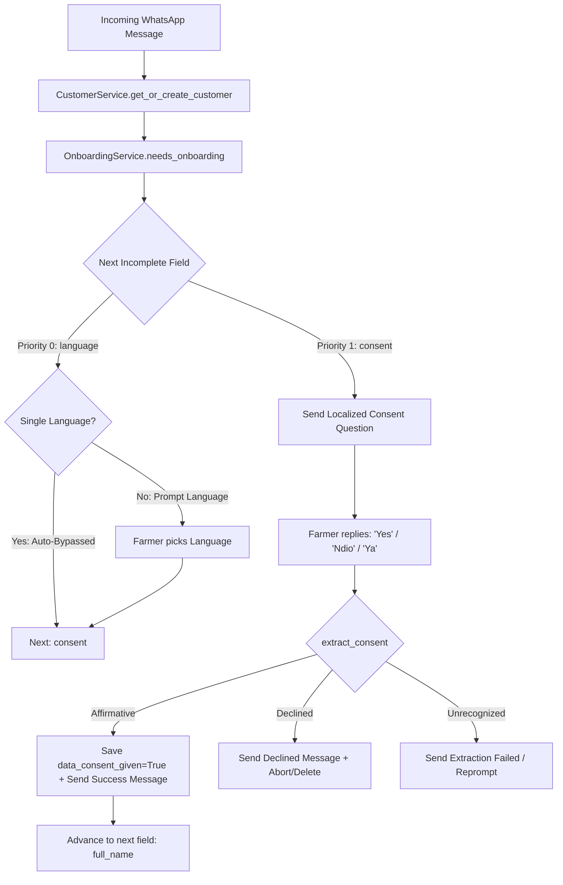

# [MT-004] Configurable Data Consent Onboarding Field (`consent`)

**Date:** 2026-08-19
**Author:** Galih Pratama
**Status:** In Progress
**Parent Specification:** [`docs/CONFIGURABLE_ONBOARDING_QUESTIONS.md`](/docs/CONFIGURABLE_ONBOARDING_QUESTIONS.md)
**Objective:** Transform data consent from a hardcoded language-posthook into a first-class configurable onboarding field (`field_name: "consent"`), enabling custom disclaimer copy, localized multi-language translations, dynamic ordering, and support for both single-language and multi-language pipelines.

---

## 📊 Overview

### Problem Statement

In the legacy onboarding system, the data privacy consent check was hardcoded to trigger exclusively inside `_save_field_value()` when `field_name == "language"`.

When operating in:

1. **Single-Language Mode**: The `language` question is automatically bypassed (`customer.language = settings.default_language`), meaning `_save_field_value("language")` is never called interactively. Consequently, farmers are **never prompted for data consent**.
2. **Custom Multi-Language Pipelines**: If a partner wants custom privacy text, custom keywords, or wants to ask consent before language or omit consent entirely, there was no way to configure it without modifying backend Python code.

### Solution (Option B: First-Class Configurable Field)

1. **First-Class Field Definition**: Define `field_name: "consent"` in `config.json` under `onboarding.fields`.
2. **Dynamic Consent Extractor (`extract_consent`)**: Add an affirmative and negative keyword parser in `OnboardingService` supporting multi-lingual responses (`yes`, `ndio`, `ya`, `setuju`, etc.).
3. **Model Property Sync**: Persist `customer.data_consent_given = True` and `customer.data_consent_asked = True` in customer profile data upon acceptance.
4. **Graceful Decline Handling**: If a required consent question is declined, send a localized decline message and abort/delete the onboarding session.
5. **Unified Router Flow**: Remove the hardcoded consent intercept in `routers/whatsapp.py` and `onboarding_service.py:2066`, allowing the unified onboarding engine to manage consent by priority order.

---

## 🔄 User Journey & Flow Comparison



---

## 📐 Architecture & Schema Design

### 1. `config.json` Field Schema

```json
{
  "field_name": "consent",
  "db_field": "data_consent",
  "enabled": true,
  "required": true,
  "priority": 1,
  "field_type": "boolean",
  "extraction_method": "extract_consent",
  "max_attempts": 3,
  "labels": {
    "en": "Data Consent",
    "sw": "Idhini ya Data",
    "id": "Persetujuan Data"
  },
  "questions": {
    "en": "Your data may be shared with trusted partners for program monitoring. Reply 'Yes' to continue.",
    "sw": "Data yako inaweza kushirikiwa na washirika wanaoaminika kwa ufuatiliaji wa programu. Jibu 'Ndio' ili kuendelea.",
    "id": "Data Anda dapat dibagikan dengan mitra tepercaya untuk pemantauan program. Balas 'Ya' untuk melanjutkan."
  },
  "affirmative_keywords": {
    "en": ["yes", "ok", "okay", "agree", "i agree", "accepted", "accept", "1", "y"],
    "sw": ["ndio", "ndiyo", "sawa", "kubali", "nakubali", "1"],
    "id": ["ya", "setuju", "oke", "1"]
  },
  "declined_keywords": {
    "en": ["no", "decline", "reject", "2", "n"],
    "sw": ["hapana", "2"],
    "id": ["tidak", "tolak", "2"]
  },
  "success_messages": {
    "en": "Thank you for your consent!",
    "sw": "Asante kwa idhini yako!",
    "id": "Terima kasih atas persetujuan Anda!"
  }
}
```

### 2. Extractor Implementation (`extract_consent`)

```python
async def extract_consent(
    self,
    message: str,
    field_config: Optional[OnboardingFieldConfig] = None,
    lang: Optional[str] = None,
) -> Optional[bool]:
    """
    Extract consent from farmer response using configured or default keywords.
    Returns:
        True: Affirmative consent given
        False: Explicitly declined
        None: Unrecognized response (re-prompt)
    """
    # Resolves field_config.affirmative_keywords / declined_keywords
    # (supports flat lists or language-specific dictionaries)
    # with automatic fallback to built-in multilingual defaults.
```

### 3. Onboarding Service Integration

- **`_is_field_complete(self, customer, field_config)`**:

  ```python
  if field_name == "consent":
      if not field_config.required:
          return customer.data_consent_asked
      return customer.data_consent_given is True
  ```

- **`_save_field_value(self, customer, value, field_config)`**:

  ```python
  if field_name == "consent":
      customer.data_consent_asked = True
      customer.data_consent_given = bool(value)
      if value is False and field_config.required:
          # Handle decline
          self.db.commit()
          lang = customer.language_code
          decline_msg = t("consent.data_sharing.declined", lang)
          return OnboardingResponse(
              message=decline_msg,
              status="aborted",
              attempts=0,
          )
  ```

---

## 🧪 Verification & Test Plan

1. **Single-Language Pipeline**:
   - Verify farmer's first message receives the `consent` question directly (e.g., `"Your data may be shared with trusted partners. Reply 'Yes' to continue."`).
   - Replying `"Yes"` saves `customer.data_consent_given = True` and transitions to `full_name`.
2. **Multi-Language Pipeline**:
   - Verify farmer selects language first (`"1. English"`).
   - Next prompt is the localized consent question in English (`"Your data may be shared..."`).
   - Replying `"Yes"` transitions to `full_name`.
3. **Decline Handling**:
   - Replying `"No"` to consent sends localized decline message and marks onboarding aborted or removes record.
4. **Full Regression**: Run `./dc.sh exec backend pytest` ensuring 1,099+ tests pass.

---

## 📋 Task Breakdown & Ballpark Estimates

- **Standard Developer Estimate**: **3.5h – 5.5h**
- **Pair Programming with Vibe Coding (Accelerated)**: **30m – 50m**
- **Confidence Level**: High

| Task ID | Description | Target Files | Status | Standard Est. | Pair Programming (Vibe Coding) | Priority |
| --- | --- | --- | --- | --- | --- | --- |
| **T-001** | Add `extract_consent` method in `OnboardingService` | `backend/services/onboarding_service.py` | `PLANNED` | 0.5h – 1.0h | 5m – 10m | Must Have |
| **T-002** | Update `_is_field_complete` and `_save_field_value` for `consent` field | `backend/services/onboarding_service.py` | `PLANNED` | 1.0h – 1.5h | 10m – 15m | Must Have |
| **T-003** | Remove legacy hardcoded consent hooks in `onboarding_service.py` & `routers/whatsapp.py` | `backend/services/onboarding_service.py`, `backend/routers/whatsapp.py` | `PLANNED` | 0.5h – 1.0h | 5m – 10m | Must Have |
| **T-004** | Update default `config.json` with `consent` field | `backend/config.json` | `PLANNED` | 0.5h | 5m | Must Have |
| **T-005** | Comprehensive Unit & Integration Test Suite | `backend/tests/test_configurable_data_consent.py` | `PLANNED` | 1.0h – 1.5h | 10m – 15m | Must Have |
