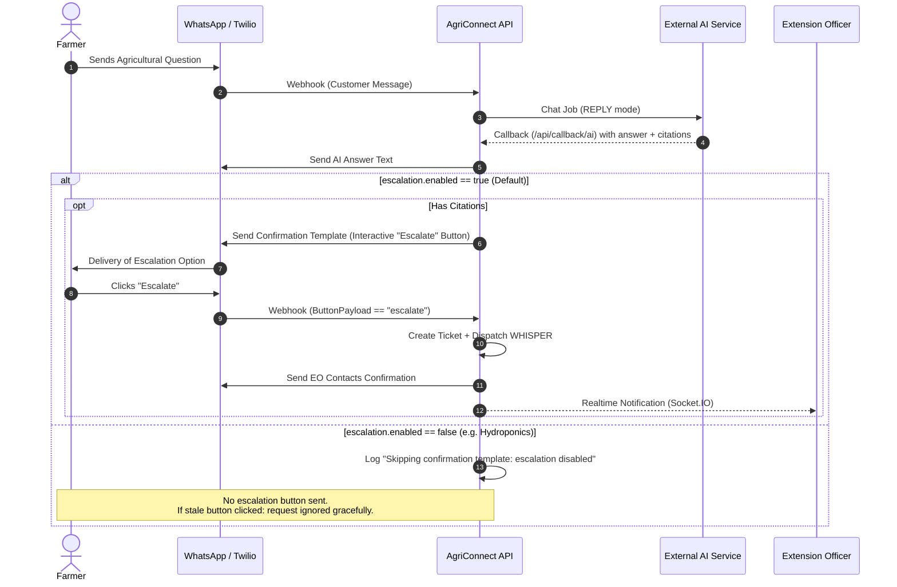

# Configurable Escalation Feature - Implementation Specification

**Date:** 2026-09-01  
**Status:** Approved / Planned  
**Parent System:** AgriConnect AI & WhatsApp Ticketing Engine  
**Objective:** Make the farmer escalation feature toggleable via system configuration (`config.json`), allowing specialized deployments (e.g. Hydroponics deployment) to disable the human escalation prompt and ticket creation flow while operating purely on automated AI advisory.

---

## 1. 5W1H Requirements Discovery

- **Who**: AgriConnect Platform Deployers and Administrators (e.g. deployments without Extension Officers or ticketing staff).
- **What**: Provide an explicit configuration toggle `escalation.enabled` (`true`/`false`) in `config.json` and `backend/config.py` that gates sending the escalation confirmation template and processing incoming escalation button payloads.
- **Where**:
  - Configuration: `backend/config.py`, `backend/config.template.json`, `backend/config.test.template.json`
  - Callback Router: `backend/routers/callbacks.py` (AI webhook response handling)
  - WhatsApp Webhook: `backend/routers/whatsapp.py` (Interactive button handling)
  - WhatsApp Service: `backend/services/whatsapp_service.py` (`send_confirmation_template`)
- **When**: Triggered at AI response dispatch and incoming WhatsApp webhook event evaluation.
- **Why**: In standalone or specialized deployments (such as the Hydroponics deployment), there may be no Extension Officers assigned to resolve tickets. Asking farmers if they want human help and creating orphaned tickets produces a confusing user experience and unwanted operational overhead.
- **How**: 
  - Add `escalation_enabled: bool` to backend settings (defaulting to `True` for backwards compatibility).
  - In `callbacks.py`, gate sending the WhatsApp confirmation template behind `settings.escalation_enabled`.
  - In `whatsapp.py`, gate the `FLOW 2C: Handle 'escalate' button response` behind `settings.escalation_enabled`.
  - Add comprehensive unit tests in `pytest`.

---

## 2. Architecture & Logic Flow

### Current vs. Configured Escalation Flow



---

## 3. Detailed Component Changes

### 3.1 Configuration Schema

#### [MODIFY] `backend/config.template.json` & `backend/config.test.template.json`
Add `"enabled": true` to the existing `"escalation"` configuration block:

```json
  "escalation": {
    "enabled": true,
    "chat_history_limit": 20,
    "reply_history_limit": 10,
    "description": "Escalation settings to allow farmers to escalate questions to extension officers"
  }
```

#### [MODIFY] `backend/config.py`
Add `escalation_enabled` field to `Settings` class:

```python
    # Escalation settings
    escalation_enabled: bool = _config.get("escalation", {}).get(
        "enabled", True
    )
    escalation_chat_history_limit: int = _config.get("escalation", {}).get(
        "chat_history_limit", 20
    )
    escalation_reply_history_limit: int = _config.get("escalation", {}).get(
        "reply_history_limit", 10
    )
```

---

### 3.2 AI Callback Router

#### [MODIFY] `backend/routers/callbacks.py`
In `handle_ai_chat_callback()`, gate Step 2 (Confirmation Template) behind `settings.escalation_enabled`:

```python
    # Step 2: Send confirmation template only if citations exist and escalation is enabled
    has_citations = (
        payload.output
        and payload.output.citations
        and len(payload.output.citations) > 0
    )

    if settings.escalation_enabled and has_citations:
        # Select template based on customer's language
        customer_lang = ai_message.customer.language_code
        template_sid = whatsapp_service.get_template_sid(
            template_type="confirmation",
            customer_language=customer_lang,
        )
        if template_sid:
            try:
                template_response = whatsapp_service.send_template_message(
                    to=ai_message.customer.phone_number,
                    content_sid=template_sid,
                    content_variables={},
                )
                logger.info(
                    f"✓ Confirmation template sent: {template_response['sid']}"
                )
            except Exception as e:
                logger.warning(
                    f"Failed to send confirmation template (non-critical): {e}"
                )
    elif not settings.escalation_enabled:
        logger.info(
            "Skipping confirmation template: escalation is disabled in configuration"
        )
    else:
        logger.info(
            "Skipping confirmation template: no citations in AI response"
        )
```

---

### 3.3 WhatsApp Webhook Router

#### [MODIFY] `backend/routers/whatsapp.py`
In `whatsapp_webhook()`, check if `settings.escalation_enabled` is active before handling `ButtonPayload == escalate_payload`:

```python
    # FLOW 2C: Handle "escalate" button response
    if ButtonPayload == escalate_payload:
        if not settings.escalation_enabled:
            logger.info(
                f"Customer {phone_number} clicked 'escalate' button, "
                "but escalation feature is disabled in configuration"
            )
            return {
                "status": "ignored",
                "message": "Escalation feature is disabled",
            }

        logger.info(f"Customer {phone_number} clicked 'escalate' button")
        # ... remainder of ticket creation & whisper dispatch ...
```

---

### 3.4 WhatsApp Service

#### [MODIFY] `backend/services/whatsapp_service.py`
In `send_confirmation_template()`:

```python
    if not settings.escalation_enabled:
        logger.info("Skipping send_confirmation_template: escalation disabled in configuration")
        return {"status": "skipped", "message": "Escalation feature is disabled"}
```

---

## 4. Verification & Testing Plan

### 4.1 Automated Tests (`pytest`)
Run tests via Docker Compose wrapper:
- `./dc.sh exec backend python -m pytest tests/test_config.py -v`
- `./dc.sh exec backend python -m pytest tests/test_callbacks.py -v`
- `./dc.sh exec backend python -m pytest tests/test_whatsapp_ai_integration.py -v`
- `./dc.sh exec backend flake8 --exclude=alembic,patches`

#### Specific Test Scenarios:
1. **Config Loading Test** (`test_config.py`):
   - Verify `settings.escalation_enabled` defaults to `True`.
   - Verify `settings.escalation_enabled` respects `False` when configured.
2. **Callback Escalation Disabled Test** (`test_callbacks.py`):
   - With `settings.escalation_enabled = False` and an AI response containing citations, verify AI answer is sent, but `send_template_message` is NEVER called.
3. **WhatsApp Webhook Escalation Disabled Test** (`test_whatsapp.py` / `test_whatsapp_ai_integration.py`):
   - With `settings.escalation_enabled = False`, post an incoming webhook with `ButtonPayload = "escalate"`.
   - Verify no ticket is created, no WHISPER job is triggered, and status returns `"ignored"`.

---

## 5. Vibe-Coding Estimation & Tasks Breakdown

- **Mode**: Agentic AI Pair-Programming (Vibe Coding)
- **Confidence Level**: High (99%)
- **Dependencies**: None

| Task ID | Component & Description | Traditional Dev Est. | Vibe-Coding Est. | Priority |
|---|---|---|---|---|
| **ESCAL-01** | Backend Config schema & settings (`config.py`, templates) | 0.5 - 1.0 h | **3 - 5 mins** | P0 |
| **ESCAL-02** | Router Callback gating (`callbacks.py`) | 0.5 - 1.0 h | **3 - 5 mins** | P0 |
| **ESCAL-03** | WhatsApp Webhook gating (`whatsapp.py`, `whatsapp_service.py`) | 0.5 - 1.0 h | **3 - 5 mins** | P0 |
| **ESCAL-04** | Unit & Integration Test Suite (`pytest`) | 1.0 - 2.0 h | **10 - 15 mins** | P0 |
| **Total** | Full Implementation, Flake8 Linting & Test Verification | **2.5 - 5.0 h** | **~20 - 30 mins** | |
