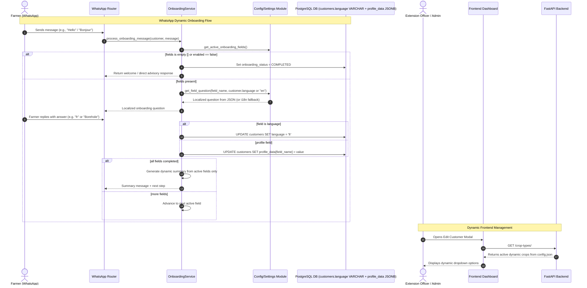

# [MT-001] Configurable Onboarding Questions, Flow & Model/Frontend Decoupling

**Date:** 2026-08-14
**Author:** Galih Pratama
**Status:** Planned / Comprehensive Audit
**Objective:** Decouple hardcoded onboarding questions, field definitions, priorities, localized prompt messages, profile summary generation, static model assumptions, and hardcoded config defaults into dynamic JSON configuration schema and API-driven UI, backed by a one-time Alembic migration converting `customers.language` to `VARCHAR(10)` for truly generic multi-partner scaling (e.g., Agriculture EN/SW → Water Management EN/FR → Empty/Bypass).

---

## 📊 Overview

### Purpose & Scaling Vision

AgriConnect's onboarding workflow must be adaptable to different deployment partners without requiring code rewrites:
- **Partner A (Standard Agriculture - Kenya/Tanzania)**: Language (`en`/`sw`), Name, Location, Crop Types (`Avocado`, `Potato`, `Dairy`), Gender, Birth Year.
- **Partner B (Water & Resource Management - Rwanda/DRC)**: Language (`en`/`fr`), Name, Location, Water Source (`Borehole`, `River`, `Piped`), Livestock.
- **Partner C (Direct Advisory - No Onboarding)**: Empty onboarding field list (`"fields": []`), immediately activates conversation.

To achieve this:
1. **One-Time Language Column Migration (`customers.language` → `VARCHAR(10)`)**: Replace the restrictive PostgreSQL `customerlanguage` enum (`'EN'`, `'SW'`) with a standard `VARCHAR(10)` column. This makes `customers.language` a single source of truth capable of natively storing any ISO language code (`en`, `sw`, `fr`, `es`, `rw`, etc.) without dual-storage workarounds.
2. **Universal Profile Storage**: Use `customers.profile_data` (JSONB column) as the store for any partner-specific profile fields (`crop_type`, `water_source`, `irrigation`, `gender`, `birth_year`, etc.).
3. **Decouple Static Model Properties (`models/customer.py:L81-L124`)**:
   - `birth_year`, `crop_type`, `gender`, `age`, `age_group` are retained as convenience accessors over `profile_data` for backward compatibility.
   - Any dynamic partner field (e.g. `water_source`) is accessed universally via `customer.get_profile_field("field_name")`.
4. **Config Fallbacks Decoupling (`config.py:L259`)**:
   - Change `crop_types` fallback in `config.py` from hardcoded `["Avocado", "Cacao"]` to empty list `[]` (sole source of truth is `config.json`).
   - Fix `get_crop_name_translated` in `i18n.py` to return the crop name as-is if translation key is missing, rather than the raw `crops.X.name` path.
5. **Dynamic Profile Summary Generation (`_generate_profile_summary`)**:
   - Replace the static 6-line template (`Language`, `Name`, `Location`, `Crop Type`, `Gender`, `Age`) in `OnboardingService`.
   - Generate summary dynamically by iterating over **active configured fields** in `config.json`. If a field was disabled or omitted (e.g., `crop_type` or `gender` not asked), it will NOT appear in the summary.
6. **Configurable JSON Questions & Flow**: Move all field configurations, questions, translations, retry limits, and priorities to `config.json` (`"onboarding": { "enabled": true, "fields": [...] }`). Support empty arrays `[]` to completely bypass onboarding.
7. **Frontend Decoupling**: Remove hardcoded `CROP_TYPES` in `frontend/src/lib/config.js` and `frontend/src/components/customers/EditCustomerModal.js`, replacing it with dynamic loading from the existing backend endpoint `GET /crop-types/` (which reads from `config.json`).

---

## 🔄 User Experience / Workflow Architecture



---

## 🔍 Deep-Down Audit: All Hardcoded / Static Configurations

| Location | Static Item | Issue / Risk | Target Decoupling |
|---|---|---|---|
| `backend/config.py:L259` | `crop_types: list = _config.get("crop_types", ["Avocado", "Cacao"])` | Hardcoded fallback crops force agriculture onto non-crop partners (e.g. water/health) | Change default fallback to `[]`. Make `config.json` the sole source of truth. |
| `backend/models/customer.py:L47` | `language = Column(Enum(CustomerLanguage), ...)` | Postgres enum `customerlanguage` (`'EN'`, `'SW'`) rejects any new partner language code (e.g. `'fr'`) | One-time Alembic migration alters column to `VARCHAR(10)` and drops enum. |
| `backend/models/customer.py:L17-L19` | `class CustomerLanguage(enum.Enum): EN = "en", SW = "sw"` | Enum not string-comparable in all standard operations | Change to `class CustomerLanguage(str, enum.Enum)` for 100% backward compatibility. |
| `backend/models/customer.py:L81-L124` | Static property getters (`birth_year`, `crop_type`, `gender`, `age`, `age_group`) | Hardcoded agricultural assumptions on Customer model | Keep properties as backward-compatible helpers; use `get_profile_field()` / `set_profile_field()` universally for arbitrary partner fields. |
| `backend/services/onboarding_service.py:L2047-L2090` | `_generate_profile_summary()` | Hardcodes 6 static fields in summary (`Language`, `Name`, `Location`, `Crop Type`, `Gender`, `Age`), printing `N/A` for unconfigured fields | Dynamically iterate over `self.fields_config`. Only active configured fields are included. |
| `backend/utils/i18n.py:L632-L644` | `get_crop_name_translated()` | Missing crop keys return the raw lookup string `"crops.Maize.name"` | Return `crop_name` as fallback when translation key is absent. |
| `frontend/src/lib/config.js` | `export const CROP_TYPES = ["Avocado", "Potato"];` | Hardcoded crops in frontend config | Deprecate static array; provide dynamic fetching from `GET /crop-types/`. |
| `frontend/src/components/customers/EditCustomerModal.js` | Static `CROP_TYPES` import & select options | Cannot reflect partner's configured crops from `config.json` | Fetch crops dynamically via `api.get("/crop-types/")` on mount. |

---

## 🛠️ Technical Specification

### 1. Database & Alembic Migration

**Migration File**: `backend/alembic/versions/2026_08_14_1200-i2b3c4d5e6f7_convert_customer_language_to_string.py`
- **Revision**: `i2b3c4d5e6f7`
- **Revises**: `h1a2b3c4d5e6`

```python
def upgrade() -> None:
    op.execute(
        "ALTER TABLE customers ALTER COLUMN language TYPE VARCHAR(10) "
        "USING LOWER(language::text)"
    )
    op.execute("DROP TYPE IF EXISTS customerlanguage")

def downgrade() -> None:
    op.execute("CREATE TYPE customerlanguage AS ENUM ('en', 'sw')")
    op.execute(
        "ALTER TABLE customers ALTER COLUMN language TYPE customerlanguage "
        "USING language::customerlanguage"
    )
```

### 2. Backend Config Updates (`backend/config.py`)

```python
    # Crop types configuration (sole source of truth from config.json)
    crop_types: list = _config.get("crop_types", [])

    # Onboarding configuration
    onboarding_enabled: bool = _config.get("onboarding", {}).get("enabled", True)
    onboarding_fields_config: list = _config.get("onboarding", {}).get("fields", [])
```

### 3. Backend Model Updates (`backend/models/customer.py`)

```python
class CustomerLanguage(str, enum.Enum):
    EN = "en"
    SW = "sw"

class Customer(Base):
    __tablename__ = "customers"

    id = Column(Integer, primary_key=True, index=True)
    phone_number = Column(String, unique=True, index=True, nullable=False)
    full_name = Column(String, nullable=True)
    # Generic string column for dynamic language codes (e.g. 'en', 'sw', 'fr', 'es', 'rw')
    language = Column(String(10), default=None, nullable=True)
    profile_data = Column(JSON, nullable=True)
```

### 4. Schemas (`backend/schemas/customer.py` & `backend/schemas/onboarding_schemas.py`)

```python
# In schemas/customer.py:
class CustomerBase(BaseModel):
    phone_number: str
    full_name: Optional[str] = None
    language: Optional[str] = None
    crop_type: Optional[str] = None
    gender: Optional[Union[Gender, str]] = None
    age: Optional[int] = None
```

```python
# In schemas/onboarding_schemas.py:
@dataclass
class OnboardingFieldConfig:
    field_name: str
    db_field: str
    required: bool
    priority: int
    extraction_method: Optional[str]
    matching_method: Optional[str]
    max_attempts: int
    field_type: str
    success_message_template: str
    enabled: bool = True
    questions: Optional[Dict[str, str]] = None
    success_messages: Optional[Dict[str, str]] = None

def load_onboarding_fields() -> List[OnboardingFieldConfig]:
    """Load fields from config.json or fall back to defaults if missing/unspecified."""
    from config import settings
    cfg = settings.onboarding_fields_config
    if not settings.onboarding_enabled or cfg is None:
        return []
    if len(cfg) == 0:
        return _DEFAULT_ONBOARDING_FIELDS  # Backward-compatible default

    fields = []
    for item in cfg:
        default = _get_default_field(item.get("field_name"))
        fields.append(OnboardingFieldConfig(
            field_name=item["field_name"],
            db_field=item.get("db_field", default.db_field if default else item["field_name"]),
            required=item.get("required", default.required if default else False),
            priority=item.get("priority", default.priority if default else 99),
            extraction_method=item.get("extraction_method", default.extraction_method if default else None),
            matching_method=item.get("matching_method", default.matching_method if default else None),
            max_attempts=item.get("max_attempts", default.max_attempts if default else 1),
            field_type=item.get("field_type", default.field_type if default else "string"),
            success_message_template=default.success_message_template if default else "",
            enabled=item.get("enabled", True),
            questions=item.get("questions"),
            success_messages=item.get("success_messages"),
        ))
    return fields
```

### 5. Service Resolution & Dynamic Summary (`backend/services/onboarding_service.py`)

```python
def _get_question(self, field_config: OnboardingFieldConfig, lang: str) -> str:
    """Resolve question from JSON config -> English JSON config -> i18n.py."""
    if field_config.questions:
        text = field_config.questions.get(lang) or field_config.questions.get("en")
        if text:
            return text
    return t(f"onboarding.{field_config.field_name}.question", lang)

def _get_success_message(self, field_config: OnboardingFieldConfig, lang: str, **kwargs) -> str:
    """Resolve success message with formatting parameters."""
    if field_config.success_messages:
        text = field_config.success_messages.get(lang) or field_config.success_messages.get("en")
        if text:
            try:
                return text.format(**kwargs)
            except KeyError:
                return text
    return t(f"onboarding.{field_config.field_name}.success", lang, **kwargs)

def _generate_profile_summary(self, customer: Customer, lang: str) -> str:
    """Dynamically build profile summary from active configured fields only."""
    if not self.fields_config:
        return ""

    summary_lines = []
    for field in self.fields_config:
        if not field.enabled:
            continue

        field_name = field.field_name
        label = t(f"onboarding.{field_name}.field_name", lang)

        if field_name == "language":
            val = customer.language or "en"
            display_val = "English" if val == "en" else ("Swahili" if val == "sw" else val)
        elif field_name == "full_name":
            display_val = customer.full_name or "N/A"
        elif field_name == "administration":
            display_val = "N/A"
            if hasattr(customer, "customer_administrative") and customer.customer_administrative:
                display_val = customer.customer_administrative[0].administrative.path
        elif field_name == "crop_type":
            display_val = get_crop_name_translated(customer.crop_type, lang) if customer.crop_type else "N/A"
        elif field_name == "gender":
            display_val = t(f"gender.{customer.gender}", lang) if customer.gender else "N/A"
        elif field_name == "birth_year":
            label = t("onboarding.common.age", lang)
            display_val = str(customer.age) if customer.age else "N/A"
        else:
            raw_val = customer.get_profile_field(field_name)
            display_val = str(raw_val) if raw_val is not None else "N/A"

        summary_lines.append(f"{label}: {display_val}")

    return "\n".join(summary_lines)
```

### 6. i18n Fix (`backend/utils/i18n.py`)

```python
def get_crop_name_translated(crop_name: str, lang: str = "en") -> str:
    """Get translated crop name, falling back to original name if untranslated."""
    if not crop_name:
        return ""
    translated = t(f"crops.{crop_name}.name", lang)
    if translated.startswith("crops."):
        return crop_name
    return translated
```

### 7. Frontend Dynamic Crop Integration (`frontend/src/components/customers/EditCustomerModal.js`)

```javascript
const [cropTypes, setCropTypes] = useState([]);

useEffect(() => {
  const fetchCrops = async () => {
    try {
      const response = await api.get("/crop-types/");
      if (response.data && Array.isArray(response.data)) {
        setCropTypes(response.data.map((c) => c.name));
      }
    } catch (err) {
      console.error("Failed to fetch crop types, using fallback:", err);
      setCropTypes(["Avocado", "Potato"]);
    }
  };
  fetchCrops();
}, []);
```

---

## 🧪 Verification & Test Scenarios

### Automated Pytest Suite (`backend/tests/test_onboarding_config.py`)

| Scenario | What is tested |
|---|---|
| `test_dynamic_language_string_storage` | Setting `"language": "fr"` saves directly to `customer.language == "fr"` via string column |
| `test_crop_types_config_fallback_empty` | When `crop_types` absent in config, default is empty list `[]` |
| `test_crop_name_translation_fallback` | Unlisted crop returns name as-is instead of `crops.X.name` path |
| `test_dynamic_profile_summary_active_fields_only` | Summary at completion contains only active fields, omitting disabled ones |
| `test_dynamic_profile_summary_empty_when_no_fields` | Summary is empty string when `"fields": []` |
| `test_alembic_migration_language_varchar` | Alembic upgrade alters column to `VARCHAR(10)` and downgrade restores enum |
| `test_empty_fields_bypasses_onboarding` | Setting `"fields": []` completes onboarding on message 1 without asking questions |
| `test_onboarding_disabled_flag` | Setting `"enabled": false` immediately completes onboarding |
| `test_default_fields_loaded_when_no_config` | Missing `onboarding` key in config loads all 6 default fields |
| `test_custom_question_en_sw_overrides` | Custom strings in JSON `questions` are returned for EN and SW |
| `test_custom_success_message_interpolation` | `{value}` in custom `success_messages` interpolates saved name/crop |
| `test_arbitrary_custom_partner_field` | Configuring a new field `"water_source"` extracts and saves to `profile_data["water_source"]` |
| `test_disabled_field_skipped` | Setting `"enabled": false` on `birth_year` skips question during active chat |
| `test_reordered_priorities` | Changing `priority` asks fields in the new custom order |
| `test_custom_max_attempts` | Setting `max_attempts: 1` skips/fails after 1 attempt |
| `test_placeholder_available_crops` | `{available_crops}` is correctly populated in crop question |
| `test_fallback_to_i18n_when_absent` | If field has `questions: null`, falls back to `i18n.py` without error |

---

## ⏱️ Work Breakdown & Estimation

- **Confidence Level**: High

| Task ID | Description | Est. Hours (Min - Max) | Priority |
|---|---|---|---|
| **T-001** | **Alembic Migration**: One-time migration converting `customers.language` to `VARCHAR(10)`. | 1h - 1.5h | Must Have |
| **T-002** | **Model & Schema Updates**: Update `Customer.language` to `String(10)`, `CustomerLanguage` to `(str, Enum)`. Update `schemas/customer.py`. | 1h - 1.5h | Must Have |
| **T-003** | **Config Layer & Fallbacks**: Add `onboarding` schema, decouple `crop_types` fallback to `[]` in `config.py`. | 1h - 2h | Must Have |
| **T-004** | **Schema Layer**: Update `OnboardingFieldConfig`, `load_onboarding_fields()`, and filtering in `onboarding_schemas.py`. | 2h - 3h | Must Have |
| **T-005** | **Service Resolution & Dynamic Summary**: Add `_get_question()`, `_get_success_message()`, replace hardcoded `t()` calls, dynamic `_generate_profile_summary()`, and `i18n.py` fallback fix. | 2.5h - 3.5h | Must Have |
| **T-006** | **Frontend Dynamic Crops**: Update `EditCustomerModal.js` to fetch crops via `GET /crop-types/`. | 1.5h - 2.5h | Must Have |
| **T-007** | **New Test Suite**: Implement `tests/test_onboarding_config.py` (17 comprehensive test cases). | 3h - 4h | Must Have |
| **T-008** | **Regression Testing & Linting**: Run migration, full pytest suite, and flake8/eslint. | 1.5h - 2.5h | Must Have |

**Total Estimated Hours:** **13.5h - 20.5h**
