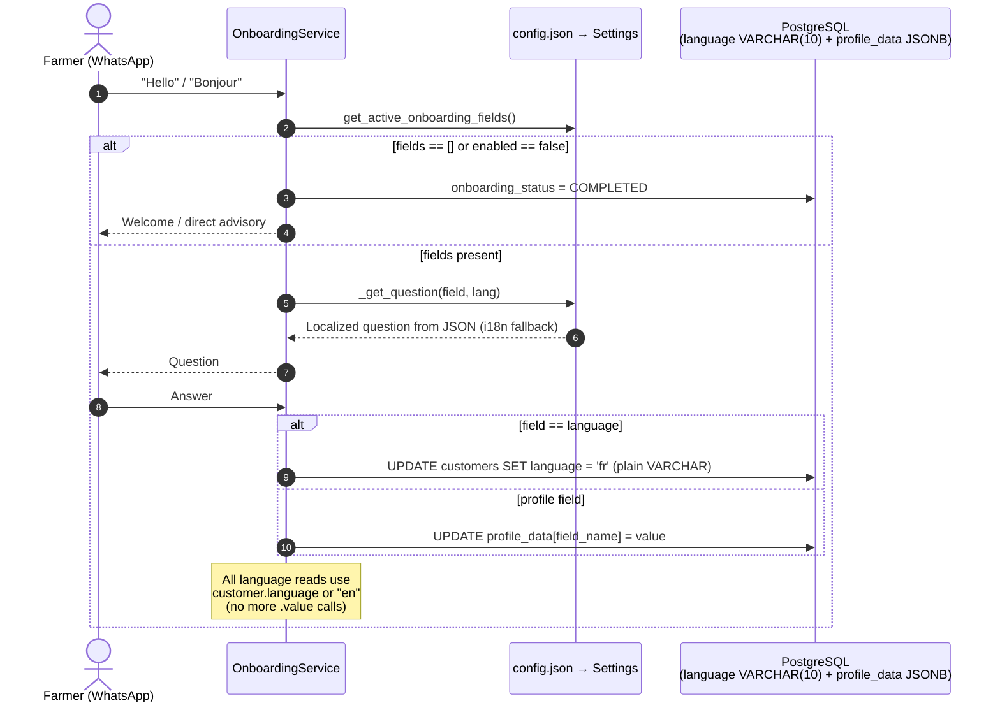

# [MT-001] Configurable Onboarding Questions, Languages, Age Groups & Decoupled Architecture

**Date:** 2026-08-14
**Author:** Galih Pratama
**Status:** Planned — Awaiting Implementation
**Branch:** `feature/185-mt-001-pull-out-onboarding-question-from-code-to-configurable-json`

---

## 📊 Overview

AgriConnect onboarding must be 100% adaptable to different deployment partners without code rewrites or DB migrations:

| Partner | Languages | Age Groups | Onboarding Fields |
|---|---|---|---|
| Partner A (Kenya/TZ Agriculture) | `en`, `sw` | `20-35`, `36-50`, `51+` | `language`, `full_name`, `administration`, `crop_type`, `gender`, `birth_year` |
| Partner B (Rwanda/DRC Water) | `en`, `fr` | `Youth (18-29)`, `Adult (30-59)`, `Senior (60+)` | `language`, `full_name`, `administration`, `water_source`, `livestock` |
| Partner C (Empty/Advisory) | `en` | *(any)* | `[]` (bypass onboarding immediately) |

---

## 🔍 Full Deep-Down Audit — All Static Hardcodes Found

| # | Location | Hardcoded Item | Impact & Fix |
|---|---|---|---|
| 1 | `backend/models/customer.py:L47` | `language = Column(Enum(CustomerLanguage), ...)` | **One-time Alembic migration** → `VARCHAR(10)`. Drops `customerlanguage` PG enum. |
| 2 | `backend/models/customer.py:L17-L19` | `CustomerLanguage(enum.Enum): EN, SW` | Change to `CustomerLanguage(str, enum.Enum)` so `CustomerLanguage.EN == "en"` is `True`. Keeps backward compat for all existing tests. Does NOT add new languages — those come from config. |
| 3 | `backend/models/customer.py:L22-L25` | `AgeGroup(enum.Enum): AGE_20_35, AGE_36_50, AGE_51_PLUS` | Change to `AgeGroup(str, enum.Enum)`. Seeder can continue using `AgeGroup` values. |
| 4 | `backend/models/customer.py:L114-L124` | `age_group` property hardcodes `20-35`, `36-50`, `51+` | Update to iterate dynamically over `settings.age_groups` from config. |
| 5 | `backend/services/onboarding_service.py` (×8 occurrences) | `customer.language.value` — calls `.value` on enum | After migration, `customer.language` is a plain `str`. Remove `.value` everywhere. Change pattern to `customer.language or "en"`. |
| 6 | `backend/services/onboarding_service.py:L1793` | `lang = value.value` — assumes returned value is enum | `extract_language()` must return plain `str` (`"en"`, `"sw"`) not `CustomerLanguage` enum. Remove `.value` call. |
| 7 | `backend/services/onboarding_service.py:L2058` | `customer.language == CustomerLanguage.EN` | Since `CustomerLanguage(str, enum.Enum)`: `"en" == CustomerLanguage.EN` is `True`. But the profile summary should still be refactored to look up the language name dynamically from `settings.languages`. |
| 8 | `backend/services/onboarding_service.py:L863-L934` | `extract_language()` returns `CustomerLanguage` enum; OpenAI schema hardcodes `enum: ["en", "sw", null]` | Must return plain `str`; OpenAI schema enum built from `settings.supported_language_codes`. |
| 9 | `backend/services/onboarding_service.py:L868-L876` | Hardcoded english/swahili patterns list | Patterns per language code should eventually come from config. For now, keep pattern matching but build result as plain string code. |
| 10 | `backend/services/customer_service.py:L153-L193` | `_detect_language_from_message()` returns `CustomerLanguage` enum | Must return `str` (`"en"` / `"sw"`) after migration. |
| 11 | `backend/services/customer_service.py:L415-L440` | `_filter_by_age_groups()` hardcodes `if age_group == "20-35": ...` | Dynamically match label from `settings.age_groups` to compute birth year bounds. |
| 12 | `backend/services/follow_up_service.py:L107` | `customer.language.value` | Remove `.value` — use `customer.language or "en"`. |
| 13 | `backend/services/weather_intent_service.py:L146,L179` | `customer.language.value` | Remove `.value` — use `customer.language or "en"`. |
| 14 | `backend/services/reconnection_service.py:L59` | `customer.language.value` | Remove `.value` — use `customer.language or "en"`. |
| 15 | `backend/schemas/customer.py:L12,L24,L74` | `language: Optional[CustomerLanguage] = None` | Change to `Optional[str] = None`. Pydantic will accept any ISO string. |
| 16 | `backend/schemas/customer.py:L76` | `age_group: Optional[AgeGroup] = None` | Change to `Optional[str] = None`. Computed property returns arbitrary config-defined label. |
| 17 | `backend/schemas/onboarding_schemas.py` | Static `_DEFAULT_ONBOARDING_FIELDS` list | Extract questions/success messages to JSON. Static defaults kept as code fallback. |
| 18 | `backend/config.py:L259` | `crop_types: list = _config.get("crop_types", ["Avocado", "Cacao"])` | Change default fallback to `[]`. Config JSON is sole source. |
| 19 | `backend/utils/i18n.py:L632-L644` | `get_crop_name_translated()` — missing key path crashes | Return `crop_name` as-is if translation key absent. |
| 20 | `backend/seeder/customer.py:L73-L76` | `language = CustomerLanguage.EN if ... else CustomerLanguage.SW` | Since `CustomerLanguage(str, enum.Enum)`: `CustomerLanguage.EN == "en"`, so `language` field naturally stores `"en"` as a string — no seeder change needed for correctness. |
| 21 | `backend/seeder/customer.py:L79-L84` | `random.choice(list(AgeGroup))` and `age_group.value.split("-")` | Since `AgeGroup(str, enum.Enum)`: `age_group.value` still returns `"20-35"` etc. No seeder change needed. |
| 22 | `frontend/src/lib/config.js` | `export const CROP_TYPES = ["Avocado", "Potato"]` | Deprecate — provide dynamic fetch helper instead. |
| 23 | `frontend/src/components/customers/EditCustomerModal.js:L6,L297` | Static `CROP_TYPES` import & select options | Fetch `GET /crop-types/` on component mount. |

---

## 🔄 Architecture Flow



---

## 🛠️ Technical Specification

### T-001: Alembic Migration (`customers.language` → `VARCHAR(10)`)

**File**: `backend/alembic/versions/2026_08_14_1200-i2b3c4d5e6f7_convert_customer_language_to_string.py`
- **Revision**: `i2b3c4d5e6f7`
- **Revises**: `h1a2b3c4d5e6`

```python
def upgrade() -> None:
    op.execute(
        "ALTER TABLE customers ALTER COLUMN language TYPE VARCHAR(10) "
        "USING LOWER(language::text)"
    )
    op.execute("DROP TYPE IF EXISTS customerlanguage")

def downgrade() -> None:
    op.execute("CREATE TYPE customerlanguage AS ENUM ('EN', 'SW')")
    op.execute(
        "ALTER TABLE customers ALTER COLUMN language TYPE customerlanguage "
        "USING CASE "
        "  WHEN UPPER(language) IN ('EN', 'SW') THEN UPPER(language)::customerlanguage "
        "  WHEN language IS NOT NULL THEN 'EN'::customerlanguage "
        "  ELSE NULL "
        "END"
    )
```

> **Why LOWER(language::text)?**
> Existing rows store `'EN'`/`'SW'` as PostgreSQL enum labels. `USING LOWER(language::text)` converts them to `'en'`/`'sw'` in a single pass, ensuring the stored value matches ISO codes used everywhere else.

---

### T-002: Model Updates (`backend/models/customer.py`)

**Changes**:

```python
# BEFORE
class CustomerLanguage(enum.Enum):
    EN = "en"
    SW = "sw"

class AgeGroup(enum.Enum):
    AGE_20_35 = "20-35"
    AGE_36_50 = "36-50"
    AGE_51_PLUS = "51+"

# AFTER — inherit from (str, enum.Enum) for backward compatibility
class CustomerLanguage(str, enum.Enum):
    EN = "en"
    SW = "sw"

class AgeGroup(str, enum.Enum):
    AGE_20_35 = "20-35"
    AGE_36_50 = "36-50"
    AGE_51_PLUS = "51+"
```

**`language` column**:
```python
# BEFORE
language = Column(Enum(CustomerLanguage), default=None, nullable=True)

# AFTER
language = Column(String(10), default=None, nullable=True)
```

**`age_group` property** — dynamic from config:
```python
@property
def age_group(self) -> str | None:
    """Calculate age group dynamically from config."""
    age = self.age
    if age is None:
        return None
    from config import settings
    for group in settings.age_groups:
        min_a = group.get("min")
        max_a = group.get("max")
        if min_a is not None and age < min_a:
            continue
        if max_a is not None and age > max_a:
            continue
        return group.get("label")
    return None
```

> **`self.birth_year` is valid** — `birth_year` remains a `@property` on `Customer` that reads from `profile_data.get("birth_year")`. The `age` property calls `self.birth_year` correctly. The `birth_year`, `crop_type`, and `gender` convenience `@property` accessors are **kept** — they are the canonical way to read these common profile fields.

---

### T-003: Schema Updates (`backend/schemas/customer.py`)

```python
# BEFORE
from models.customer import AgeGroup, CustomerLanguage, Gender

class CustomerBase(BaseModel):
    language: Optional[CustomerLanguage] = None

class CustomerUpdate(BaseModel):
    language: Optional[CustomerLanguage] = None

class CustomerListItem(BaseModel):
    language: Optional[CustomerLanguage] = None
    age_group: Optional[AgeGroup] = None

# AFTER
# Remove AgeGroup and CustomerLanguage from imports (keep Gender)
from models.customer import Gender

class CustomerBase(BaseModel):
    language: Optional[str] = None

class CustomerUpdate(BaseModel):
    language: Optional[str] = None

class CustomerListItem(BaseModel):
    language: Optional[str] = None
    age_group: Optional[str] = None
```

---

### T-004: Config Layer (`backend/config.py` + JSON templates)

**`config.json` / `config.template.json` additions**:
```json
{
  "languages": [
    { "code": "en", "name": "English" },
    { "code": "sw", "name": "Swahili" }
  ],
  "age_groups": [
    { "label": "20-35", "min": 20, "max": 35 },
    { "label": "36-50", "min": 36, "max": 50 },
    { "label": "51+",   "min": 51, "max": null }
  ],
  "crop_types": ["Avocado", "Potato", "Dairy"],
  "onboarding": {
    "enabled": true,
    "fields": [ ... ]
  }
}
```

**`backend/config.py`** — add to `Settings`:
```python
languages: list = _config.get("languages", [
    {"code": "en", "name": "English"},
    {"code": "sw", "name": "Swahili"},
])

@property
def supported_language_codes(self) -> list[str]:
    return [lang["code"] for lang in self.languages] if self.languages else ["en"]

@property
def default_language(self) -> str:
    codes = self.supported_language_codes
    return codes[0] if codes else "en"

age_groups: list = _config.get("age_groups", [
    {"label": "20-35", "min": 20, "max": 35},
    {"label": "36-50", "min": 36, "max": 50},
    {"label": "51+",   "min": 51, "max": None},
])

# CHANGED: default from ["Avocado", "Cacao"] to []
crop_types: list = _config.get("crop_types", [])

onboarding_enabled: bool = _config.get("onboarding", {}).get("enabled", True)
onboarding_fields_config: list = _config.get("onboarding", {}).get("fields", [])
```

---

### T-005: Language `.value` Cascade Fix — All Affected Files

All `customer.language.value` patterns must become `customer.language or settings.default_language` (since `customer.language` is now a plain `str`):

| File | Line(s) | Change |
|---|---|---|
| `onboarding_service.py` | L422, L475, L1254, L1369, L1449, L1606, L1644, L1731, L1787, L1933, L1989 | `customer.language.value if customer.language else "en"` → `customer.language or settings.default_language` |
| `onboarding_service.py` | L1793 | `lang = value.value` → `lang = value` (since `extract_language` now returns str) |
| `onboarding_service.py` | L1792 | `customer.language = value` — keep as-is (value is now a str directly) |
| `onboarding_service.py` | L2056-L2060 | `customer.language == CustomerLanguage.EN` → look up language name from `settings.languages` by code |
| `onboarding_service.py` | L880, L884, L929, L932 | `extract_language()` returns `CustomerLanguage.EN/.SW` → return `"en"` / `"sw"` as plain str |
| `onboarding_service.py` | L914 | OpenAI schema `enum: ["en", "sw", null]` → `settings.supported_language_codes + [None]` |
| `follow_up_service.py` | L107 | `customer.language.value if customer.language else "en"` → `customer.language or settings.default_language` |
| `weather_intent_service.py` | L146, L179 | same → `customer.language or settings.default_language` |
| `reconnection_service.py` | L59 | same → `customer.language or settings.default_language` |
| `customer_service.py:L153-L193` | `_detect_language_from_message()` | Return `"en"` / `"sw"` as plain str instead of `CustomerLanguage` enum |

---

### T-006: Dynamic Onboarding Schema (`backend/schemas/onboarding_schemas.py`)

Add `questions` and `success_messages` to `OnboardingFieldConfig`:

```python
@dataclass
class OnboardingFieldConfig:
    field_name: str
    db_field: str
    enabled: bool = True
    required: bool = True
    priority: int = 0
    extraction_method: Optional[str] = None
    matching_method: Optional[str] = None
    max_attempts: int = 3
    field_type: str = "string"
    questions: Optional[dict] = None        # {"en": "...", "sw": "..."}
    success_messages: Optional[dict] = None # {"en": "...", "sw": "..."}
```

Add `load_onboarding_fields()` to merge config JSON fields with hardcoded defaults (config takes priority if both exist for same `field_name`).

---

### T-007: Dynamic Service Helpers (`backend/services/onboarding_service.py`)

**`_get_question(field, lang)`**:
1. Look for `field.questions[lang]` in config
2. Fallback to `field.questions["en"]` if lang not found
3. Final fallback to `t(f"onboarding.{field.field_name}.question", lang)` from `i18n.py`

**`_get_success_message(field, lang, **kwargs)`**:
1. Look for `field.success_messages[lang]` in config
2. Fallback to `field.success_messages["en"]`
3. Final fallback to `t(f"onboarding.{field.field_name}.success", lang)` from `i18n.py`
4. `str.format(**kwargs)` for `{value}` interpolation

**`_generate_profile_summary()` — dynamic**:
```python
def _generate_profile_summary(self, customer: Customer) -> str:
    lang = customer.language or settings.default_language
    lines = []
    for field in sorted(self.fields_config, key=lambda f: f.priority):
        if not field.enabled:
            continue
        if field.field_name == "language":
            # Look up human name from settings.languages
            lang_entry = next(
                (l for l in settings.languages if l["code"] == customer.language),
                None
            )
            value = lang_entry["name"] if lang_entry else customer.language or "N/A"
        elif field.db_field in ("full_name",):
            value = getattr(customer, field.db_field, "N/A") or "N/A"
        elif field.field_name == "administration":
            value = ...  # existing admin path lookup
        else:
            value = customer.get_profile_field(field.field_name) or "N/A"
        label = t(f"onboarding.{field.field_name}.field_name", lang)
        lines.append(f"• {label}: {value}")
    return "\n".join(lines)
```

**`_filter_by_age_groups()` — dynamic**:
```python
def _filter_by_age_groups(self, query, age_groups: List[str]):
    current_year = datetime.now().year
    age_conditions = []
    for label in age_groups:
        matched = next(
            (g for g in settings.age_groups if g["label"] == label), None
        )
        if not matched:
            continue
        min_a = matched.get("min")  # e.g. 20
        max_a = matched.get("max")  # e.g. 35, or None for open-ended

        # birth year = current_year - age
        min_birth = (current_year - max_a) if max_a is not None else 1900
        max_birth = (current_year - min_a) if min_a is not None else current_year

        age_conditions.append(and_(
            cast(Customer.profile_data.op("->>")(  "birth_year"), Integer) >= min_birth,
            cast(Customer.profile_data.op("->>")(  "birth_year"), Integer) <= max_birth,
        ))
    if age_conditions:
        query = query.filter(or_(*age_conditions))
    return query
```

**`i18n.py` fix**:
```python
# BEFORE — crashes on missing key
def get_crop_name_translated(crop_name: str, lang: str) -> str:
    return t(f"crops.{crop_name}.name", lang)

# AFTER — safe fallback
def get_crop_name_translated(crop_name: str, lang: str) -> str:
    key = f"crops.{crop_name}.name"
    result = t(key, lang)
    # t() returns the key path itself if not found — detect and fall back
    return crop_name if result == key else result
```

---

### T-008: Frontend Dynamic Crops (`frontend/src/components/customers/EditCustomerModal.js`)

```js
// BEFORE
import { CROP_TYPES } from '../../lib/config';

// AFTER — dynamic load
const [cropTypes, setCropTypes] = useState([]);
useEffect(() => {
  api.get('/crop-types/').then(res => {
    setCropTypes(res.data.map(c => c.name));
  }).catch(() => setCropTypes([]));
}, []);
```

---

## 🧪 Test Plan

### Automated Regression (existing passing tests — must stay green):
- `tests/test_customer_list.py` — uses `CustomerLanguage.EN` (still valid: `"en" == CustomerLanguage.EN` after `str, enum.Enum`)
- `tests/test_skip_optional_onboarding.py` — uses `CustomerLanguage.EN` — same
- `tests/test_hierarchical_access.py` — same

### New Test Suite (`backend/tests/test_onboarding_config.py`) — 19 scenarios:

| Test | What is asserted |
|---|---|
| `test_language_varchar_stored_as_string` | `customer.language == "fr"` after saving plain string |
| `test_customerlanguage_str_enum_backward_compat` | `CustomerLanguage.EN == "en"` is `True` |
| `test_customer_language_no_dot_value` | `customer.language or "en"` works when column is `"en"` str |
| `test_dynamic_age_group_from_config` | Custom `[{"label": "Youth", "min": 18, "max": 29}]` → `customer.age_group == "Youth"` |
| `test_dynamic_age_group_open_ended` | `max: null` in config → age 70 falls into "Senior 60+" |
| `test_dynamic_age_group_returns_none_when_birth_year_absent` | `profile_data` has no `birth_year` → `customer.age_group is None` |
| `test_dynamic_filter_age_group_from_config` | Filter `age_group:Youth` maps to correct birth year range via SQL |
| `test_crop_types_default_empty_when_absent` | No `crop_types` key in config → `settings.crop_types == []` |
| `test_crop_name_translation_fallback` | Unknown crop name returns name as-is |
| `test_dynamic_profile_summary_active_fields_only` | Disabled field absent from summary |
| `test_dynamic_profile_summary_empty_when_no_fields` | `"fields": []` → empty summary string |
| `test_dynamic_profile_summary_language_name_lookup` | Summary shows `"English"` not `"en"` |
| `test_empty_fields_config_bypasses_onboarding` | First message completes onboarding immediately |
| `test_onboarding_disabled_flag` | `"enabled": false` → onboarding skipped |
| `test_custom_question_override` | `questions.en` from JSON used over `i18n.py` |
| `test_success_message_interpolation` | `{value}` in `success_messages` is interpolated |
| `test_arbitrary_partner_field` | `"water_source"` in config → saved to `profile_data["water_source"]` |
| `test_extract_language_returns_string` | `extract_language("1")` returns `"en"` (plain str, not enum) |
| `test_detect_language_from_message_returns_string` | `_detect_language_from_message("hello")` returns `"en"` str |

---

## ⏱️ Estimation

| Task | Description | Est. Hours |
|---|---|---|
| **T-001** | Alembic Migration (`language` → VARCHAR) | 1h–1.5h |
| **T-002** | Model: `(str, enum.Enum)`, `String(10)`, dynamic `age_group` | 1h–1.5h |
| **T-003** | Schema: remove enum types from Pydantic schemas | 0.5h–1h |
| **T-004** | Config layer: `languages`, `age_groups`, `crop_types`, `onboarding` | 1.5h–2h |
| **T-005** | Language `.value` cascade fix across 5 service files | 2h–3h |
| **T-006** | Dynamic onboarding schema + loader | 1.5h–2h |
| **T-007** | Service helpers: `_get_question`, `_get_success_message`, `_generate_profile_summary`, `_filter_by_age_groups`, i18n fix | 2.5h–3.5h |
| **T-008** | Frontend dynamic crops | 1h–1.5h |
| **T-009** | New test suite (19 cases) + regression suite | 3h–4h |
| **T-010** | Linting, integration, final verification | 1h–2h |

**Total: 15h–21.5h**
**Confidence: High**
