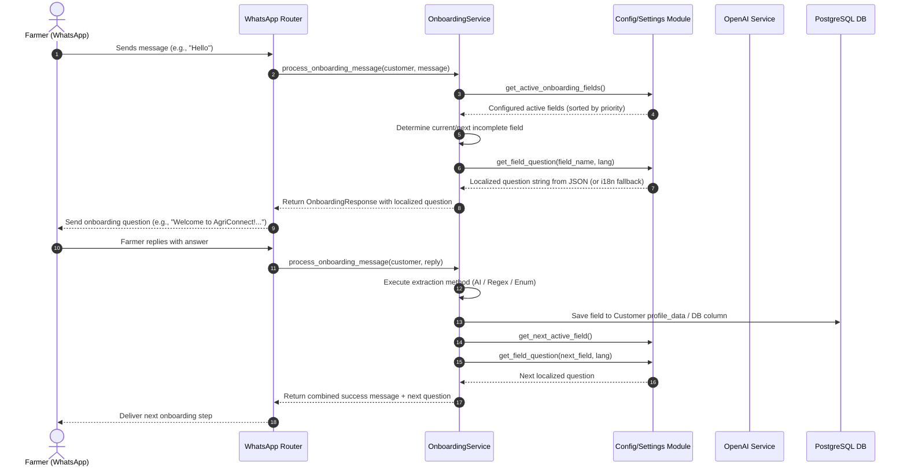

# [MT-001] Configurable Onboarding Questions & Flow Implementation

**Date:** 2026-08-14
**Author:** Galih Pratama
**Status:** Planned
**Objective:** Pull out hardcoded onboarding questions, field definitions, priorities, and localized prompt messages from Python source code into a flexible, configurable JSON configuration schema.

---

## 📊 Overview

### Purpose

Currently, AgriConnect's farmer onboarding workflow is driven by hardcoded Python dataclasses (`ONBOARDING_FIELDS` in `backend/schemas/onboarding_schemas.py`) and static translation dictionaries (`backend/utils/i18n.py`). When administrators or deployment engineers need to:

1. Rephrase onboarding questions or introductory greetings for specific agricultural programs or regions,
2. Enable, disable, or reorder onboarding fields (e.g., skip gender/age questions or prioritize crop selection),
3. Adjust maximum retry attempts before fallback per field, or
4. Add custom localization or prompt templates without modifying and redeploying Python code,

they are forced to make direct code edits.

This feature externalizes all onboarding field configurations, question prompts, localized strings (English & Swahili), and retry thresholds into `config.json` (with templates `config.template.json` and `config.test.template.json`), backed by dynamic schema loading and seamless fallback to built-in defaults.

### User Experience / Workflow



---

## 🎯 Design Principles & Constraints

1. **Zero Breaking Changes / Strict Backward Compatibility**:
   - If `onboarding` configuration is omitted or partially defined in `config.json`, the system MUST seamlessly fall back to default field definitions and existing `i18n.py` translations.
   - All existing tests (`test_generic_onboarding.py`, `test_onboarding_service.py`, `test_whatsapp_onboarding.py`, etc.) must pass without regression.

2. **Hot / Warm Config Reloading**:
   - Field configurations, questions, and retry limits are loaded via `config.py` / `Settings` and can be reloaded or mocked in tests without requiring database schema changes.

3. **Dynamic Field Ordering & Toggle**:
   - Fields can be enabled/disabled (`enabled: true/false`) and re-prioritized (`priority: 0..N`) via JSON.
   - `OnboardingService` will dynamically evaluate the sequence of active fields based on `priority` of enabled fields.

4. **Multi-Language Support**:
   - Each question and message template supports ISO language codes (e.g., `"en"`, `"sw"`).
   - Dynamic placeholders such as `{available_crops}`, `{value}`, `{options}`, `{parent}`, `{field}` must be interpolated accurately.

---

## 📐 Architecture Design

### Current State: Hardcoded Paths

```
┌──────────────────────────────────────────┐
│ schemas/onboarding_schemas.py            │
│  ONBOARDING_FIELDS = [                   │
│   OnboardingFieldConfig(                 │
│    field_name="language",                │
│    priority=0, max_attempts=3,           │  ← Hardcoded
│    success_message_template="...",       │  ← Hardcoded
│   ), ...                                 │
│  ]                                       │
└───────────────────┬──────────────────────┘
                    │ get_fields_by_priority()
                    ▼
┌──────────────────────────────────────────┐
│ services/onboarding_service.py           │
│  _ask_initial_question():               │
│   question = t("onboarding.X.question") │  ← Always uses i18n.py
│  _save_field_value():                   │
│   success_msg = t("onboarding.X.success")│ ← Always uses i18n.py
└──────────────────────────────────────────┘
```

### Target State: Config-Driven Paths

```
┌──────────────────────────────────────────┐
│ config.json / config.template.json       │
│  "onboarding": {                         │
│   "fields": [{ "field_name": "language", │
│    "enabled": true, "priority": 0,       │
│    "max_attempts": 3,                    │
│    "questions": {"en": "...", "sw": "..."}│  ← Configurable
│    "success_messages": {"en": "..."}     │  ← Configurable
│   }]                                     │
│  }                                       │
└───────────────────┬──────────────────────┘
                    │ config.py loads via _config.get("onboarding", {})
                    ▼
┌──────────────────────────────────────────┐
│ schemas/onboarding_schemas.py            │
│  load_onboarding_fields() dynamically   │
│  builds list from config OR uses        │
│  hardcoded defaults as fallback         │
└───────────────────┬──────────────────────┘
                    │
                    ▼
┌──────────────────────────────────────────┐
│ services/onboarding_service.py           │
│  _get_question(field_config, lang):     │
│   1. field_config.questions.get(lang)   │  ← Try JSON config
│   2. t("onboarding.X.question", lang)  │  ← Fallback to i18n.py
│  _get_success_msg(field_config, lang):  │
│   1. field_config.success_messages      │  ← Try JSON config
│   2. t("onboarding.X.success", lang)   │  ← Fallback to i18n.py
└──────────────────────────────────────────┘
```

---

## 1. Backend Implementation (FastAPI)

### 1.1 JSON Configuration Schema
**Files**:
- `/backend/config.template.json`
- `/backend/config.test.template.json`
- `/backend/config.json` (auto-generated from template)

The new top-level `onboarding` section will be added to the existing config structure alongside `openai`, `crop_types`, `weather`, etc.

```json
{
  "onboarding": {
    "enabled": true,
    "fields": [
      {
        "field_name": "language",
        "db_field": "language",
        "enabled": true,
        "required": true,
        "priority": 0,
        "extraction_method": "extract_language",
        "matching_method": null,
        "max_attempts": 3,
        "field_type": "enum",
        "questions": {
          "en": "Welcome to AgriConnect! 🌱 Your agricultural advisory companion.\nKaribu AgriConnect! 🌱 Mshauri wako wa kilimo.\n\nChoose your language / Chagua lugha yako:\n1. English / Kiingereza\n2. Swahili / Kiswahili",
          "sw": "Karibu AgriConnect! 🌱 Mshauri wako wa kilimo.\n\nChagua lugha yako:\n1. Kiingereza\n2. Kiswahili"
        },
        "success_messages": {
          "en": "Great! Your language preference has been set to English.",
          "sw": "Vizuri! Lugha uliyopendelea imewekwa kuwa Kiswahili."
        }
      },
      {
        "field_name": "full_name",
        "db_field": "full_name",
        "enabled": true,
        "required": true,
        "priority": 1,
        "extraction_method": null,
        "matching_method": null,
        "max_attempts": 1,
        "field_type": "string",
        "questions": {
          "en": "To get started, I need to know your full name.\n\nPlease tell me: What is your full name?",
          "sw": "Kuanza, nahitaji majina yako kamili.\n\nTafadhali niambie: Jina lako kamili ni nani?"
        },
        "success_messages": {
          "en": "Thank you, {value}!",
          "sw": "Asante, {value}!"
        }
      },
      {
        "field_name": "administration",
        "db_field": "customer_administrative",
        "enabled": true,
        "required": true,
        "priority": 2,
        "extraction_method": "extract_location",
        "matching_method": "resolve_administration_ambiguity",
        "max_attempts": 3,
        "field_type": "location",
        "questions": {
          "en": "I need to know your location.\n\nPlease tell me your district and ward.\nFor example: Njoro, Lare",
          "sw": "Ninahitaji kujua eneo lako.\n\nTafadhali niambie wilaya na kata yako.\nMfano: Njoro, Lare"
        },
        "success_messages": {
          "en": "Location saved as {value}.",
          "sw": "Eneo limehifadhiwa kama {value}."
        }
      },
      {
        "field_name": "crop_type",
        "db_field": "crop_type",
        "enabled": true,
        "required": true,
        "priority": 3,
        "extraction_method": "extract_crop_type",
        "matching_method": "resolve_crop_ambiguity",
        "max_attempts": 3,
        "field_type": "string",
        "questions": {
          "en": "What crops do you grow?\n\nPlease select from the list below:\n{available_crops}\n\nReply with the number (e.g., '1', '2', etc.)",
          "sw": "Unalima mazao gani?\n\nTafadhali chagua kutoka orodha hapa chini:\n{available_crops}\n\nJibu kwa namba (mfano, '1', '2', n.k.)"
        },
        "success_messages": {
          "en": "Primary crops recorded: {value}.",
          "sw": "Mazao makuu yamerekodiwa: {value}."
        }
      },
      {
        "field_name": "gender",
        "db_field": "gender",
        "enabled": true,
        "required": false,
        "priority": 4,
        "extraction_method": "extract_gender",
        "matching_method": null,
        "max_attempts": 2,
        "field_type": "enum",
        "questions": {
          "en": "To help us serve you better, may I know your gender?\n\nYou can say: male, female, or other",
          "sw": "Ili tukusaidie vizuri zaidi, naweza kujua jinsia yako?\n\nUnaweza kusema: mwanamume, mwanamke, au nyingine"
        },
        "success_messages": {
          "en": "Thank you for sharing.",
          "sw": "Asante kwa kushiriki."
        }
      },
      {
        "field_name": "birth_year",
        "db_field": "birth_year",
        "enabled": true,
        "required": false,
        "priority": 5,
        "extraction_method": "extract_birth_year",
        "matching_method": null,
        "max_attempts": 2,
        "field_type": "integer",
        "questions": {
          "en": "What year were you born? You can also tell me your age if that's easier.\n\nFor example: '1980' or 'I'm 45 years old'",
          "sw": "Ulizaliwa mwaka gani? Ama unaweza pia kuniambia umri wako.\n\nKwa mfano: '1980' au 'Nina miaka 45'"
        },
        "success_messages": {
          "en": "Got it, thank you!",
          "sw": "Nimeelewa, asante!"
        }
      }
    ]
  }
}
```

> [!NOTE]
> `field_name`, `db_field`, `extraction_method`, `matching_method`, and `field_type` are **structural keys** and must match hardcoded service method names. They exist in the JSON for completeness but are NOT expected to be changed by admins. Only `enabled`, `priority`, `max_attempts`, `questions`, and `success_messages` are the "operator-configurable" surface.

### 1.2 Config & Settings Updates
**File**: `/backend/config.py`

A new property is added to `Settings` to expose the raw `onboarding` dict and typed accessors:

```python
# In Settings class:
onboarding_config: Dict[str, Any] = Field(
    default_factory=dict
)

# At module level, below _config = load_config():
_onboarding_cfg = _config.get("onboarding", {})
```

And in `Settings`:
```python
onboarding_enabled: bool = _config.get("onboarding", {}).get("enabled", True)
onboarding_fields_config: List[Dict] = (
    _config.get("onboarding", {}).get("fields", [])
)
```

### 1.3 Schema Updates
**File**: `/backend/schemas/onboarding_schemas.py`

#### 1.3.1 Extend `OnboardingFieldConfig` dataclass

```python
@dataclass
class OnboardingFieldConfig:
    field_name: str
    db_field: str
    required: bool
    priority: int
    extraction_method: Optional[str]
    matching_method: Optional[str]
    max_attempts: int
    field_type: str
    success_message_template: str
    # NEW FIELDS:
    enabled: bool = True
    questions: Optional[Dict[str, str]] = None        # {"en": "...", "sw": "..."}
    success_messages: Optional[Dict[str, str]] = None # {"en": "...", "sw": "..."}
```

#### 1.3.2 Refactor `ONBOARDING_FIELDS` → dynamic `load_onboarding_fields()`

```python
def load_onboarding_fields() -> List[OnboardingFieldConfig]:
    """
    Build OnboardingFieldConfig list from config.json if present,
    falling back to hardcoded defaults if config is absent or empty.
    """
    from config import settings
    cfg_fields = settings.onboarding_fields_config  # List[Dict] from JSON
    if not cfg_fields:
        return _DEFAULT_ONBOARDING_FIELDS  # existing hardcoded list

    result = []
    for entry in cfg_fields:
        # Map JSON keys → dataclass fields
        # Non-configurable structural fields fall back to matching defaults
        default = _get_default_field(entry["field_name"])
        result.append(OnboardingFieldConfig(
            field_name=entry["field_name"],
            db_field=entry.get("db_field", default.db_field),
            required=entry.get("required", default.required),
            priority=entry.get("priority", default.priority),
            extraction_method=entry.get(
                "extraction_method", default.extraction_method
            ),
            matching_method=entry.get(
                "matching_method", default.matching_method
            ),
            max_attempts=entry.get("max_attempts", default.max_attempts),
            field_type=entry.get("field_type", default.field_type),
            success_message_template=default.success_message_template,
            enabled=entry.get("enabled", True),
            questions=entry.get("questions"),
            success_messages=entry.get("success_messages"),
        ))
    return result

# Module-level constant (replaces existing ONBOARDING_FIELDS)
ONBOARDING_FIELDS: List[OnboardingFieldConfig] = load_onboarding_fields()
```

#### 1.3.3 Update helpers to filter `enabled`

```python
def get_fields_by_priority(
    include_disabled: bool = False,
) -> List[OnboardingFieldConfig]:
    """Get all fields sorted by priority, filtering disabled by default."""
    fields = ONBOARDING_FIELDS
    if not include_disabled:
        fields = [f for f in fields if f.enabled]
    return sorted(fields, key=lambda x: x.priority)

def get_required_fields() -> List[OnboardingFieldConfig]:
    return [f for f in ONBOARDING_FIELDS if f.required and f.enabled]

def get_optional_fields() -> List[OnboardingFieldConfig]:
    return [f for f in ONBOARDING_FIELDS if not f.required and f.enabled]
```

### 1.4 Service Layer Updates
**File**: `/backend/services/onboarding_service.py`

#### 1.4.1 `__init__` — refresh `fields_config` from updated helpers

```python
def __init__(self, db: Session):
    self.db = db
    self.openai_service = get_openai_service()
    # Uses updated get_fields_by_priority() which filters enabled=True
    self.fields_config = get_fields_by_priority()
    self.supported_crops = settings.crop_types
    # ... thresholds unchanged
```

#### 1.4.2 New private helper: `_get_question(field_config, lang) -> str`

Currently, question resolution is scattered across `_ask_initial_question()`, `_process_field_value()`, and `_save_field_value()` with duplicate `t()` calls. This is centralized:

```python
def _get_question(
    self,
    field_config: OnboardingFieldConfig,
    lang: str,
) -> str:
    """
    Resolve question text for a field in a given language.

    Priority:
    1. field_config.questions[lang] (from JSON config)
    2. field_config.questions["en"] (English fallback in JSON)
    3. t("onboarding.{field_name}.question", lang) (i18n.py fallback)
    """
    if field_config.questions:
        text = field_config.questions.get(lang) or field_config.questions.get("en")
        if text:
            return text
    # Fallback to i18n.py static dictionary
    return t(f"onboarding.{field_config.field_name}.question", lang)
```

#### 1.4.3 New private helper: `_get_success_message(field_config, lang, **kwargs) -> str`

```python
def _get_success_message(
    self,
    field_config: OnboardingFieldConfig,
    lang: str,
    **kwargs,
) -> str:
    """
    Resolve success message for a field in a given language.

    Priority:
    1. field_config.success_messages[lang] (from JSON config)
    2. field_config.success_messages["en"] (English fallback in JSON)
    3. t("onboarding.{field_name}.success", lang) (i18n.py fallback)

    Performs {value} and other placeholder substitution via kwargs.
    """
    if field_config.success_messages:
        text = (
            field_config.success_messages.get(lang)
            or field_config.success_messages.get("en")
        )
        if text:
            try:
                return text.format(**kwargs)
            except KeyError:
                return text
    return t(f"onboarding.{field_config.field_name}.success", lang, **kwargs)
```

#### 1.4.4 Update `_ask_initial_question()`

Before (current code, L1372):
```python
question = t(f"onboarding.{field_name}.question", lang)
```

After:
```python
question = self._get_question(field_config, lang)
```

The `{available_crops}` interpolation, skip instruction appending, and response construction remain unchanged.

#### 1.4.5 Update `_save_field_value()`

Before (current code, L1794–L1848 — scattered `t()` calls):
```python
success_msg = t(f"onboarding.{field_name}.success", lang)
# or
success_msg = t(f"onboarding.{field_name}.success", lang, value=value)
```

After — unify to:
```python
success_msg = self._get_success_message(field_config, lang, value=display_value)
```

Note: The special-case branching for `language`, `full_name`, `administration` (L1791–L1848) remains structurally intact; only the `t()` calls within each branch are replaced with `_get_success_message()`.

#### 1.4.6 Update extraction failure fallback paths

In `_process_field_value()` (L1484, L1507, L1523) and `_handle_max_attempts()` (L1934):
```python
# Before:
question = t(f"onboarding.{field_name}.question", lang)
# After:
question = self._get_question(next_field_config, lang)
```

Similarly for `field_display` in `_handle_max_attempts()` (uses `t("onboarding.X.field_name", lang)`) — this remains as-is, as `field_name` display labels are not part of this feature scope.

### 1.5 i18n Utilities
**File**: `/backend/utils/i18n.py`

No structural changes required. The existing `t()` function remains the fallback layer. A single new public helper is added to provide a clean cross-cutting interface (optional but improves testability):

```python
def get_onboarding_text(
    field_name: str,
    text_type: str,  # "question" | "success" | "field_name" | etc.
    lang: str,
    **kwargs,
) -> str:
    """
    Convenience wrapper for onboarding-specific translations.
    Translates onboarding.{field_name}.{text_type} in the given language.
    """
    return t(f"onboarding.{field_name}.{text_type}", lang, **kwargs)
```

---

## 2. Frontend / Mobile Impact

- **No direct UI changes required.** The mobile and web applications consume responses from the backend WhatsApp/API webhook endpoints, which will return the dynamically configured question texts transparently.

---

## 3. Database Impact

- **No schema migrations required.** All changes are in Python business logic and JSON configuration files. The `Customer` model, `onboarding_status`, `current_onboarding_field`, `onboarding_attempts`, `onboarding_candidates`, and `profile_data` columns are unaffected.

---

## 4. Key Affected Code Locations (Precise)

| File | Location | Change |
|------|----------|--------|
| `backend/config.template.json` | Top-level JSON | Add `"onboarding": { "fields": [...] }` section |
| `backend/config.test.template.json` | Top-level JSON | Same `onboarding` section (minimal / partial for tests) |
| `backend/config.py` | `Settings` class | Add `onboarding_enabled` and `onboarding_fields_config` properties |
| `backend/schemas/onboarding_schemas.py` | `OnboardingFieldConfig` dataclass | Add `enabled`, `questions`, `success_messages` fields |
| `backend/schemas/onboarding_schemas.py` | `ONBOARDING_FIELDS` | Replace static list with `load_onboarding_fields()` call |
| `backend/schemas/onboarding_schemas.py` | `get_fields_by_priority()` | Add `include_disabled` param, filter `enabled=True` by default |
| `backend/schemas/onboarding_schemas.py` | `get_required_fields()` | Filter `enabled=True` |
| `backend/schemas/onboarding_schemas.py` | `get_optional_fields()` | Filter `enabled=True` |
| `backend/services/onboarding_service.py` | New `_get_question()` | Helper with JSON config → i18n fallback |
| `backend/services/onboarding_service.py` | New `_get_success_message()` | Helper with JSON config → i18n fallback + placeholder format |
| `backend/services/onboarding_service.py` | `_ask_initial_question()` L1372, L1382 | Replace `t(...)` with `_get_question()` |
| `backend/services/onboarding_service.py` | `_save_field_value()` L1794–L1848 | Replace `t(...)` calls with `_get_success_message()` |
| `backend/services/onboarding_service.py` | `_process_field_value()` L1484, L1507, L1523 | Replace fallback `t(...)` calls with `_get_question()` |
| `backend/services/onboarding_service.py` | `_save_field_value()` L1881–1892 | Replace next question `t(...)` with `_get_question()` |
| `backend/utils/i18n.py` | New `get_onboarding_text()` | Optional convenience wrapper |
| `backend/tests/test_onboarding_config.py` | New file | Full coverage of JSON config loading, overrides, fallback |

---

## 5. Verification & Testing

### 5.1 Automated Tests

**Commands**:
```bash
# Full onboarding test suite
./dc.sh exec backend python -m pytest tests/test_generic_onboarding.py tests/test_onboarding_service.py tests/test_whatsapp_onboarding.py tests/test_onboarding_lang_pref.py tests/test_skip_optional_onboarding.py tests/test_onboarding_complete.py -v

# New config test suite
./dc.sh exec backend python -m pytest tests/test_onboarding_config.py -v

# Backend lint
./dc.sh exec backend flake8 --exclude=alembic,patches
```

**New test file `tests/test_onboarding_config.py`** — key scenarios:

| Test | What it verifies |
|------|-----------------|
| `test_default_fields_loaded_when_no_config` | `load_onboarding_fields()` returns hardcoded defaults when JSON has no `onboarding.fields` key |
| `test_custom_question_overrides_i18n` | `_get_question()` returns JSON-configured text over `i18n.py` for both `en` and `sw` |
| `test_custom_success_message_overrides_i18n` | `_get_success_message()` returns JSON-configured text over `i18n.py` |
| `test_fallback_to_i18n_when_questions_absent` | If `questions` key is missing in field JSON, falls back to `t("onboarding.X.question", lang)` |
| `test_disabled_field_skipped_in_priority_order` | Field with `enabled: false` is excluded from `get_fields_by_priority()` |
| `test_disabled_field_not_asked_during_onboarding` | Full onboarding flow skips `birth_year` when `enabled=false`, completes without asking |
| `test_reordered_field_priorities` | Swapping `administration` and `crop_type` priorities causes service to ask crop first |
| `test_custom_max_attempts_respected` | Setting `max_attempts: 1` for `gender` causes immediate skip after first failed extraction |
| `test_partial_config_uses_defaults_for_missing_fields` | Partial `onboarding.fields` config (only 2 fields specified) still loads all 6 with defaults for unspecified |
| `test_language_fallback_en_when_sw_missing_in_config` | If `questions` has only `"en"` key, `sw` user gets English text rather than empty string |
| `test_placeholder_interpolation_in_custom_question` | `{available_crops}` in crop_type question is correctly substituted with numbered list |
| `test_placeholder_interpolation_in_custom_success_message` | `{value}` in success message is correctly substituted with saved value |

### 5.2 Manual Verification Steps

1. **Default Config Test** (baseline — no `onboarding` key in `config.json`):
   - Send `"Hello"` from a new phone number to the WhatsApp webhook.
   - Verify the exact default language question from `i18n.py` is received.

2. **Custom Question Override Test**:
   - Add the `onboarding.fields` section to `config.json`. For `full_name`, override:
     ```json
     "questions": { "en": "Welcome! What is your lovely name?" }
     ```
   - Reset an existing test customer's onboarding status. Progress past language/consent steps.
   - Verify `"Welcome! What is your lovely name?"` is received instead of the default.

3. **Disabled Field Test**:
   - Set `"enabled": false` for `birth_year` in `config.json`.
   - Complete onboarding for a test customer. Verify `birth_year` question is never sent and profile completes after `gender`.
   - Verify `customer.profile_data` does NOT contain `"birth_year"` key (was never asked, not skipped with `None`).

4. **Field Reordering Test**:
   - Swap `priority` of `crop_type` (set to `2`) and `administration` (set to `3`) in `config.json`.
   - Start onboarding a new customer and verify `crop_type` question arrives before location question.

5. **Swahili Custom Message Test**:
   - Configure a custom Swahili question for `gender`.
   - Onboard a customer who picks Swahili.
   - Verify the custom `"sw"` text is delivered.

---

## 6. Epic & Ballpark Estimation

- **Confidence Level**: High
- **Dependencies**: None (purely backend configuration & onboarding service enhancement)

| Task ID | Component & Description | Est. Hours (Min - Max) | Priority |
|---------|-------------------------|------------------------|----------|
| T-001 | **JSON Config Schema**: Add `onboarding.fields` structure to `config.template.json` and `config.test.template.json`. Add `onboarding_enabled` and `onboarding_fields_config` to `Settings` in `config.py`. | 1h - 2h | Must Have |
| T-002 | **Schema Layer**: Extend `OnboardingFieldConfig` with `enabled`, `questions`, `success_messages`. Implement `load_onboarding_fields()` with default fallback. Update `get_fields_by_priority()` / `get_required_fields()` / `get_optional_fields()` to filter `enabled`. | 2h - 3h | Must Have |
| T-003 | **Service Helpers**: Implement `_get_question()` and `_get_success_message()` private helpers in `OnboardingService`. Replace all scattered `t("onboarding.X.question/success", ...)` call sites (≈12 occurrences across `_ask_initial_question`, `_save_field_value`, `_process_field_value`, `_handle_max_attempts`, `_save_field_value` next-question logic). | 2h - 4h | Must Have |
| T-004 | **i18n Utility**: Add `get_onboarding_text()` convenience wrapper to `utils/i18n.py`. | 0.5h - 1h | Nice to Have |
| T-005 | **New Test Suite**: Implement `tests/test_onboarding_config.py` covering all 12 scenarios in §5.1. | 3h - 5h | Must Have |
| T-006 | **Regression Verification & Lint**: Run full pytest suite and flake8 across all affected onboarding test files. Fix any regressions. | 1h - 2h | Must Have |

**Total Estimated Hours**: **9.5h - 17h**
