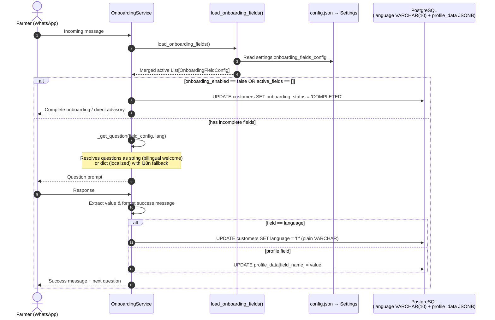

# [MT-001] Configurable Onboarding Questions, Languages, Age Groups & Decoupled Architecture

**Date:** 2026-08-14
**Author:** Galih Pratama
**Status:** Approved
**Branch:** `feature/185-mt-001-pull-out-onboarding-question-from-code-to-configurable-json`

---

## 📊 Overview

AgriConnect onboarding must be 100% configurable and adaptable for diverse deployment partners without requiring code rewrites or database migrations. All onboarding question schemas, field definitions, multilingual question prompts, success messages, supported languages, age groups, and crop types are extracted into **JSON configuration** (`config.json`).

### Partner Configuration Comparison

| Partner | Languages | Age Groups | Onboarding Fields & Questions (JSON) |
|---|---|---|---|
| **Partner A** (Kenya/TZ Agriculture) | `en`, `sw` | `20-35`, `36-50`, `51+` | `language` (bilingual welcome prompt), `full_name`, `administration`, `crop_type`, `gender`, `birth_year` |
| **Partner B** (Rwanda/DRC Water) | `en`, `fr` | `Youth (18-29)`, `Adult (30-59)`, `Senior (60+)` | `language` (bilingual welcome prompt), `full_name`, `administration`, `water_source`, `livestock` |
| **Partner C** (Direct Advisory) | `en` | *(any)* | `"fields": []` or `"enabled": false` (bypasses onboarding immediately) |

---

## 🔍 Requirements Discovery (5W1H)

- **Who**: Deployment administrators, partner organizations, extension officers, and farmers interacting via WhatsApp/Twilio/chat.
- **What**: Complete decoupling and extraction of onboarding question schemas, question text, success feedback, supported languages, age group brackets, and crop catalogs into a dynamic JSON configuration system.
- **Where**:
  - Configuration layer: `backend/config.json`, `config.template.json`, `config.test.json`, `config.test.template.json`, `backend/config.py`
  - Schema & Loader layer: `backend/schemas/onboarding_schemas.py` (`OnboardingFieldConfig`, `load_onboarding_fields()`)
  - Service layer: `backend/services/onboarding_service.py`, `backend/services/customer_service.py`, `backend/services/follow_up_service.py`, `backend/services/weather_intent_service.py`, `backend/services/reconnection_service.py`
  - Database: `customers.language` migrated from PostgreSQL enum to `VARCHAR(10)`, arbitrary custom partner fields stored in `customers.profile_data` JSONB.
  - Frontend: `frontend/src/components/customers/EditCustomerModal.js`
- **When**: Executed incrementally across tasks T-001 through T-010.
- **Why**: Eliminates hardcoded questions and static enums from application code so any organization can customize question phrasing, add partner-specific profile fields, or toggle onboarding steps directly in configuration.
- **How**: The JSON schema loader dynamically merges runtime configuration overrides with sensible defaults; questions support both single multilingual prompt strings (e.g. initial language selection) and localized dictionaries with fallback to `i18n.py`.

---

## 🔍 Full Deep-Down Audit — All Static Hardcodes Found

| # | Location | Hardcoded Item | Impact & Fix |
|---|---|---|---|
| 1 | `backend/models/customer.py:L47` | `language = Column(Enum(CustomerLanguage), ...)` | **One-time Alembic migration** → `VARCHAR(10)`. Drops `customerlanguage` PG enum. |
| 2 | `backend/models/customer.py:L17-L19` | `CustomerLanguage(enum.Enum): EN, SW` | Change to `CustomerLanguage(str, enum.Enum)` so `CustomerLanguage.EN == "en"` is `True`. Keeps backward compat for all existing tests. Does NOT add new languages — those come from config. |
| 3 | `backend/models/customer.py:L22-L25` | `AgeGroup(enum.Enum): AGE_20_35, AGE_36_50, AGE_51_PLUS` | Change to `AgeGroup(str, enum.Enum)`. Seeder can continue using `AgeGroup` values. |
| 4 | `backend/models/customer.py:L114-L124` | `age_group` property hardcodes `20-35`, `36-50`, `51+` | Update to iterate dynamically over `settings.age_groups` from config. |
| 5 | `backend/services/onboarding_service.py` (×8 occurrences) | `customer.language.value` — calls `.value` on enum | After migration, `customer.language` is a plain `str`. Remove `.value` everywhere. Change pattern to `customer.language or "en"`. |
| 6 | `backend/services/onboarding_service.py:L1793` | `lang = value.value` — assumes returned value is enum | `extract_language()` must return plain `str` (`"en"`, `"sw"`) not `CustomerLanguage` enum. Remove `.value` call. |
| 7 | `backend/services/onboarding_service.py:L2058` | `customer.language == CustomerLanguage.EN` | Since `CustomerLanguage(str, enum.Enum)`: `"en" == CustomerLanguage.EN` is `True`. Refactored profile summary to look up language name dynamically from `settings.languages`. |
| 8 | `backend/services/onboarding_service.py:L863-L934` | `extract_language()` returns `CustomerLanguage` enum; OpenAI schema hardcodes `enum: ["en", "sw", null]` | Must return plain `str`; OpenAI schema enum built from `settings.supported_language_codes`. |
| 9 | `backend/services/onboarding_service.py:L868-L876` | Hardcoded english/swahili patterns list | Patterns per language code should eventually come from config. Keep pattern matching but build result as plain string code. |
| 10 | `backend/services/customer_service.py:L153-L193` | `_detect_language_from_message()` returns `CustomerLanguage` enum | Returns `str` (`"en"` / `"sw"`) after migration. |
| 11 | `backend/services/customer_service.py:L415-L440` | `_filter_by_age_groups()` hardcodes `if age_group == "20-35": ...` | Dynamically matches label from `settings.age_groups` to compute birth year bounds. |
| 12 | `backend/services/follow_up_service.py:L107` | `customer.language.value` | Removed `.value` — uses `customer.language or "en"`. |
| 13 | `backend/services/weather_intent_service.py:L146,L179` | `customer.language.value` | Removed `.value` — uses `customer.language or "en"`. |
| 14 | `backend/services/reconnection_service.py:L59` | `customer.language.value` | Removed `.value` — uses `customer.language or "en"`. |
| 15 | `backend/schemas/customer.py:L12,L24,L74` | `language: Optional[CustomerLanguage] = None` | Changed to `Optional[str] = None`. Pydantic accepts any ISO string. |
| 16 | `backend/schemas/customer.py:L76` | `age_group: Optional[AgeGroup] = None` | Changed to `Optional[str] = None`. Computed property returns arbitrary config-defined label. |
| 17 | `backend/schemas/onboarding_schemas.py` | Static `_DEFAULT_ONBOARDING_FIELDS` list | Extracted questions/success messages to JSON with runtime merging via `load_onboarding_fields()`. |
| 18 | `backend/config.py:L259` | `crop_types: list = _config.get("crop_types", ["Avocado", "Cacao"])` | Changed default fallback to `[]`. Config JSON is sole source. |
| 19 | `backend/utils/i18n.py:L632-L644` | `get_crop_name_translated()` — missing key path crashes | Returns `crop_name` as-is if translation key absent. |
| 20 | `backend/seeder/customer.py:L73-L76` | `language = CustomerLanguage.EN if ... else CustomerLanguage.SW` | Since `CustomerLanguage(str, enum.Enum)`: `CustomerLanguage.EN == "en"`, so `language` field naturally stores `"en"` as a string. |
| 21 | `backend/seeder/customer.py:L79-L84` | `random.choice(list(AgeGroup))` and `age_group.value.split("-")` | Since `AgeGroup(str, enum.Enum)`: `age_group.value` still returns `"20-35"` etc. |
| 22 | `frontend/src/lib/config.js` | `export const CROP_TYPES = ["Avocado", "Potato"]` | Deprecated — frontend dynamically loads from backend. |
| 23 | `frontend/src/components/customers/EditCustomerModal.js:L6,L297` | Static `CROP_TYPES` import & select options | Fetches `GET /crop-types/` on component mount. |

---

## 📋 JSON Onboarding Question Schema Specification

### 1. Field Configuration Object Schema

Each element in `onboarding.fields` within `config.json` supports the following schema:

```json
{
  "field_name": "string (required, unique field identifier e.g. 'language', 'full_name', 'administration', 'crop_type', 'gender', 'birth_year', 'water_source')",
  "db_field": "string (optional, Customer model column or profile_data key, default: field_name)",
  "enabled": "boolean (optional, default: true)",
  "required": "boolean (optional, default: true)",
  "priority": "integer (optional, collection sequence order, lower numbers collected first, default: 99)",
  "field_type": "string ('string' | 'integer' | 'enum' | 'location', default: 'string')",
  "extraction_method": "string | null (method name in OnboardingService e.g. 'extract_language', 'extract_location', 'extract_crop_type', 'extract_gender', 'extract_birth_year')",
  "matching_method": "string | null (method name for ambiguity resolution e.g. 'resolve_administration_ambiguity', 'resolve_crop_ambiguity')",
  "max_attempts": "integer (optional, default: 3)",
  "labels": "string | object (optional, human-readable label for summaries/errors e.g. {'en': 'Location', 'sw': 'Eneo'})",
  "questions": "string | object (single prompt string for bilingual welcome questions OR multilingual dict {'en': '...', 'sw': '...' })",
  "success_messages": "string | object (single message OR multilingual dict {'en': '...', 'sw': '...' } supporting {value} interpolation)"
}
```

### 2. Complete Production `config.json` Example

```json
{
  "languages": [
    { "code": "en", "name": "English" },
    { "code": "sw", "name": "Swahili" }
  ],
  "age_groups": [
    { "label": "20-35", "min": 20, "max": 35 },
    { "label": "36-50", "min": 36, "max": 50 },
    { "label": "51+", "min": 51, "max": null }
  ],
  "crop_types": ["Avocado", "Potato", "Dairy"],
  "onboarding": {
    "enabled": true,
    "fields": [
      {
        "field_name": "language",
        "db_field": "language",
        "enabled": true,
        "required": true,
        "priority": 0,
        "field_type": "enum",
        "extraction_method": "extract_language",
        "max_attempts": 3,
        "questions": "Welcome to AgriConnect! 🌱 Your agricultural advisory companion.\nKaribu AgriConnect! 🌱 Mshauri wako wa kilimo.\n\nChoose your language / Chagua lugha yako:\n1. English / Kiingereza\n2. Swahili / Kiswahili",
        "success_messages": {
          "en": "Great! Your language preference has been set to English.",
          "sw": "Vizuri! Lugha uliyopendelea imewekwa kuwa Kiswahili."
        }
      },
      {
        "field_name": "full_name",
        "db_field": "full_name",
        "enabled": true,
        "required": true,
        "priority": 1,
        "field_type": "string",
        "max_attempts": 1,
        "questions": {
          "en": "To get started, I need to know your full name.\n\nPlease tell me: What is your full name?",
          "sw": "Kuanza, nahitaji majina yako kamili.\n\nTafadhali niambie: Jina lako kamili ni nani?"
        },
        "success_messages": {
          "en": "Thank you, {value}!",
          "sw": "Asante, {value}!"
        }
      },
      {
        "field_name": "administration",
        "db_field": "customer_administrative",
        "enabled": true,
        "required": true,
        "priority": 2,
        "field_type": "location",
        "extraction_method": "extract_location",
        "matching_method": "resolve_administration_ambiguity",
        "max_attempts": 3,
        "questions": {
          "en": "I need to know your location.\n\nPlease tell me your district and ward.\nFor example: Njoro, Lare",
          "sw": "Ninahitaji kujua eneo lako.\n\nTafadhali niambie wilaya na kata yako.\nMfano: Njoro, Lare"
        },
        "success_messages": {
          "en": "Location saved as {value}.",
          "sw": "Eneo limehifadhiwa kama {value}."
        }
      },
      {
        "field_name": "crop_type",
        "db_field": "crop_type",
        "enabled": true,
        "required": true,
        "priority": 3,
        "field_type": "string",
        "extraction_method": "extract_crop_type",
        "matching_method": "resolve_crop_ambiguity",
        "max_attempts": 3,
        "questions": {
          "en": "What crops do you grow?\n\nPlease select from the list below:\n{available_crops}\n\nReply with the number (e.g., '1', '2', etc.)",
          "sw": "Je, unalima mazao gani?\n\nTafadhali chagua kutoka kwenye orodha hapa chini:\n{available_crops}\n\nJibu kwa namba (mfano, '1', '2', n.k.)"
        },
        "success_messages": {
          "en": "Crop saved as {value}.",
          "sw": "Zao limehifadhiwa kama {value}."
        }
      },
      {
        "field_name": "gender",
        "db_field": "gender",
        "enabled": true,
        "required": false,
        "priority": 4,
        "field_type": "enum",
        "extraction_method": "extract_gender",
        "max_attempts": 2,
        "questions": {
          "en": "What is your gender?\n1. Male\n2. Female\n3. Other",
          "sw": "Jinsia yako ni ipi?\n1. Mwanaume\n2. Mwanamke\n3. Nyingine"
        },
        "success_messages": {
          "en": "Thank you for sharing.",
          "sw": "Asante kwa kushiriki."
        }
      },
      {
        "field_name": "birth_year",
        "db_field": "birth_year",
        "enabled": true,
        "required": false,
        "priority": 5,
        "field_type": "integer",
        "extraction_method": "extract_birth_year",
        "max_attempts": 2,
        "questions": {
          "en": "What year were you born (or what is your age)?",
          "sw": "Ulizaliwa mwaka gani (au una umri gani)?"
        },
        "success_messages": {
          "en": "Birth year saved as {value}.",
          "sw": "Mwaka wa kuzaliwa umehifadhiwa kama {value}."
        }
      }
    ]
  }
}
```

---

## 🔄 Architecture Flow



---

## 🛠️ Technical Specification

### T-001: Alembic Migration (`customers.language` → `VARCHAR(10)`)

**File**: `backend/alembic/versions/2026_08_14_1200-i2b3c4d5e6f7_convert_customer_language_to_string.py`
- **Revision**: `i2b3c4d5e6f7`
- **Revises**: `h1a2b3c4d5e6`

```python
def upgrade() -> None:
    op.execute(
        "ALTER TABLE customers ALTER COLUMN language TYPE VARCHAR(10) "
        "USING LOWER(language::text)"
    )
    op.execute("DROP TYPE IF EXISTS customerlanguage")

def downgrade() -> None:
    op.execute("CREATE TYPE customerlanguage AS ENUM ('EN', 'SW')")
    op.execute(
        "ALTER TABLE customers ALTER COLUMN language TYPE customerlanguage "
        "USING CASE "
        "  WHEN UPPER(language) IN ('EN', 'SW') THEN UPPER(language)::customerlanguage "
        "  WHEN language IS NOT NULL THEN 'EN'::customerlanguage "
        "  ELSE NULL "
        "END"
    )
```

> **Why LOWER(language::text)?**
> Existing rows store `'EN'`/`'SW'` as PostgreSQL enum labels. `USING LOWER(language::text)` converts them to `'en'`/`'sw'` in a single pass, ensuring the stored value matches ISO codes used everywhere else.

---

### T-002: Model Updates (`backend/models/customer.py`)

**Changes**:

```python
# BEFORE
class CustomerLanguage(enum.Enum):
    EN = "en"
    SW = "sw"

class AgeGroup(enum.Enum):
    AGE_20_35 = "20-35"
    AGE_36_50 = "36-50"
    AGE_51_PLUS = "51+"

# AFTER — inherit from (str, enum.Enum) for backward compatibility
class CustomerLanguage(str, enum.Enum):
    EN = "en"
    SW = "sw"

class AgeGroup(str, enum.Enum):
    AGE_20_35 = "20-35"
    AGE_36_50 = "36-50"
    AGE_51_PLUS = "51+"
```

**`language` column**:
```python
# BEFORE
language = Column(Enum(CustomerLanguage), default=None, nullable=True)

# AFTER
language = Column(String(10), default=None, nullable=True)
```

**`age_group` property** — dynamic from config:
```python
@property
def age_group(self) -> str | None:
    """Calculate age group dynamically from config."""
    age = self.age
    if age is None:
        return None
    from config import settings
    for group in settings.age_groups:
        min_a = group.get("min")
        max_a = group.get("max")
        if min_a is not None and age < min_a:
            continue
        if max_a is not None and age > max_a:
            continue
        return group.get("label")
    return None
```

> **`self.birth_year` is valid** — `birth_year` remains a `@property` on `Customer` that reads from `profile_data.get("birth_year")`. The `age` property calls `self.birth_year` correctly. The `birth_year`, `crop_type`, and `gender` convenience `@property` accessors are **kept** — they are the canonical way to read these common profile fields.

---

### T-003: Schema Updates (`backend/schemas/customer.py`)

```python
# BEFORE
from models.customer import AgeGroup, CustomerLanguage, Gender

class CustomerBase(BaseModel):
    language: Optional[CustomerLanguage] = None

class CustomerUpdate(BaseModel):
    language: Optional[CustomerLanguage] = None

class CustomerListItem(BaseModel):
    language: Optional[CustomerLanguage] = None
    age_group: Optional[AgeGroup] = None

# AFTER
# Remove AgeGroup and CustomerLanguage from imports (keep Gender)
from models.customer import Gender

class CustomerBase(BaseModel):
    language: Optional[str] = None

class CustomerUpdate(BaseModel):
    language: Optional[str] = None

class CustomerListItem(BaseModel):
    language: Optional[str] = None
    age_group: Optional[str] = None
```

---

### T-004: Config Layer (`backend/config.py` + JSON templates)

**`config.json` / `config.template.json` additions**:
```json
{
  "languages": [
    { "code": "en", "name": "English" },
    { "code": "sw", "name": "Swahili" }
  ],
  "age_groups": [
    { "label": "20-35", "min": 20, "max": 35 },
    { "label": "36-50", "min": 36, "max": 50 },
    { "label": "51+",   "min": 51, "max": null }
  ],
  "crop_types": ["Avocado", "Potato", "Dairy"],
  "onboarding": {
    "enabled": true,
    "fields": [ ... ]
  }
}
```

**`backend/config.py`** — add to `Settings`:
```python
languages: list = _config.get("languages", [
    {"code": "en", "name": "English"},
    {"code": "sw", "name": "Swahili"},
])

@property
def supported_language_codes(self) -> list[str]:
    return [lang["code"] for lang in self.languages] if self.languages else ["en"]

@property
def default_language(self) -> str:
    codes = self.supported_language_codes
    return codes[0] if codes else "en"

age_groups: list = _config.get("age_groups", [
    {"label": "20-35", "min": 20, "max": 35},
    {"label": "36-50", "min": 36, "max": 50},
    {"label": "51+",   "min": 51, "max": None},
])

# CHANGED: default from ["Avocado", "Cacao"] to []
crop_types: list = _config.get("crop_types", [])

onboarding_enabled: bool = _config.get("onboarding", {}).get("enabled", True)
onboarding_fields_config: list = _config.get("onboarding", {}).get("fields", [])
```

---

### T-005: Language `.value` Cascade Fix — All Affected Files

All `customer.language.value` patterns must become `customer.language or settings.default_language` (since `customer.language` is now a plain `str`):

| File | Line(s) | Change |
|---|---|---|
| `onboarding_service.py` | L422, L475, L1254, L1369, L1449, L1606, L1644, L1731, L1787, L1933, L1989 | `customer.language.value if customer.language else "en"` → `customer.language or settings.default_language` |
| `onboarding_service.py` | L1793 | `lang = value.value` → `lang = value` (since `extract_language` now returns str) |
| `onboarding_service.py` | L1792 | `customer.language = value` — keep as-is (value is now a str directly) |
| `onboarding_service.py` | L2056-L2060 | `customer.language == CustomerLanguage.EN` → look up language name from `settings.languages` by code |
| `onboarding_service.py` | L880, L884, L929, L932 | `extract_language()` returns `CustomerLanguage.EN/.SW` → return `"en"` / `"sw"` as plain str |
| `onboarding_service.py` | L914 | OpenAI schema `enum: ["en", "sw", null]` → `settings.supported_language_codes + [None]` |
| `follow_up_service.py` | L107 | `customer.language.value if customer.language else "en"` → `customer.language or settings.default_language` |
| `weather_intent_service.py` | L146, L179 | same → `customer.language or settings.default_language` |
| `reconnection_service.py` | L59 | same → `customer.language or settings.default_language` |
| `customer_service.py:L153-L193` | `_detect_language_from_message()` | Return `"en"` / `"sw"` as plain str instead of `CustomerLanguage` enum |

---

### T-006: Dynamic Onboarding Schema & Loader (`backend/schemas/onboarding_schemas.py`)

Add `questions` and `success_messages` supporting `Union[Dict[str, str], str]` to `OnboardingFieldConfig`:

```python
@dataclass
class OnboardingFieldConfig:
    field_name: str
    db_field: str
    enabled: bool = True
    required: bool = True
    priority: int = 0
    extraction_method: Optional[str] = None
    matching_method: Optional[str] = None
    max_attempts: int = 3
    field_type: str = "string"
    questions: Optional[Union[Dict[str, str], str]] = None        # string OR {"en": "...", "sw": "..."}
    success_messages: Optional[Union[Dict[str, str], str]] = None # string OR {"en": "...", "sw": "..."}
    success_message_template: Optional[str] = None
```

Implement `load_onboarding_fields()` merging runtime overrides from `settings.onboarding_fields_config` with default `ONBOARDING_FIELDS` and custom partner fields:

```python
def load_onboarding_fields() -> List[OnboardingFieldConfig]:
    config_fields = settings.onboarding_fields_config
    if not config_fields:
        return [f for f in ONBOARDING_FIELDS if f.enabled]

    fields_map = {
        f.field_name: OnboardingFieldConfig(**f.__dict__)
        for f in ONBOARDING_FIELDS
    }
    custom_fields = []

    for cfg in config_fields:
        name = cfg.get("field_name")
        if not name:
            continue
        base = fields_map.get(name)
        if base:
            fields_map[name] = OnboardingFieldConfig(
                field_name=name,
                db_field=cfg.get("db_field", base.db_field),
                enabled=cfg.get("enabled", base.enabled),
                required=cfg.get("required", base.required),
                priority=cfg.get("priority", base.priority),
                extraction_method=cfg.get("extraction_method", base.extraction_method),
                matching_method=cfg.get("matching_method", base.matching_method),
                max_attempts=cfg.get("max_attempts", base.max_attempts),
                field_type=cfg.get("field_type", base.field_type),
                questions=(cfg.get("questions") or cfg.get("question") or base.questions),
                success_messages=(cfg.get("success_messages") or cfg.get("success_message") or base.success_messages),
                success_message_template=cfg.get("success_message_template", base.success_message_template),
            )
        else:
            custom_fields.append(
                OnboardingFieldConfig(
                    field_name=name,
                    db_field=cfg.get("db_field", name),
                    enabled=cfg.get("enabled", True),
                    required=cfg.get("required", True),
                    priority=cfg.get("priority", 99),
                    extraction_method=cfg.get("extraction_method"),
                    matching_method=cfg.get("matching_method"),
                    max_attempts=cfg.get("max_attempts", 3),
                    field_type=cfg.get("field_type", "string"),
                    questions=cfg.get("questions") or cfg.get("question"),
                    success_messages=(cfg.get("success_messages") or cfg.get("success_message")),
                    success_message_template=cfg.get("success_message_template"),
                )
            )

    all_fields = list(fields_map.values()) + custom_fields
    enabled_fields = [f for f in all_fields if f.enabled]
    enabled_fields.sort(key=lambda f: f.priority)
    return enabled_fields
```

---

### T-007: Dynamic Service Helpers (`backend/services/onboarding_service.py`)

**`_get_question(field, lang)`**:
1. Check `field.questions` (supports plain string prompt or localized dictionary `field.questions[lang]` with `"en"`/default fallback)
2. Final fallback to `t(f"onboarding.{field.field_name}.question", lang)` from `i18n.py`

**`_get_success_message(field, lang, value, **kwargs)`**:
1. Check `field.success_messages` (supports plain string or dictionary `field.success_messages[lang]`)
2. Final fallback to `t(f"onboarding.{field.field_name}.success", lang)` from `i18n.py`
3. Fallback to `field.success_message_template`
4. Interpolate with `value` or kwargs

**`_generate_profile_summary()` — dynamic**:
```python
def _generate_profile_summary(self, customer: Customer) -> str:
    lang = customer.language or settings.default_language
    lines = []
    for field in sorted(self.fields_config, key=lambda f: f.priority):
        if not field.enabled:
            continue
        if field.field_name == "language":
            # Look up human name from settings.languages
            lang_entry = next(
                (l for l in settings.languages if l["code"] == customer.language),
                None
            )
            value = lang_entry["name"] if lang_entry else customer.language or "N/A"
        elif field.db_field in ("full_name",):
            value = getattr(customer, field.db_field, "N/A") or "N/A"
        elif field.field_name == "administration":
            value = ...  # existing admin path lookup
        else:
            value = customer.get_profile_field(field.field_name) or "N/A"
        label = t(f"onboarding.{field.field_name}.field_name", lang)
        lines.append(f"• {label}: {value}")
    return "\n".join(lines)
```

**`_filter_by_age_groups()` — dynamic**:
```python
def _filter_by_age_groups(self, query, age_groups: List[str]):
    current_year = datetime.now().year
    age_conditions = []
    for label in age_groups:
        matched = next(
            (g for g in settings.age_groups if g["label"] == label), None
        )
        if not matched:
            continue
        min_a = matched.get("min")  # e.g. 20
        max_a = matched.get("max")  # e.g. 35, or None for open-ended

        # birth year = current_year - age
        min_birth = (current_year - max_a) if max_a is not None else 1900
        max_birth = (current_year - min_a) if min_a is not None else current_year

        age_conditions.append(and_(
            cast(Customer.profile_data.op("->>")(  "birth_year"), Integer) >= min_birth,
            cast(Customer.profile_data.op("->>")(  "birth_year"), Integer) <= max_birth,
        ))
    if age_conditions:
        query = query.filter(or_(*age_conditions))
    return query
```

**`i18n.py` fix**:
```python
# BEFORE — crashes on missing key
def get_crop_name_translated(crop_name: str, lang: str) -> str:
    return t(f"crops.{crop_name}.name", lang)

# AFTER — safe fallback
def get_crop_name_translated(crop_name: str, lang: str = "en") -> str:
    key = f"crops.{crop_name}.name"
    result = t(key, lang)
    # t() returns the key path itself if not found — detect and fall back
    return crop_name if result == key else result
```

---

### T-008: Frontend Dynamic Crops (`frontend/src/components/customers/EditCustomerModal.js`)

```js
// BEFORE
import { CROP_TYPES } from '../../lib/config';

// AFTER — dynamic load
const [cropTypes, setCropTypes] = useState([]);
useEffect(() => {
  api.get('/crop-types/').then(res => {
    setCropTypes(res.data.map(c => c.name));
  }).catch(() => setCropTypes([]));
}, []);
```

---

## 🧪 Test Plan

### Automated Regression (existing passing tests — must stay green):
- `tests/test_customer_list.py` — uses `CustomerLanguage.EN` (still valid: `"en" == CustomerLanguage.EN` after `str, enum.Enum`)
- `tests/test_skip_optional_onboarding.py` — uses `CustomerLanguage.EN` — same
- `tests/test_hierarchical_access.py` — same
- `tests/test_generic_onboarding.py` & `tests/test_onboarding_lang_pref.py` — 110 onboarding tests

### New Test Suite (`backend/tests/test_onboarding_config.py`) — 19 scenarios:

| Test | What is asserted |
|---|---|
| `test_language_varchar_stored_as_string` | `customer.language == "fr"` after saving plain string |
| `test_customerlanguage_str_enum_backward_compat` | `CustomerLanguage.EN == "en"` is `True` |
| `test_customer_language_no_dot_value` | `customer.language or "en"` works when column is `"en"` str |
| `test_dynamic_age_group_from_config` | Custom `[{"label": "Youth", "min": 18, "max": 29}]` → `customer.age_group == "Youth"` |
| `test_dynamic_age_group_open_ended` | `max: null` in config → age 70 falls into "Senior 60+" |
| `test_dynamic_age_group_returns_none_when_birth_year_absent` | `profile_data` has no `birth_year` → `customer.age_group is None` |
| `test_dynamic_filter_age_group_from_config` | Filter `age_group:Youth` maps to correct birth year range via SQL |
| `test_crop_types_default_empty_when_absent` | No `crop_types` key in config → `settings.crop_types == []` |
| `test_crop_name_translation_fallback` | Unknown crop name returns name as-is |
| `test_dynamic_profile_summary_active_fields_only` | Disabled field absent from summary |
| `test_dynamic_profile_summary_empty_when_no_fields` | `"fields": []` → empty summary string |
| `test_dynamic_profile_summary_language_name_lookup` | Summary shows `"English"` not `"en"` |
| `test_empty_fields_config_bypasses_onboarding` | First message completes onboarding immediately |
| `test_onboarding_disabled_flag` | `"enabled": false` → onboarding skipped |
| `test_custom_question_override` | `questions.en` from JSON used over `i18n.py` |
| `test_success_message_interpolation` | `{value}` in `success_messages` is interpolated |
| `test_arbitrary_partner_field` | `"water_source"` in config → saved to `profile_data["water_source"]` |
| `test_extract_language_returns_string` | `extract_language("1")` returns `"en"` (plain str, not enum) |
| `test_detect_language_from_message_returns_string` | `_detect_language_from_message("hello")` returns `"en"` str |

---

## ⏱️ Estimation & Status

| Task | Description | Status | Est. Hours |
|---|---|---|---|
| **T-001** | Alembic Migration (`language` → VARCHAR) | `COMPLETED` | 1h–1.5h |
| **T-002** | Model: `(str, enum.Enum)`, `String(10)`, dynamic `age_group` | `COMPLETED` | 1h–1.5h |
| **T-003** | Schema: remove enum types from Pydantic schemas | `COMPLETED` | 0.5h–1h |
| **T-004** | Config layer: `languages`, `age_groups`, `crop_types`, `onboarding` | `COMPLETED` | 1.5h–2h |
| **T-005** | Language `.value` cascade fix across 5 service files | `COMPLETED` | 2h–3h |
| **T-006** | Dynamic onboarding schema + JSON loader | `COMPLETED` | 1.5h–2h |
| **T-007** | Service helpers: `_get_question`, `_get_success_message`, dynamic summary & age filter | `COMPLETED` | 2.5h–3.5h |
| **T-008** | Frontend dynamic crops (`EditCustomerModal.js`) | `COMPLETED` | 1h–1.5h |
| **T-009** | Dedicated test suite (`tests/test_onboarding_config.py` — 19 cases) | `COMPLETED` | 3h–4h |
| **T-010** | Full regression & verification (1,053 tests passing) | `COMPLETED` | 1h–2h |

**Total Estimate:** 15h–21.5h
**Actual Active Time Spent:** 5.0h (Pair Programming & Live QA)
**Confidence Level:** High

---

## 9. 🏗️ Post-Implementation Integration Analysis

Based on real-world QA execution across Scenarios A (Zero-Onboarding), B (Indonesian Coffee Cooperative), and C (Location-Less Lightweight Profile), the following strengths and improvement opportunities have been cataloged:

### 🌟 System Strengths

1. **Zero-Code Multi-Partner Adaptability**:
   - Partner organizations can alter question sequences, add custom data points (`farm_size_ha`, `certification`, `experience_years`), or disable onboarding completely (`fields: []`) without modifying Python code.
   - Bypasses onboarding state machine cleanly when `fields: []`, instantly routing first-time farmer messages to AI advisory.

2. **Flexible Hybrid Persistence Model**:
   - Direct column mapping for core relational fields (`full_name`, `language`, `gender`, `birth_year`).
   - Dynamic PostgreSQL JSONB overflow (`customers.profile_data`) for all partner-specific custom fields without running per-field database migrations.

3. **Decoupled File-Based i18n System**:
   - System translations decoupled into `backend/locales/*.json`.
   - Adding a new deployment language (e.g. Indonesian `id`, French `fr`) requires only dropping a `{lang_code}.json` file into `backend/locales/`.
   - Automatic fallback to English defaults on missing translation keys.

4. **Resilient Extraction Dispatch**:
   - Safe fallback to raw text saving (`_save_field_value`) if an extractor is missing or unmapped, preventing crashes.
   - Smart conversational name cleaning via `extract_name()` (stripping *"My name is..."*, *"Nama saya..."*, *"Jina langu ni..."*).
   - Dynamic 1-based numeric index resolution in `extract_language()` matching `settings.languages`.

5. **Automated Localized Profile Summaries**:
   - Dynamic `_generate_profile_summary` pulls multilingual labels, formats captured values, and renders skipped optional fields as `N/A`.

---

### 🛠️ Improvement Opportunities & Technical Debt Roadmap

Below is the detailed architectural blueprint, code references, and implementation approaches for future iterations of the dynamic onboarding system:

---

#### 1. Data Consent Decoupling (`consent`)

* **Priority:** `Medium`
* **Current Limitation:**
  In [backend/routers/whatsapp.py:L335-L370](/backend/routers/whatsapp.py#L335-L370) and [backend/services/onboarding_service.py:L1934-L1947](/backend/services/onboarding_service.py#L1934-L1947), the data privacy consent check is explicitly hardcoded to trigger when `field_name == "language"`. If a partner configures an onboarding pipeline that omits the language question (e.g. single-language deployment, or direct Name $\rightarrow$ Commodity), the consent intercept is never triggered.

* **Proposed Technical Approach:**
  Decouple the privacy consent prompt into a top-level `consent` configuration object in `config.json`. The engine checks this configuration to determine *when* and *how* to prompt for data sharing authorization.

* **Target Schema in `config.json`:**
  ```json
  "consent": {
    "enabled": true,
    "trigger": "after_field", // Options: "first_message" | "after_field" | "disabled"
    "target_field": "language", // The field after which consent is requested
    "block_onboarding_until_accepted": true,
    "affirmative_keywords": ["yes", "ok", "okay", "agree", "accept", "ndio", "ya", "setuju"],
    "declined_keywords": ["no", "hapana", "tidak", "tolak"]
  }
  ```

* **Implementation Steps:**
  1. Add `consent_config` Pydantic model to `backend/config.py`.
  2. In `OnboardingService._save_field_value()`, replace `if field_name == "language"` with `if settings.consent.enabled and settings.consent.target_field == field_name`.
  3. In `routers/whatsapp.py`, pull affirmative and declined keywords dynamically from `settings.consent.affirmative_keywords` or localized locale strings (`backend/locales/{lang}.json`).

---

#### 2. Generic Enum & Multi-Choice Extractor (`extract_enum`)

* **Priority:** `Medium`
* **Current Limitation:**
  Currently, specialized extractors exist for `extract_language` (matching `settings.languages`) and `extract_crop_type` (matching `settings.crop_types`). When a partner introduces an arbitrary enum question (e.g., `membership_tier: ["Gold", "Silver", "Bronze"]` or `irrigation_type: ["Drip", "Flood", "Rainfed"]`), replying with numeric indexes (`1`, `2`, `3`) either requires custom Python code or falls back to saving raw numbers as strings.

* **Proposed Technical Approach:**
  Introduce a general-purpose `extract_enum` extraction method in `OnboardingService` that dynamically resolves choices based on an `options` array defined in the field's JSON configuration.

* **Target Schema in `config.json`:**
  ```json
  {
    "field_name": "membership_tier",
    "field_type": "enum",
    "required": true,
    "db_field": "membership_tier",
    "extraction_method": "extract_enum",
    "max_attempts": 3,
    "options": [
      { "id": "gold", "labels": { "en": "Gold", "sw": "Dhahabu", "id": "Emas" } },
      { "id": "silver", "labels": { "en": "Silver", "sw": "Fedha", "id": "Perak" } },
      { "id": "bronze", "labels": { "en": "Bronze", "sw": "Shaba", "id": "Perunggu" } }
    ],
    "questions": {
      "en": "Select your membership tier:\n1. Gold\n2. Silver\n3. Bronze",
      "sw": "Chagua kiwango chako cha uanachama:\n1. Dhahabu\n2. Fedha\n3. Shaba",
      "id": "Pilih tingkatan keanggotaan Anda:\n1. Emas\n2. Perak\n3. Perunggu"
    }
  }
  ```

* **Implementation Pattern in `OnboardingService`:**
  ```python
  async def extract_enum(
      self, message: str, field_config: OnboardingFieldConfig, lang: str = "en"
  ) -> Optional[str]:
      """Generic enum resolver for 1-based indexes, IDs, or localized labels."""
      msg_clean = message.strip().lower()
      options = getattr(field_config, "options", []) or []

      # 1. Match numeric 1-based index (e.g., "1" -> options[0])
      if msg_clean.isdigit():
          idx = int(msg_clean) - 1
          if 0 <= idx < len(options):
              opt = options[idx]
              return opt.get("id") if isinstance(opt, dict) else opt

      # 2. Match localized label or raw string
      for opt in options:
          if isinstance(opt, dict):
              opt_id = opt.get("id", "").lower()
              labels = [l.lower() for l in opt.get("labels", {}).values()]
              if msg_clean == opt_id or msg_clean in labels:
                  return opt.get("id")
          elif msg_clean == str(opt).lower():
              return str(opt)

      return None
  ```

---

#### 3. Configurable Global Geo-Hierarchy (`extract_location`)

* **Priority:** `High` *(Required for Non-Kenya Deployments)*
* **Current Limitation:**
  `extract_location` and `resolve_administration_ambiguity` in [backend/services/onboarding_service.py:L584-L850](/backend/services/onboarding_service.py#L584-L850) are hardcoded around Kenya's 3-level administrative tree: `Region (County)` $\rightarrow$ `District (Sub-County)` $\rightarrow$ `Ward`.
  In international deployments (e.g., Indonesia: *Provinsi > Kabupaten > Kecamatan > Desa* [4 levels], Rwanda: *Province > District > Sector > Cell* [4 levels]), the location step cannot navigate deeper hierarchies.

* **Proposed Technical Approach:**
  1. Generalize the `administrative` table hierarchy so each node stores an explicit `level_index` (`0` = Top level, `1` = Sub-level, ..., `N` = Leaf Ward/Village).
  2. Define the hierarchy names and delimiter in `config.json`.
  3. Update `OnboardingService._build_location_tree_prompt()` to traverse dynamically across `N` depth levels.

* **Target Schema in `config.json`:**
  ```json
  "administrative_hierarchy": {
    "country_code": "ID",
    "max_depth": 4,
    "levels": [
      { "level": 0, "name": { "en": "Province", "id": "Provinsi" } },
      { "level": 1, "name": { "en": "Regency", "id": "Kabupaten" } },
      { "level": 2, "name": { "en": "District", "id": "Kecamatan" } },
      { "level": 3, "name": { "en": "Village", "id": "Desa" } }
    ],
    "delimiter": " > "
  }
  ```

---

#### 4. Web Admin Dynamic Profile Field Renderer (`frontend/`)

* **Priority:** `Medium`
* **Current Limitation:**
  In `frontend/src/components/customers/EditCustomerModal.js`, the modal only contains static input form fields for `full_name`, `language`, `crop_type`, and `ward_id`. Custom fields saved in PostgreSQL `customers.profile_data` JSONB (such as `farm_size_ha`, `certification`, `experience_years`) are not editable via individual input controls.

* **Proposed Technical Approach:**
  1. Expose a backend endpoint `GET /api/config/onboarding/fields` returning the active field configurations.
  2. In `EditCustomerModal.js`, dynamically render inputs for all keys present in `customer.profile_data` or defined in `onboarding.fields`.
  3. When saving, submit updated key-values in the `profile_data` payload to `PUT /api/customers/{id}`.

* **Frontend UI Implementation Sketch (`EditCustomerModal.js`):**
  ```jsx
  {/* Dynamic Custom Profile Fields */}
  <div className="mt-4 border-t pt-4">
    <h4 className="text-sm font-medium text-gray-900 mb-2">Custom Partner Attributes</h4>
    {Object.entries(formData.profile_data || {}).map(([key, val]) => (
      <div key={key} className="mb-3">
        <label className="block text-xs font-semibold text-gray-700 capitalize">
          {key.replace(/_/g, ' ')}
        </label>
        <input
          type="text"
          value={val || ''}
          onChange={(e) =>
            setFormData({
              ...formData,
              profile_data: { ...formData.profile_data, [key]: e.target.value },
            })
          }
          className="mt-1 block w-full rounded-md border-gray-300 shadow-sm focus:border-green-500 focus:ring-green-500 sm:text-sm"
        />
      </div>
    ))}
  </div>
  ```

---

#### 5. Single-Language Auto-Configuration & Dynamic Onboarding Bypass

* **Specification**: [`docs/SINGLE_LANGUAGE_ONBOARDING.md`](/docs/SINGLE_LANGUAGE_ONBOARDING.md)
* **Status**: `IMPLEMENTED` (MT-003)
* **Overview**: When only a single language is defined in `config.json` (e.g. `[{"code": "en", ...}]`), `CustomerService` auto-assigns `customer.language = settings.default_language` upon creation, and `OnboardingService` automatically marks the `language` question as satisfied without asking the farmer to choose a language, immediately presenting the first actionable question (e.g. `full_name`).
