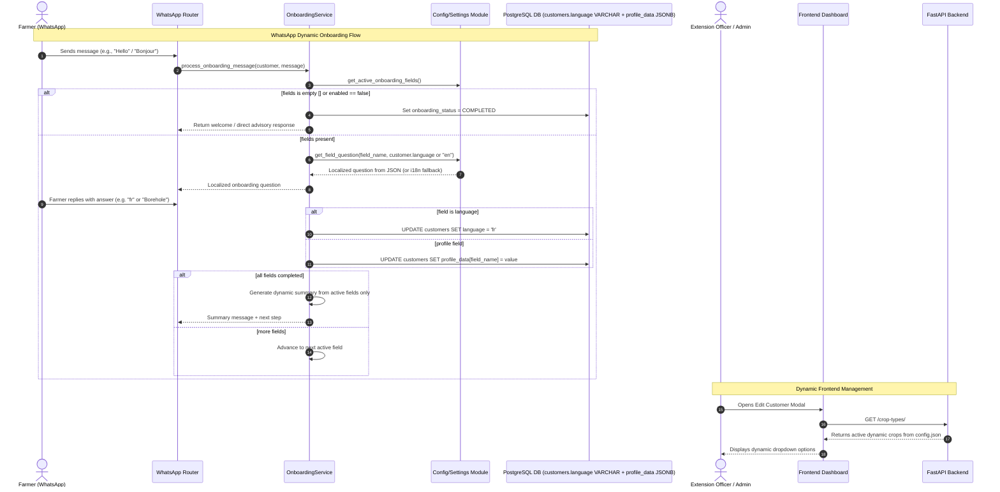

# [MT-001] Configurable Onboarding Questions, Flow & Model/Frontend Decoupling

**Date:** 2026-08-14
**Author:** Galih Pratama
**Status:** Planned / Revised
**Objective:** Decouple hardcoded onboarding questions, field definitions, priorities, localized prompt messages, profile summary generation, and static frontend/backend constants into dynamic JSON configuration schema and API-driven UI, backed by a one-time Alembic migration converting `customers.language` to `VARCHAR(10)` for truly generic, dynamic scaling (e.g., Agriculture EN/SW → Water Management EN/FR → Empty/Bypass).

---

## 📊 Overview

### Purpose & Scaling Vision

AgriConnect's onboarding workflow must be adaptable to different deployment partners without requiring code rewrites:
- **Partner A (Standard Agriculture - Kenya/Tanzania)**: Language (`en`/`sw`), Name, Location, Crop Types (`Avocado`, `Potato`, `Dairy`), Gender, Birth Year.
- **Partner B (Water & Resource Management - Rwanda/DRC)**: Language (`en`/`fr`), Name, Location, Water Source (`Borehole`, `River`, `Piped`), Livestock.
- **Partner C (Direct Advisory - No Onboarding)**: Empty onboarding field list (`"fields": []`), immediately activates conversation.

To achieve this:
1. **One-Time Language Column Migration (`customers.language` → `VARCHAR(10)`)**: Replace the restrictive PostgreSQL `customerlanguage` enum (`'EN'`, `'SW'`) with a standard `VARCHAR(10)` column. This makes `customers.language` a single source of truth capable of natively storing any ISO language code (`en`, `sw`, `fr`, `es`, `rw`, etc.) without dual-storage workarounds.
2. **Universal Profile Storage**: Use `customers.profile_data` (JSONB column) as the store for any partner-specific profile fields (`crop_type`, `water_source`, `irrigation`, `gender`, `birth_year`, etc.).
3. **Decouple Static Model Properties (`models/customer.py:L81-L124`)**:
   - `birth_year`, `crop_type`, `gender`, `age`, `age_group` are retained as convenience accessors over `profile_data` for backward compatibility.
   - Any dynamic partner field (e.g. `water_source`) is accessed universally via `customer.get_profile_field("field_name")`.
4. **Dynamic Profile Summary Generation (`_generate_profile_summary`)**:
   - Replace the static 6-line summary (`f_lang`, `f_name`, `f_administration`, `f_crop_type`, `f_gender`, `f_age`) in `OnboardingService`.
   - Generate summary dynamically by iterating over **active configured fields** in `config.json`. If a field was disabled or omitted (e.g., `crop_type` or `gender` not asked), it will NOT appear in the summary.
5. **Configurable JSON Questions & Flow**: Move all field configurations, questions, translations, retry limits, and priorities to `config.json` (`"onboarding": { "enabled": true, "fields": [...] }`). Support empty arrays `[]` to completely bypass onboarding.
6. **Frontend Decoupling**: Remove hardcoded `CROP_TYPES` in `frontend/src/lib/config.js` and `frontend/src/components/customers/EditCustomerModal.js`, replacing it with dynamic loading from the existing backend endpoint `GET /crop-types/` (which reads from `config.json`).

---

## 🔄 User Experience / Workflow Architecture



---

## 🎯 Design Principles & Constraints

1. **One-Time Clean Migration**:
   - `customers.language` becomes `VARCHAR(10)`. The old `customerlanguage` PostgreSQL enum is cleanly converted using `LOWER(language::text)` and dropped.
   - Future partner deployments with any language code (`fr`, `es`, `de`, `rw`, etc.) require zero additional DB schema changes.

2. **Dynamic Profile Summary**:
   - Profile summary at onboarding completion is built dynamically from active `self.fields_config` fields only. If `gender` or `crop_type` is not configured, it is completely absent from the completion message.

3. **Decoupled Model Access**:
   - `Customer` properties (`crop_type`, `gender`, `birth_year`, `age`, `age_group`) remain non-breaking convenience accessors over `profile_data`. Any generic or partner-specific field is accessible via `get_profile_field(name)` / `set_profile_field(name, value)`.

4. **Empty / Bypass Support (`"fields": []`)**:
   - If `"fields": []` is configured or `"enabled": false`, onboarding is instantly completed on the user's first interaction.

5. **Multi-Language Adaptability in Config**:
   - Supports arbitrary language codes (`en`, `sw`, `fr`, `es`, etc.) inside the `questions` and `success_messages` dictionaries in `config.json`.

---

## 📐 System Audit: Models, Summaries, Migrations & Frontend

### 1. Database & Alembic Migration

**Migration File**: `backend/alembic/versions/2026_08_14_1200-i2b3c4d5e6f7_convert_customer_language_to_string.py`
- **Revision**: `i2b3c4d5e6f7`
- **Revises**: `h1a2b3c4d5e6`

```python
def upgrade() -> None:
    op.execute(
        "ALTER TABLE customers ALTER COLUMN language TYPE VARCHAR(10) "
        "USING LOWER(language::text)"
    )
    op.execute("DROP TYPE IF EXISTS customerlanguage")

def downgrade() -> None:
    op.execute("CREATE TYPE customerlanguage AS ENUM ('en', 'sw')")
    op.execute(
        "ALTER TABLE customers ALTER COLUMN language TYPE customerlanguage "
        "USING language::customerlanguage"
    )
```

### 2. Backend Models Audit (`backend/models/customer.py:L47, L81-L124`)

| Element | Location | Previous Implementation | Target Dynamic Implementation |
|---|---|---|---|
| `Customer.language` | L47 | `Column(Enum(CustomerLanguage), ...)` | `Column(String(10), default=None, nullable=True)` |
| `CustomerLanguage` | L17-L19 | `class CustomerLanguage(enum.Enum): EN = "en", SW = "sw"` | `class CustomerLanguage(str, enum.Enum): EN = "en", SW = "sw"` (StringEnum for full backward compatibility) |
| `Customer.birth_year` | L83-L88 | `@property def birth_year(...)` | Keep as convenience property on `self.profile_data.get("birth_year")` |
| `Customer.crop_type` | L90-L95 | `@property def crop_type(...)` | Keep as convenience property on `self.profile_data.get("crop_type")` |
| `Customer.gender` | L97-L102 | `@property def gender(...)` | Keep as convenience property on `self.profile_data.get("gender")` |
| `Customer.age` & `Customer.age_group` | L104-L124 | `@property def age(...)` & `@property def age_group(...)` | Keep as computed properties. Return `None` safely if `birth_year` is absent. |
| Dynamic Fields Access | L226-L247 | `get_profile_field()`, `set_profile_field()` | Primary universal interface for any partner custom fields (`water_source`, `irrigation`, etc.). |

### 3. Dynamic Profile Summary in `OnboardingService` (`L2047-L2090`)

```python
def _generate_profile_summary(self, customer: Customer, lang: str) -> str:
    """Dynamically build profile summary from active configured fields only."""
    if not self.fields_config:
        return ""

    summary_lines = []
    for field in self.fields_config:
        if not field.enabled:
            continue

        field_name = field.field_name
        label = t(f"onboarding.{field_name}.field_name", lang)

        # Get display value for field
        if field_name == "language":
            val = customer.language or "en"
            display_val = "English" if val == "en" else ("Swahili" if val == "sw" else val)
        elif field_name == "full_name":
            display_val = customer.full_name or "N/A"
        elif field_name == "administration":
            display_val = "N/A"
            if hasattr(customer, "customer_administrative") and customer.customer_administrative:
                display_val = customer.customer_administrative[0].administrative.path
        elif field_name == "crop_type":
            display_val = t(f"crops.{customer.crop_type}.name", lang) if customer.crop_type else "N/A"
        elif field_name == "gender":
            display_val = t(f"gender.{customer.gender}", lang) if customer.gender else "N/A"
        elif field_name == "birth_year":
            label = t("onboarding.common.age", lang)
            display_val = str(customer.age) if customer.age else "N/A"
        else:
            # Generic custom partner field (e.g. water_source)
            raw_val = customer.get_profile_field(field_name)
            display_val = str(raw_val) if raw_val is not None else "N/A"

        summary_lines.append(f"{label}: {display_val}")

    return "\n".join(summary_lines)
```

### 4. Frontend Decoupling Audit (`frontend/`)

| File | Current Hardcoded Pattern | Target Solution |
|---|---|---|
| `frontend/src/lib/config.js` | `export const CROP_TYPES = ["Avocado", "Potato"];` | Deprecate static array; provide fallback only for offline / error states. |
| `frontend/src/components/customers/EditCustomerModal.js` | Imports `CROP_TYPES` from `@/lib/config` | Fetch crop types dynamically on mount via `api.get("/crop-types/")`. Populate select options from API response. |
| `frontend/src/components/customers/CreateCustomerModal.js` & `EditCustomerModal.js` | Hardcoded language select (`en`, `sw`) | Extensible language options with dynamic display fallback. |
| `frontend/src/components/customers/CustomerList.js` | `getLanguageLabel()` switch case | Keep generic fallback `default: return language;` so codes like `fr` render cleanly. |

---

## 🛠️ Technical Specification

### 1. JSON Configuration Schema (`config.json` / `config.template.json` / `config.test.template.json`)

```json
{
  "onboarding": {
    "enabled": true,
    "fields": [
      {
        "field_name": "language",
        "db_field": "language",
        "enabled": true,
        "required": true,
        "priority": 0,
        "extraction_method": "extract_language",
        "matching_method": null,
        "max_attempts": 3,
        "field_type": "string",
        "questions": {
          "en": "Welcome to AgriConnect! 🌱 Your agricultural advisory companion.\nKaribu AgriConnect! 🌱 Mshauri wako wa kilimo.\n\nChoose your language / Chagua lugha yako:\n1. English / Kiingereza\n2. Swahili / Kiswahili",
          "sw": "Karibu AgriConnect! 🌱 Mshauri wako wa kilimo.\n\nChagua lugha yako:\n1. Kiingereza\n2. Kiswahili"
        },
        "success_messages": {
          "en": "Great! Your language preference has been set to English.",
          "sw": "Vizuri! Lugha uliyopendelea imewekwa kuwa Kiswahili."
        }
      },
      {
        "field_name": "full_name",
        "db_field": "full_name",
        "enabled": true,
        "required": true,
        "priority": 1,
        "extraction_method": null,
        "matching_method": null,
        "max_attempts": 1,
        "field_type": "string",
        "questions": {
          "en": "To get started, I need to know your full name.\n\nPlease tell me: What is your full name?",
          "sw": "Kuanza, nahitaji majina yako kamili.\n\nTafadhali niambie: Jina lako kamili ni nani?"
        },
        "success_messages": {
          "en": "Thank you, {value}!",
          "sw": "Asante, {value}!"
        }
      },
      {
        "field_name": "administration",
        "db_field": "customer_administrative",
        "enabled": true,
        "required": true,
        "priority": 2,
        "extraction_method": "extract_location",
        "matching_method": "resolve_administration_ambiguity",
        "max_attempts": 3,
        "field_type": "location",
        "questions": {
          "en": "I need to know your location.\n\nPlease tell me your district and ward.\nFor example: Njoro, Lare",
          "sw": "Ninahitaji kujua eneo lako.\n\nTafadhali niambie wilaya na kata yako.\nMfano: Njoro, Lare"
        },
        "success_messages": {
          "en": "Location saved as {value}.",
          "sw": "Eneo limehifadhiwa kama {value}."
        }
      },
      {
        "field_name": "crop_type",
        "db_field": "crop_type",
        "enabled": true,
        "required": true,
        "priority": 3,
        "extraction_method": "extract_crop_type",
        "matching_method": "resolve_crop_ambiguity",
        "max_attempts": 3,
        "field_type": "string",
        "questions": {
          "en": "What crops do you grow?\n\nPlease select from the list below:\n{available_crops}\n\nReply with the number (e.g., '1', '2', etc.)",
          "sw": "Unalima mazao gani?\n\nTafadhali chagua kutoka orodha hapa chini:\n{available_crops}\n\nJibu kwa namba (mfano, '1', '2', n.k.)"
        },
        "success_messages": {
          "en": "Primary crops recorded: {value}.",
          "sw": "Mazao makuu yamerekodiwa: {value}."
        }
      },
      {
        "field_name": "gender",
        "db_field": "gender",
        "enabled": true,
        "required": false,
        "priority": 4,
        "extraction_method": "extract_gender",
        "matching_method": null,
        "max_attempts": 2,
        "field_type": "enum",
        "questions": {
          "en": "To help us serve you better, may I know your gender?\n\nYou can say: male, female, or other",
          "sw": "Ili tukusaidie vizuri zaidi, naweza kujua jinsia yako?\n\nUnaweza kusema: mwanamume, mwanamke, au nyingine"
        },
        "success_messages": {
          "en": "Thank you for sharing.",
          "sw": "Asante kwa kushiriki."
        }
      },
      {
        "field_name": "birth_year",
        "db_field": "birth_year",
        "enabled": true,
        "required": false,
        "priority": 5,
        "extraction_method": "extract_birth_year",
        "matching_method": null,
        "max_attempts": 2,
        "field_type": "integer",
        "questions": {
          "en": "What year were you born? You can also tell me your age if that's easier.\n\nFor example: '1980' or 'I'm 45 years old'",
          "sw": "Ulizaliwa mwaka gani? Ama unaweza pia kuniambia umri wako.\n\nKwa mfano: '1980' au 'Nina miaka 45'"
        },
        "success_messages": {
          "en": "Got it, thank you!",
          "sw": "Nimeelewa, asante!"
        }
      }
    ]
  }
}
```

### 2. Backend Model Updates (`backend/models/customer.py`)

```python
class CustomerLanguage(str, enum.Enum):
    EN = "en"
    SW = "sw"

class Customer(Base):
    __tablename__ = "customers"

    id = Column(Integer, primary_key=True, index=True)
    phone_number = Column(String, unique=True, index=True, nullable=False)
    full_name = Column(String, nullable=True)
    # Generic string column for dynamic language codes (e.g. 'en', 'sw', 'fr', 'es')
    language = Column(String(10), default=None, nullable=True)
    profile_data = Column(JSON, nullable=True)
```

---

## 🧪 Verification & Test Scenarios

### Automated Pytest Suite (`backend/tests/test_onboarding_config.py`)

| Scenario | What is tested |
|---|---|
| `test_dynamic_language_string_storage` | Setting `"language": "fr"` saves directly to `customer.language == "fr"` via string column |
| `test_dynamic_profile_summary_active_fields_only` | Summary at completion contains only active fields, omitting disabled ones |
| `test_dynamic_profile_summary_empty_when_no_fields` | Summary is empty string when `"fields": []` |
| `test_alembic_migration_language_varchar` | Alembic upgrade alters column to `VARCHAR(10)` and downgrade restores enum |
| `test_empty_fields_bypasses_onboarding` | Setting `"fields": []` completes onboarding on message 1 without asking questions |
| `test_onboarding_disabled_flag` | Setting `"enabled": false` immediately completes onboarding |
| `test_default_fields_loaded_when_no_config` | Missing `onboarding` key in config loads all 6 default fields |
| `test_custom_question_en_sw_overrides` | Custom strings in JSON `questions` are returned for EN and SW |
| `test_custom_success_message_interpolation` | `{value}` in custom `success_messages` interpolates saved name/crop |
| `test_arbitrary_custom_partner_field` | Configuring a new field `"water_source"` extracts and saves to `profile_data["water_source"]` |
| `test_disabled_field_skipped` | Setting `"enabled": false` on `birth_year` skips question during active chat |
| `test_reordered_priorities` | Changing `priority` asks fields in the new custom order |
| `test_custom_max_attempts` | Setting `max_attempts: 1` skips/fails after 1 attempt |
| `test_placeholder_available_crops` | `{available_crops}` is correctly populated in crop question |
| `test_fallback_to_i18n_when_absent` | If field has `questions: null`, falls back to `i18n.py` without error |

---

## ⏱️ Work Breakdown & Estimation

- **Confidence Level**: High

| Task ID | Description | Est. Hours (Min - Max) | Priority |
|---|---|---|---|
| **T-001** | **Alembic Migration**: Create migration `convert_customer_language_to_string` altering `customers.language` to `VARCHAR(10)`. | 1h - 1.5h | Must Have |
| **T-002** | **Model & Schema String Language**: Update `Customer.language` to `String(10)` and `CustomerLanguage` to `(str, Enum)`. | 1h - 1.5h | Must Have |
| **T-003** | **Config Layer**: Add `onboarding` schema to `config.template.json`, `config.test.template.json`, and `config.py`. | 1h - 2h | Must Have |
| **T-004** | **Schema Layer**: Update `OnboardingFieldConfig`, `load_onboarding_fields()`, and filtering in `onboarding_schemas.py`. | 2h - 3h | Must Have |
| **T-005** | **Service Resolution & Dynamic Summary**: Add `_get_question()`, `_get_success_message()`, replace hardcoded `t()` calls, and dynamically generate `_generate_profile_summary()` from active fields. | 2.5h - 3.5h | Must Have |
| **T-006** | **Frontend Dynamic Crops**: Update `EditCustomerModal.js` to fetch crops via `GET /crop-types/`. | 1.5h - 2.5h | Must Have |
| **T-007** | **New Test Suite**: Implement `tests/test_onboarding_config.py` (14 comprehensive test cases). | 3h - 4h | Must Have |
| **T-008** | **Regression Testing & Linting**: Run migration, pytest suite, and flake8/eslint. | 1.5h - 2.5h | Must Have |

**Total Estimated Hours:** **13.5h - 20.5h**
