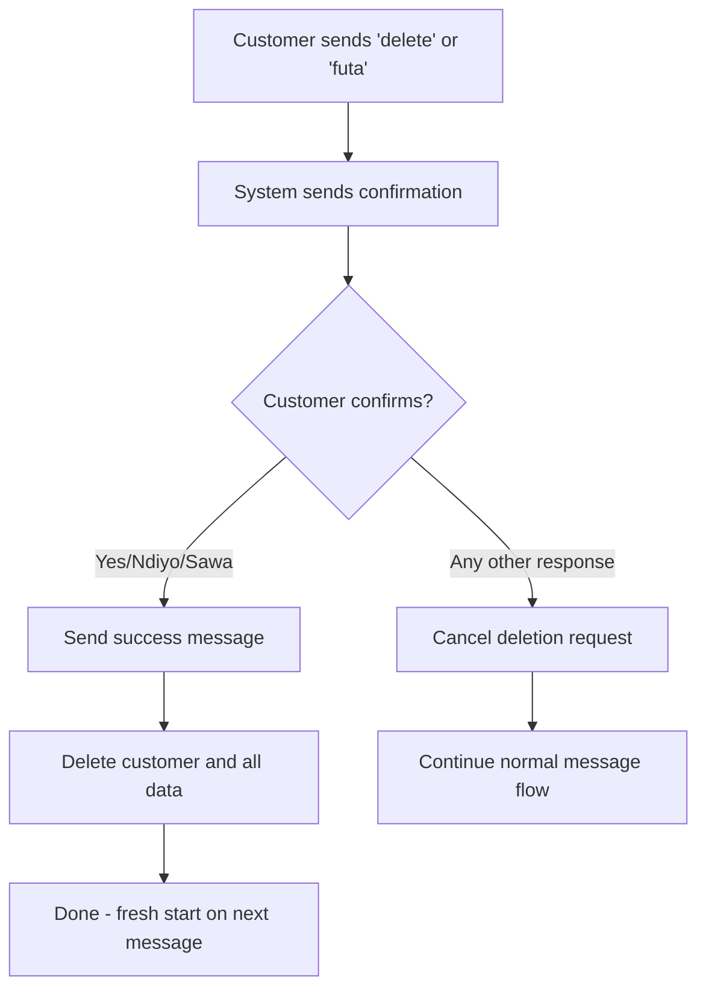

# Customer-Initiated Account Deletion

## Overview

Customers can delete their own account and all associated data by sending a simple message via WhatsApp. This provides a self-service option for data removal without requiring admin intervention.

## How It Works



### Step-by-Step Flow

1. **Customer requests deletion**: Sends "delete" (English) or "futa" (Swahili)
2. **System asks for confirmation**: "Are you sure you want to delete your account?"
3. **Customer confirms**: Replies with "yes", "ndiyo", "sawa", "ok", "okay", or "confirm"
4. **System deletes account**: All customer data is permanently removed
5. **Confirmation sent**: Customer receives success message

### Important Notes

- The "delete" message is **NOT recorded** to the database
- If customer doesn't confirm, the deletion request is cancelled
- Customer can message again to create a new account

## Supported Keywords

### Delete Triggers (case-insensitive, stripped)
| Language | Keyword |
|----------|---------|
| English  | `delete` |
| Swahili  | `futa`   |

### Confirmation Responses
| Response | Description |
|----------|-------------|
| `yes`    | English     |
| `ok`     | Universal   |
| `okay`   | Universal   |
| `ndio`   | Swahili     |
| `ndiyo`  | Swahili     |
| `sawa`   | Swahili     |
| `confirm`| English     |

## Data Deleted

When a customer confirms deletion, the following data is permanently removed:

1. **Customer record** - Profile, phone number, preferences
2. **Messages** - All conversation history
3. **Tickets** - All support tickets
4. **Administrative associations** - Location links
5. **Broadcast recipients** - Broadcast delivery records
6. **Broadcast group contacts** - Group memberships
7. **Weather broadcast recipients** - Weather subscription records

## Technical Implementation

### Key Files

| File | Purpose |
|------|---------|
| `routers/whatsapp.py` | Webhook handler with deletion flow |
| `models/customer.py` | `delete_requested` property for tracking |
| `services/customer_service.py` | `delete_customer()` method |
| `utils/i18n.py` | Confirmation and success messages |

### Customer Model Property

```python
# Stored in profile_data JSON (no migration needed)
@property
def delete_requested(self) -> bool:
    """Check if account deletion was requested and confirmation pending."""
    return self.get_profile_field("delete_requested", False)
```

### i18n Translations

```python
"account": {
    "delete_confirmation": {
        "en": "Are you sure you want to delete your account? ...",
        "sw": "Je, una uhakika unataka kufuta akaunti yako? ..."
    },
    "deleted": {
        "en": "Your account and all associated data have been deleted. ...",
        "sw": "Akaunti yako na data zote zinazohusiana zimefutwa. ..."
    }
}
```

## WhatsApp Profile Description

Add to your WhatsApp business profile:

```
Delete account: send "delete" | Futa akaunti: tuma "futa"
```

## Related Features

- [Weather Subscription](./WEATHER_SUBSCRIPTION.md) - Weather keyword triggers
- [Follow-up Question System](./FOLLOW_UP_QUESTION_SYSTEM.md) - Message flow handling
