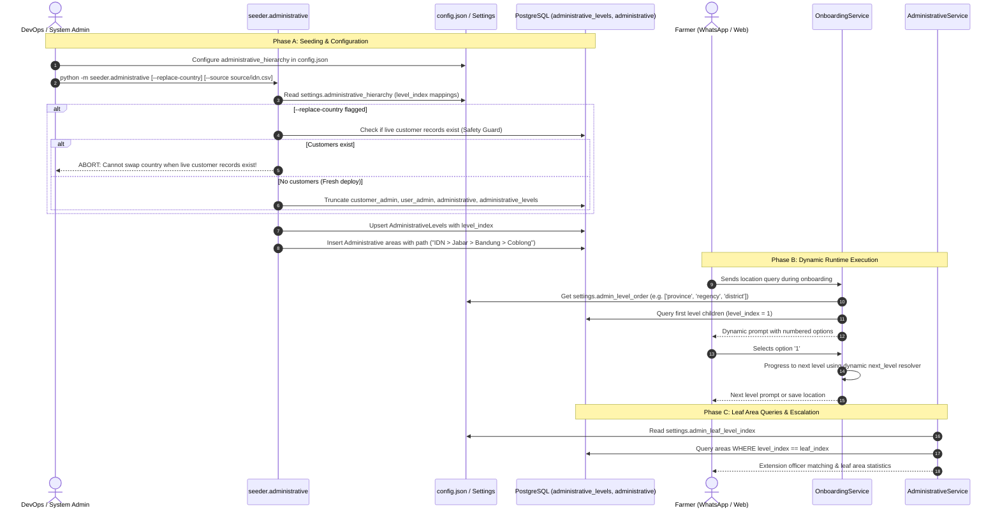

# [MT-002] Remove Hardcoded Administration Level on Model and Develop Dynamic Levels / Administration Seeder

**Date:** 2026-08-17
**Author:** Galih Pratama
**Status:** Approved – Ready for Implementation Review
**Branch:** `feature/187-mt-002-remove-hardcoded-administration-level-on-model-and-develop-dynamic-levels-or-administration-seeder`
**Parent Spec:** [CONFIGURABLE_ONBOARDING_QUESTIONS.md](./CONFIGURABLE_ONBOARDING_QUESTIONS.md) (Improvement Opportunity §3)

---

## 📊 Overview

### 1. Executive Summary
AgriConnect's geographical and administrative boundary system was originally designed around Kenya's 4-tier administrative hierarchy (`Country` $\rightarrow$ `Region` $\rightarrow$ `District` $\rightarrow$ `Ward`). Across the codebase, level names (`"ward"`, `"region"`, `"district"`), hierarchy ordering, and leaf-node definitions are hardcoded as static string constants and fixed conditional branches in `OnboardingService`, `AdministrativeService`, and `StatisticService`.

When deploying AgriConnect internationally (for example, Indonesia: `Provinsi > Kabupaten > Kecamatan > Desa` [4 sub-levels, 5 total with Country], Rwanda: `Province > District > Sector > Cell` [4 sub-levels, 5 total with Country], or Uganda: `Region > District > County > Sub-County > Parish > Village` [6 sub-levels, 7 total with Country]), these hardcoded strings and fixed hierarchy levels prevent the application from functioning without direct codebase rewrites and schema modifications.

This feature specification establishes a **config-driven, dynamic administrative hierarchy engine** and an **administrative seeder with country-swap capabilities** that:
1. Adds an explicit integer `level_index` (`0` for root/country up to `N` for leaf wards/villages) with a `UNIQUE` database constraint to `AdministrativeLevel`.
2. Extends `config.json` with an `administrative_hierarchy` specification defining level names, localized display labels, delimiters, and level indices.
3. Decouples all services (`OnboardingService`, `AdministrativeService`, `StatisticService`) from static level names to dynamic runtime lookups derived from `Settings`.
4. Enhances `backend/seeder/administrative.py` to auto-propagate `level_index` during standard upserts and introduces a `--replace-country` mode with safety guards for fresh country deployments (e.g. Kenya $\rightarrow$ Indonesia).

---

## 🔍 Requirements Discovery (5W1H)

- **Who**: Deployment DevOps engineers, partner organizations in non-Kenya countries, Extension Officers (EOs), and onboarding farmers interacting via WhatsApp/Twilio/Chat.
- **What**:
  - Decouple administrative levels from hardcoded static strings.
  - Implement dynamic hierarchy navigation (0 to $N$ levels).
  - Create a seeder capable of upserting or cleanly swapping national datasets (`--replace-country`).
- **Where**:
  - **Database & Model**: `backend/alembic/versions/`, `backend/models/administrative.py`.
  - **Configuration**: `backend/config.py`, `backend/config.json`, `config.template.json`, `config.test.json`, `config.test.template.json`.
  - **Seeder Engine**: `backend/seeder/administrative.py`.
  - **Service Layer**: `backend/services/onboarding_service.py`, `backend/services/administrative_service.py`, `backend/services/statistic_service.py`.
  - **Localization**: `backend/locales/en.json`, `backend/locales/sw.json`, `backend/locales/id.json` (optional).
  - **Test Suite**: `backend/tests/test_admin_dynamic_levels.py`.
- **When**: Executed prior to multi-country international rollouts.
- **Why**: Eliminates manual code modifications and migrations when deploying to new partner countries with arbitrary administrative depths.
- **How**:
  - `AdministrativeLevel.level_index` provides numeric depth ordering.
  - Config defines `levels`, `country_code`, and `delimiter`.
  - Services query dynamic properties (`settings.admin_level_order`, `settings.admin_leaf_level_index`).
  - Seeder truncates/replaces areas in FK-safe order when changing countries.

---

## 🌍 Multi-Country Hierarchy Comparison

| Country | Code | Depth | Level 0 (Root) | Level 1 | Level 2 | Level 3 (Leaf / Ward) | Level 4+ |
|---|---|---|---|---|---|---|---|
| **Kenya** *(Current)* | `KEN` | 4 | `country` | `region` (County) | `district` (Sub-County) | `ward` | — |
| **Indonesia** *(Target)* | `IDN` | 5 | `country` | `province` (*Provinsi*) | `regency` (*Kabupaten/Kota*) | `district` (*Kecamatan*) | `village` (*Desa/Kelurahan*) |
| **Rwanda** | `RWA` | 5 | `country` | `province` | `district` | `sector` | `cell` |
| **Tanzania** | `TZA` | 4 | `country` | `region` (*Mkoa*) | `district` (*Wilaya*) | `ward` (*Kata*) | — |

---

## 🔄 Architecture & Data Flow



---

## 🔍 Comprehensive Hardcode Audit

| # | File Location | Existing Hardcoded Implementation | Issue / Limitation | Target Dynamic Resolution |
|---|---|---|---|---|
| 1 | `backend/models/administrative.py:L7-L12` | `class AdministrativeLevel(Base): name = Column(String(20))` | No sorting column or depth index; database cannot know which level is parent/leaf. | Add `level_index = Column(Integer, nullable=True, unique=True)`. |
| 2 | `backend/services/onboarding_service.py:L78` | `self.admin_level_order = ["region", "district", "ward"]` | Fixed 3-level Kenya array. Fails on 2-level or 4+-level countries. | Replace with `self.admin_level_order = settings.admin_level_order`. |
| 3 | `backend/services/onboarding_service.py:L388` | `AdministrativeLevel.name == "country"` | Hardcoded string `"country"` assumes level name is literally `"country"`. | Replace with `AdministrativeLevel.name == settings.admin_country_level_name` or `level_index == 0`. |
| 4 | `backend/services/onboarding_service.py:L454` | `t("onboarding.administration.select_region", lang)` | Fixed i18n key for first level assumes region. | Dynamic: `t(f"onboarding.administration.select_{first_level}", lang)` with fallback to `select_level`. |
| 5 | `backend/services/onboarding_service.py:L541-L554` | `if next_level == "district": ... else: # ward` | Binary `if/else` breaks for hierarchies with 4 or more levels. | Dynamic: `t(f"onboarding.administration.select_{next_level}", lang)` with fallback to `select_next`. |
| 6 | `backend/services/onboarding_service.py:L1142-L1152` | `path_parts` assumes 4 fixed indexes (country, province, district, ward) | String parsing assumes fixed positions. | Dynamic level index lookup based on path depth. |
| 7 | `backend/services/onboarding_service.py:L2349, L2392` | Fallback prompt string: `"province/region, district, and ward"` | Error prompts hardcode Kenya geographic names. | Build dynamic string: `" / ".join(settings.admin_level_order)`. |
| 8 | `backend/services/administrative_service.py:L247, L262` | `func.lower(AdministrativeLevel.name) == "ward"` in `get_descendant_ward_ids()` | Extension officer routing and filtering strictly looks for `"ward"`. | Query `AdministrativeLevel.level_index == settings.admin_leaf_level_index`. |
| 9 | `backend/services/statistic_service.py:L362` | `AdministrativeLevel.name == "Ward"` in `get_ward_statistics()` | Ward statistics calculation breaks if leaf level is `"Desa"` or `"Cell"`. | Query `AdministrativeLevel.level_index == settings.admin_leaf_level_index`. |
| 10 | `backend/services/statistic_service.py:L1423-L1428` | Static dictionary `level_hierarchy = {"country": "region", "region": "district", "district": "ward", "ward": "ward"}` | Matrix breakdown cannot drill down into arbitrary depths. | Dynamically generate hierarchy map from `settings.administrative_hierarchy`. |
| 11 | `backend/services/statistic_service.py:L1434, L1450` | `AdministrativeLevel.name == "region"` fallback | Assumes fallback child level is `"region"`. | Fallback to `settings.admin_level_order[0]`. |
| 12 | `backend/seeder/administrative.py:L34-L47` | `get_or_create_level(db, level_name)` does not assign `level_index` | Existing levels have `NULL` level index. | Read `level_index_map` from config, pass `level_index`, and backfill existing rows. |
| 13 | `backend/seeder/administrative.py` | No CLI args or purge mechanism for country swaps | Switching country CSV leaves old country data orphaned/mixed. | Add `argparse` with `--replace-country`, `--source`, and `clear_administrative_data()` with safety checks. |

---

## 🛠️ Step-by-Step Technical Implementation Plan

### Task T-001: Database Migration (Alembic)

**Target File**: `backend/alembic/versions/2026_08_17_1000-j3c4d5e6f7g8_add_level_index_to_administrative_levels.py`
**Revises**: `i2b3c4d5e6f7`

```python
"""add level_index to administrative_levels

Revision ID: j3c4d5e6f7g8
Revises: i2b3c4d5e6f7
Create Date: 2026-08-17 10:00:00.000000
"""
from alembic import op
import sqlalchemy as sa

# revision identifiers, used by Alembic.
revision = 'j3c4d5e6f7g8'
down_revision = 'i2b3c4d5e6f7'
branch_labels = None
depends_on = None


def upgrade() -> None:
    # 1. Add level_index column as nullable
    op.add_column(
        'administrative_levels',
        sa.Column('level_index', sa.Integer(), nullable=True)
    )
    # 2. Add unique constraint on level_index
    op.create_unique_constraint(
        'uq_administrative_levels_level_index',
        'administrative_levels',
        ['level_index']
    )


def downgrade() -> None:
    op.drop_constraint(
        'uq_administrative_levels_level_index',
        'administrative_levels',
        type_='unique'
    )
    op.drop_column('administrative_levels', 'level_index')
```

---

### Task T-002: Model Update (`AdministrativeLevel`)

**Target File**: `backend/models/administrative.py`

```python
class AdministrativeLevel(Base):
    __tablename__ = "administrative_levels"

    id = Column(Integer, primary_key=True, index=True)
    name = Column(String(20), unique=True, nullable=False)
    level_index = Column(Integer, unique=True, nullable=True)  # 0=country, 1=region, ..., N=leaf

    # Relationships
    administrative_areas = relationship(
        "Administrative", back_populates="level"
    )
```

---

### Task T-003: Configuration Layer & JSON Schemas

#### 1. `backend/config.py` Settings Additions

```python
# Administrative hierarchy configuration defaults (Kenya 4-level standard)
_admin_hierarchy_default = {
    "country_code": "KEN",
    "delimiter": " > ",
    "levels": [
        {"level_index": 0, "name": "country", "display": {"en": "Country"}},
        {"level_index": 1, "name": "region", "display": {"en": "Region", "sw": "Mkoa"}},
        {"level_index": 2, "name": "district", "display": {"en": "District", "sw": "Wilaya"}},
        {"level_index": 3, "name": "ward", "display": {"en": "Ward", "sw": "Kata"}},
    ],
}

administrative_hierarchy: dict = _config.get(
    "administrative_hierarchy", _admin_hierarchy_default
)

@property
def admin_level_order(self) -> list[str]:
    """Ordered list of administrative level names excluding root country (level_index > 0)."""
    levels = self.administrative_hierarchy.get("levels", [])
    filtered = [l for l in levels if l.get("level_index", 0) > 0]
    filtered.sort(key=lambda x: x.get("level_index", 99))
    return [l["name"] for l in filtered]

@property
def admin_country_level_name(self) -> str:
    """Name of the root country level (level_index == 0)."""
    levels = self.administrative_hierarchy.get("levels", [])
    root = next((l for l in levels if l.get("level_index") == 0), None)
    return root["name"] if root else "country"

@property
def admin_leaf_level_name(self) -> str:
    """Name of the deepest (leaf) administrative level."""
    levels = self.administrative_hierarchy.get("levels", [])
    if not levels:
        return "ward"
    return max(levels, key=lambda l: l.get("level_index", 0))["name"]

@property
def admin_leaf_level_index(self) -> int:
    """level_index of the deepest (leaf) administrative level."""
    levels = self.administrative_hierarchy.get("levels", [])
    if not levels:
        return 3
    return max(levels, key=lambda l: l.get("level_index", 0)).get("level_index", 3)

@property
def admin_delimiter(self) -> str:
    """Delimiter used in human-readable path strings."""
    return self.administrative_hierarchy.get("delimiter", " > ")
```

#### 2. `backend/config.json`, `config.template.json`, `config.test.json`, `config.test.template.json`

Add top-level block:
```json
"administrative_hierarchy": {
  "country_code": "KEN",
  "delimiter": " > ",
  "levels": [
    { "level_index": 0, "name": "country", "display": { "en": "Country" } },
    { "level_index": 1, "name": "region", "display": { "en": "Region", "sw": "Mkoa" } },
    { "level_index": 2, "name": "district", "display": { "en": "District", "sw": "Wilaya" } },
    { "level_index": 3, "name": "ward", "display": { "en": "Ward", "sw": "Kata" } }
  ]
}
```

---

### Task T-004: Dynamic Seeder & Country Swap Engine

**Target File**: `backend/seeder/administrative.py`

#### 1. `get_or_create_level()` with `level_index` & Backfill Support

```python
def get_or_create_level(
    db: Session, level_name: str, level_index: Optional[int] = None
) -> AdministrativeLevel:
    """Get or create administrative level with optional level_index and auto-backfill."""
    level = (
        db.query(AdministrativeLevel)
        .filter(AdministrativeLevel.name == level_name)
        .first()
    )
    if not level:
        level = AdministrativeLevel(name=level_name, level_index=level_index)
        db.add(level)
        db.commit()
        db.refresh(level)
    elif level_index is not None and level.level_index != level_index:
        level.level_index = level_index
        db.commit()
        db.refresh(level)
    return level
```

#### 2. FK-Safe Database Purge Function

```python
from models.customer import Customer
from models.administrative import CustomerAdministrative, UserAdministrative

def clear_administrative_data(db: Session) -> dict:
    """
    Safely remove all administrative data in FK-safe order.

    Deletion sequence:
      1. customer_administrative
      2. user_administrative
      3. administrative
      4. administrative_levels
    """
    ca_count = db.query(CustomerAdministrative).delete()
    ua_count = db.query(UserAdministrative).delete()
    a_count = db.query(Administrative).delete()
    al_count = db.query(AdministrativeLevel).delete()
    db.commit()
    return {
        "customer_administrative": ca_count,
        "user_administrative": ua_count,
        "administrative": a_count,
        "administrative_levels": al_count,
    }
```

#### 3. CLI Argument Parsing & Safety Guard

```python
def main():
    parser = argparse.ArgumentParser(description="Seed administrative data from CSV")
    parser.add_argument(
        "--replace-country",
        action="store_true",
        help="Clear ALL existing administrative data before seeding (fresh deployments only)",
    )
    parser.add_argument(
        "--source",
        type=str,
        default=None,
        help="Path to source CSV file (default: backend/source/administrative.csv)",
    )
    args = parser.parse_args()

    db = SessionLocal()
    try:
        if args.replace_country:
            # SAFETY GUARD: Abort if live customer data exists
            customer_count = db.query(Customer).count()
            if customer_count > 0:
                print(
                    f"❌ ERROR: Cannot run --replace-country! Found {customer_count} "
                    "live customer records in database. Country replacement is restricted "
                    "to fresh deployments to prevent data corruption."
                )
                sys.exit(1)

            print("⚠️  REPLACE-COUNTRY mode active: Purging all existing administrative entities...")
            cleared = clear_administrative_data(db)
            print(f"🗑️  Purged records: {cleared}")

        # Resolve CSV path
        csv_path = args.source or os.path.join(
            os.path.dirname(os.path.dirname(__file__)),
            "source",
            "administrative.csv",
        )
        ...
```

---

### Task T-005: `OnboardingService` Decoupling & Localization

**Target File**: `backend/services/onboarding_service.py`

#### 1. Constructor Initialization
```python
# BEFORE
self.admin_level_order = ["region", "district", "ward"]

# AFTER
self.admin_level_order = settings.admin_level_order
```

#### 2. Root Country Level Query (`_get_children_at_level`)
```python
# BEFORE
.filter(AdministrativeLevel.name == "country")

# AFTER
.filter(AdministrativeLevel.name == settings.admin_country_level_name)
```

#### 3. First Level Prompt (`_start_hierarchical_selection`)
```python
# BEFORE
message = t("onboarding.administration.select_region", lang, options=options_text)

# AFTER
primary_key = f"onboarding.administration.select_{first_level}"
msg_template = t(primary_key, lang)
if msg_template == primary_key:
    # Fallback to generic prompt if level-specific key does not exist
    msg_template = t("onboarding.administration.select_level", lang)
message = msg_template.format(options=options_text)
```

#### 4. Next Level Prompt (`_process_hierarchical_selection`)
```python
# BEFORE
if next_level == "district":
    message = t("onboarding.administration.select_district", lang, parent=selected_admin.name, options=options_text)
else: # ward
    message = t("onboarding.administration.select_ward", lang, parent=selected_admin.name, options=options_text)

# AFTER
level_key = f"onboarding.administration.select_{next_level}"
msg_template = t(level_key, lang)
if msg_template == level_key:
    msg_template = t("onboarding.administration.select_next", lang)
message = msg_template.format(parent=selected_admin.name, options=options_text)
```

#### 5. Localization Fallback Keys in `locales/en.json` & `locales/sw.json`

In `backend/locales/en.json`:
```json
"onboarding": {
  "administration": {
    "select_level": "Let's find your location step by step.\n\nPlease select your area:\n\n{options}",
    "select_next": "Great! You selected {parent}.\n\nPlease choose your sub-area:\n\n{options}"
  }
}
```

In `backend/locales/sw.json`:
```json
"onboarding": {
  "administration": {
    "select_level": "Hebu tupate eneo lako hatua kwa hatua.\n\nTafadhali chagua eneo lako:\n\n{options}",
    "select_next": "Vizuri! Umechagua {parent}.\n\nTafadhali chagua eneo dogo:\n\n{options}"
  }
}
```

---

### Task T-006: `AdministrativeService` Decoupling

**Target File**: `backend/services/administrative_service.py`

Update `get_descendant_ward_ids` to query using the dynamic leaf level index:

```python
@staticmethod
def get_descendant_ward_ids(
    db: Session, administrative_id: int
) -> List[int]:
    """
    Get all leaf administrative IDs (wards/villages) that are descendants of the given administrative area.
    """
    from config import settings

    admin = (
        db.query(Administrative)
        .filter(Administrative.id == administrative_id)
        .first()
    )
    if not admin:
        return [administrative_id]

    leaf_level = (
        db.query(AdministrativeLevel)
        .filter(AdministrativeLevel.level_index == settings.admin_leaf_level_index)
        .first()
    )

    # If this is already a leaf node, return just itself
    if leaf_level and admin.level_id == leaf_level.id:
        return [administrative_id]

    descendant_wards = (
        db.query(Administrative.id)
        .join(AdministrativeLevel)
        .filter(
            Administrative.path.like(f"{admin.path} > %"),
            AdministrativeLevel.level_index == settings.admin_leaf_level_index
        )
        .all()
    )

    return [w.id for w in descendant_wards]
```

---

### Task T-007: `StatisticService` Dynamic Hierarchy Resolution

**Target File**: `backend/services/statistic_service.py`

#### 1. `get_ward_statistics()`
```python
# BEFORE
ward_level = self.db.query(AdministrativeLevel).filter(AdministrativeLevel.name == "Ward").first()

# AFTER
from config import settings
leaf_level = (
    self.db.query(AdministrativeLevel)
    .filter(AdministrativeLevel.level_index == settings.admin_leaf_level_index)
    .first()
)
```

#### 2. `_get_child_level()` Dynamic Hierarchy Generation
```python
def _get_child_level(
    self, administrative_id: Optional[int]
) -> Tuple[Optional[AdministrativeLevel], str]:
    """
    Determine the child level dynamically based on settings.administrative_hierarchy.
    """
    from config import settings

    level_order = [settings.admin_country_level_name] + settings.admin_level_order

    # Build dynamic hierarchy mapping: level_name -> child_level_name
    level_hierarchy = {}
    for i, name in enumerate(level_order):
        # Leaf level maps to itself
        next_name = level_order[i + 1] if i + 1 < len(level_order) else name
        level_hierarchy[name.lower()] = next_name.lower()

    first_child_name = settings.admin_level_order[0] if settings.admin_level_order else "region"

    if not administrative_id:
        child_level = (
            self.db.query(AdministrativeLevel)
            .filter(AdministrativeLevel.name == first_child_name)
            .first()
        )
        return child_level, first_child_name.capitalize()

    parent_admin = (
        self.db.query(Administrative)
        .filter(Administrative.id == administrative_id)
        .first()
    )

    if not parent_admin or not parent_admin.level:
        child_level = (
            self.db.query(AdministrativeLevel)
            .filter(AdministrativeLevel.name == first_child_name)
            .first()
        )
        return child_level, first_child_name.capitalize()

    parent_level_name = parent_admin.level.name.lower()
    child_level_name = level_hierarchy.get(parent_level_name, first_child_name.lower())

    child_level = (
        self.db.query(AdministrativeLevel)
        .filter(func.lower(AdministrativeLevel.name) == child_level_name)
        .first()
    )

    return child_level, child_level_name.capitalize()
```

---

### Task T-008: Comprehensive Test Suite

**Target File**: `backend/tests/test_admin_dynamic_levels.py`

| # | Test Case Identifier | Scenario / Assertion Tested |
|---|---|---|
| 1 | `test_level_index_column_exists_and_unique` | Verify `level_index` column exists on `AdministrativeLevel` and rejects duplicate indices. |
| 2 | `test_seeder_assigns_level_index_from_config` | Seeder creates levels with matching `level_index` values (0, 1, 2, 3). |
| 3 | `test_seeder_backfills_missing_level_index` | Pre-existing rows with `level_index=None` are updated with correct index. |
| 4 | `test_settings_admin_level_order_kenya` | Default Kenya config yields `['region', 'district', 'ward']`. |
| 5 | `test_settings_admin_leaf_level_properties` | `admin_leaf_level_name == 'ward'` and `admin_leaf_level_index == 3`. |
| 6 | `test_custom_4_level_indonesia_config` | 4-tier hierarchy (`provinsi`, `kabupaten`, `kecamatan`, `desa`) correctly reflects in properties. |
| 7 | `test_onboarding_service_initializes_from_config` | `OnboardingService.admin_level_order` dynamically matches config. |
| 8 | `test_get_descendant_ward_ids_uses_leaf_index` | Resolves descendants using `level_index` even if leaf is named `"Desa"`. |
| 9 | `test_statistic_child_level_navigation` | Parent area correctly resolves next child level across all hierarchy tiers. |
| 10 | `test_statistic_leaf_level_returns_self` | Lowest tier (leaf) returns itself without error. |
| 11 | `test_replace_country_safety_guard_blocks_live_data` | Seeder `--replace-country` raises SystemExit / error when `Customer` count > 0. |
| 12 | `test_replace_country_clean_purge_on_fresh_db` | When `Customer` count == 0, seeder cleanly purges and seeds replacement country. |
| 13 | `test_i18n_fallback_prompts_on_custom_levels` | Custom level names safely fall back to `select_level` and `select_next` locale strings. |

---

## 📖 Operational Runbooks & CLI Guide

### 1. Standard Kenya Seeding (Default Upsert)
```bash
# Executed in backend container
./dc.sh exec backend python -m seeder.administrative
```

### 2. Country Swap: Indonesia Deployment (Fresh Database)
```bash
# 1. Place indonesia CSV at backend/source/indonesia.csv
# 2. Update backend/config.json with Indonesian administrative_hierarchy
# 3. Execute country swap seeder
./dc.sh exec backend python -m seeder.administrative --replace-country --source source/indonesia.csv
```

---

## ⏱️ Ballpark Estimation

- **Standard Developer Estimate**: **9.0h – 13.5h**
- **Pair Programming with Vibe Coding (Accelerated)**: **3.0h – 4.5h**
- **Confidence Level**: High

| Task ID | Component & Description | Status | Standard Est. | Pair Programming (Vibe Coding) | Priority |
| --- | --- | --- | --- | --- | --- |
| **T-001** | Database Migration (`level_index` column & unique constraint) | `PLANNED` | 0.5h – 1.0h | 15m – 20m | Must Have |
| **T-002** | Model Update (`AdministrativeLevel.level_index`) | `PLANNED` | 0.5h | 10m – 15m | Must Have |
| **T-003** | Config Layer (`Settings` properties & JSON templates) | `PLANNED` | 1.0h – 1.5h | 20m – 30m | Must Have |
| **T-004a** | Dynamic Seeder (`level_index` propagation & auto-backfill) | `PLANNED` | 1.0h – 1.5h | 25m – 35m | Must Have |
| **T-004b** | Country Swap Engine (`--replace-country`, safety guards, purge) | `PLANNED` | 1.0h – 1.5h | 25m – 35m | Must Have |
| **T-005** | `OnboardingService` Dynamic Hierarchy & Localization | `PLANNED` | 1.5h – 2.0h | 30m – 45m | Must Have |
| **T-006** | `AdministrativeService` Dynamic Leaf Resolver | `PLANNED` | 0.5h – 1.0h | 15m – 20m | Must Have |
| **T-007** | `StatisticService` Dynamic Hierarchy Matrix | `PLANNED` | 1.0h – 1.5h | 20m – 30m | Must Have |
| **T-008** | Automated Test Suite (13 Scenarios) & Regression Verification | `PLANNED` | 2.0h – 3.0h | 40m – 60m | Must Have |
| **Total** | | | **9.0h – 13.5h** | **3.0h – 4.5h** | |
