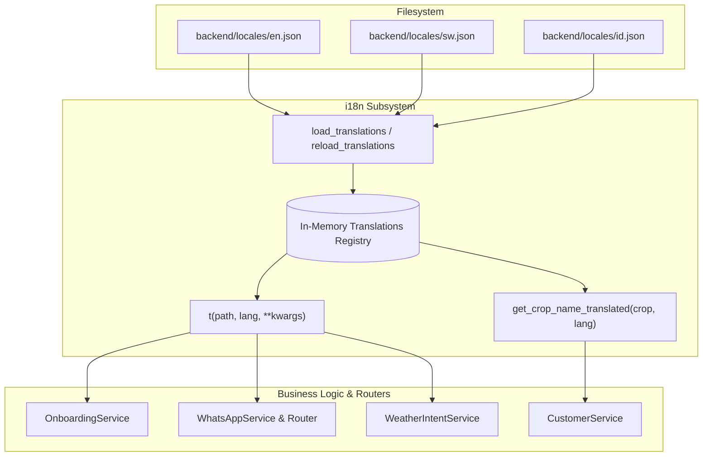

# Dynamic File-Based i18n Locale System Specification

**Feature:** Dynamic File-Based i18n Locale System
**Document:** `docs/DYNAMIC_I18N_LOCALE_SYSTEM.md`
**Status:** Approved
**Target:** Backend Localization Refactor

---

## 📊 Overview

### Purpose
Currently, onboarding questions and field configurations are driven by `config.json`. However, all underlying system dialogues (location hierarchy resolution, consent messages, weather subscription prompts, account deletion flows, escalation contacts, AI disclaimers, and common error messages) are statically hardcoded in Python dictionaries inside `backend/utils/i18n.py`.

This feature decouples system translations from Python code into language-specific JSON locale files under `backend/locales/` (`en.json`, `sw.json`, `id.json`, etc.), allowing partners to deploy AgriConnect in any new language with **zero Python code modifications**.

---

## 📐 Architecture Design



---

## 1. Directory Structure

```
backend/
├── locales/
│   ├── en.json      # English base system strings
│   ├── sw.json      # Swahili translated system strings
│   └── id.json      # Indonesian (or additional target languages)
└── utils/
    └── i18n.py      # Dynamic loader, lookup resolver, fallback handler
```

---

## 2. Dynamic Lookup & Fallback Protocol

1. **Resolution Sequence**:
   - `t(path, lang)` inspects `_locales.get(lang)`.
   - Traverses dot-notation key (e.g. `consent.data_sharing.question`).
   - If key is found in target language $\rightarrow$ returns translated string.
   - If key or language is missing $\rightarrow$ falls back to `_locales.get("en")` (or `settings.default_language`).
   - If key is missing entirely $\rightarrow$ returns raw `path`.
2. **String Interpolation**:
   - Safely interpolates `**kwargs` into formatting placeholders (e.g. `{options}`, `{parent}`, `{field}`).
3. **Crop Name Translation**:
   - `get_crop_name_translated(crop_name, lang)` looks up `crops.{crop_name}.name` in the active locale, returning original `crop_name` if not defined.

---

## 3. Tasks & Estimates

| Task ID | Component | Description | Status | Est. Hours |
| :--- | :--- | :--- | :--- | :--- |
| **T-001** | `backend/locales/en.json` | Extract all English translation keys from `i18n.py` into clean JSON schema | `COMPLETED` | 1.5h |
| **T-002** | `backend/locales/sw.json` | Extract all Swahili translation keys matching `en.json` | `COMPLETED` | 1.5h |
| **T-003** | `backend/utils/i18n.py` | Implement `load_translations()`, `reload_translations()`, dynamic `t()`, and backward-compatible `trans` proxy | `COMPLETED` | 2.0h |
| **T-004** | `backend/tests/test_utils_i18n.py` | Add unit tests for dynamic locale loading, runtime reloads, multi-language fallback, and kwargs interpolation | `COMPLETED` | 1.5h |
| **T-005** | Regression & Linting | Run full pytest test suite (1,053 tests passing) and Flake8 compliance | `COMPLETED` | 1.0h |

**Total Estimated Effort**: 7.5 developer hours (Confidence: High)
**Status**: All tasks completed, 1,053/1,053 tests passing (100%).

