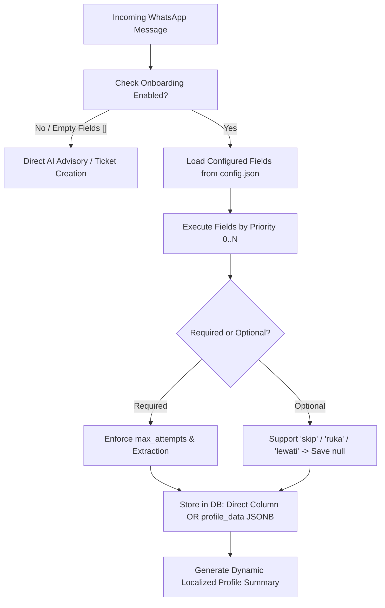

# Dynamic Onboarding & Locale Configuration Guide

**Version:** 1.0
**Target:** AgriConnect Administrators, Technical Project Managers & Partner Integrators
**Scope:** Multi-Partner Dynamic Onboarding Engine & File-Based i18n System

---

## 1. Executive Summary & Architecture

AgriConnect features a **zero-code dynamic onboarding engine**. It allows system administrators and partner organizations (e.g., NGOs, agricultural cooperatives, governmental extension programs) to completely customize or disable the farmer onboarding experience simply by editing JSON configuration files.



### Key Capabilities:
- **Zero-Code Customization**: Add new questions, change order, remove fields, or adjust retry limits without touching Python code.
- **Single-Language Auto-Bypass**: When only one language is configured (`languages: [{"code": "en", ...}]`), the system automatically assigns the default language to customer profiles and bypasses the language prompt so farmers jump straight to the first question (e.g. `full_name`).
- **Zero-Onboarding Mode**: Bypass onboarding completely (`fields: []`) for instant agricultural advisory.
- **Dynamic Field Storage**: Known columns (`full_name`, `language`, `gender`, `birth_year`) map to direct database columns; all custom partner fields (e.g., `farm_size_ha`, `certification`, `coop_member_id`) are automatically saved into `customers.profile_data` (PostgreSQL JSONB).
- **File-Based i18n**: Add new languages (e.g., Indonesian, French, Spanish, Oromo) in minutes by dropping a `{lang_code}.json` file into `backend/locales/`.

---

## 2. Configuration File Structure (`config.json`)

The system configuration is defined in `backend/config.json`. Below is the top-level schema:

```json
{
  "default_language": "en",
  "languages": [
    { "code": "en", "name": "English", "active": true },
    { "code": "sw", "name": "Swahili", "active": true },
    { "code": "id", "name": "Bahasa Indonesia", "active": true }
  ],
  "crop_types": ["Avocado", "Coffee", "Cacao", "Potato", "Dairy"],
  "age_groups": [
    { "label": "20-35", "min": 20, "max": 35 },
    { "label": "36-50", "min": 36, "max": 50 },
    { "label": "51+", "min": 51, "max": null }
  ],
  "onboarding": {
    "enabled": true,
    "fields": [ ... ]
  },
  "contact_info": {
    "name": "Admin Support",
    "phone_number": "+254700000000"
  }
}
```

---

## 3. Field Parameter Reference

Each object in `onboarding.fields` defines a single onboarding step.

| Parameter | Type | Required? | Default | Description |
|---|---|---|---|---|
| `field_name` | `string` | **Yes** | — | Unique identifier for the field (e.g., `full_name`, `language`, `farm_size_ha`). |
| `field_type` | `string` | **Yes** | `"string"` | Data type: `"string"`, `"integer"`, `"enum"`, or `"location"`. |
| `db_field` | `string` | **Yes** | `field_name` | Database column name. If it matches a column in `customers` table (`full_name`, `language`, `gender`, `birth_year`), it writes to that column; otherwise it writes to `customers.profile_data` JSONB. |
| `enabled` | `boolean` | No | `true` | Set `false` to disable this question without deleting its definition. |
| `required` | `boolean` | No | `true` | `true`: Farmer must provide a valid answer before proceeding.<br>`false`: Optional; system automatically appends a skip prompt (e.g., *"Reply 'skip' if you prefer not to answer"*). |
| `priority` | `integer` | No | `99` | Determines question order (lowest number asked first: `0`, `1`, `2`, ...). |
| `max_attempts` | `integer` | No | `3` | Maximum times the bot will reprompt after invalid/unrecognized input before triggering fallback or abort. |
| `extraction_method` | `string` or `null` | No | `null` | Name of the extraction algorithm used to parse the farmer's response (see section 4). |
| `matching_method` | `string` or `null` | No | `null` | Disambiguation method for multi-match resolution (e.g., `resolve_administration_ambiguity`, `resolve_crop_ambiguity`). |
| `questions` | `object` or `string` | **Yes** | — | Multilingual question copy mapped by language code: `{"en": "...", "sw": "...", "id": "..."}` or a single raw string. |
| `labels` | `object` | No | `{}` | Multilingual label used when generating the final profile summary: `{"en": "Full Name", "id": "Nama Lengkap"}`. |
| `success_messages` | `object` | No | `{}` | Multilingual confirmation sent upon successfully saving the field. Supports `{value}` interpolation. |
| `success_message_template`| `string` | No | `null` | Fallback single-language template string (e.g., `"Saved as {value}."`). |

---

## 4. Extraction Methods Reference (`extraction_method`)

| Value | When to Use | Behavior & Examples |
|---|---|---|
| `null` | Standard text, notes, custom partner fields | **Saves raw message text directly**. Ideal for arbitrary open-ended responses (e.g., `"2.5 ha"`, `"Rainforest Alliance"`, `"10 years"`). |
| `"extract_name"` | Full name questions | Cleans conversational greetings: `"My name is John Doe"` $\rightarrow$ `"John Doe"`, `"Nama saya Budi"` $\rightarrow$ `"Budi"`, `"Wayan"` $\rightarrow$ `"Wayan"`. |
| `"extract_language"` | Language selection | Dynamically resolves 1-based index numbers (`"1"`, `"2"`) and language names/aliases (`"swahili"`, `"bahasa"`) based on configured `languages`. |
| `"extract_location"` | Administrative location | AI-powered extraction matching against hierarchical administrative database (`Region > District > Ward`). |
| `"extract_crop_type"` | Crop selection | Parses numbers (`"1"`, `"2"`) or crop names matching the configured `crop_types` list. |
| `"extract_gender"` | Gender demographic | Normalizes input to `male`, `female`, or `other`. |
| `"extract_birth_year"` | Age / Birth year | Converts raw age (`"35"`, `"I am 35 years old"`) or year (`"1989"`) to a 4-digit birth year integer (`1989`). |

---

## 5. Adding New Languages (`backend/locales/`)

To add a new language (e.g., **Indonesian / `id`**):

### Step 1: Add language code to `config.json`
```json
"languages": [
  { "code": "en", "name": "English", "active": true },
  { "code": "sw", "name": "Swahili", "active": true },
  { "code": "id", "name": "Bahasa Indonesia", "active": true }
]
```

### Step 2: Create `backend/locales/id.json`
Copy `backend/locales/en.json` to `backend/locales/id.json` and translate the values:

```json
{
  "onboarding": {
    "common": {
      "extraction_failed": "Maaf, kami tidak dapat memahami informasi tersebut. {question}",
      "selection_prompt": "Balas dengan nomor pilihan Anda (contoh: '1', '2')",
      "skip_instruction": "\n\n(Balas 'lewati' jika tidak ingin menjawab)",
      "completion": "Selesai! Profil petani Anda telah terdaftar:\n\n{profile_summary}"
    }
  },
  "consent": {
    "data_sharing": {
      "question": "Data Anda dapat dibagikan dengan mitra tepercaya untuk pemantauan program. Balas 'Ya' untuk melanjutkan.",
      "accepted": "Terima kasih atas persetujuan Anda!",
      "declined": "Kami memahami. Layanan tidak dapat dilanjutkan tanpa persetujuan."
    }
  }
}
```

*Translations reload dynamically at startup or via `reload_translations()` without recompilation.*

---

## 6. Blueprints & Partner Recipes

### Recipe 1: Zero-Onboarding / Instant Advisory Mode
Bypasses all onboarding. Farmers get immediate answers to farming questions on their very first message.

```json
{
  "onboarding": {
    "enabled": true,
    "fields": []
  }
}
```

---

### Recipe 2: Indonesian Coffee Cooperative (Custom Fields & Indonesian Language)
Collects Name, Farm Size in Hectares, and Optional Certification Status.

```json
{
  "default_language": "id",
  "languages": [
    { "code": "id", "name": "Bahasa Indonesia", "active": true },
    { "code": "en", "name": "English", "active": true }
  ],
  "onboarding": {
    "enabled": true,
    "fields": [
      {
        "field_name": "language",
        "field_type": "enum",
        "required": true,
        "db_field": "language",
        "priority": 0,
        "extraction_method": "extract_language",
        "questions": "Pilih bahasa Anda / Choose your language:\n1. Bahasa Indonesia\n2. English",
        "labels": { "id": "Bahasa", "en": "Language" },
        "success_messages": {
          "id": "Bahasa Anda telah diatur ke Bahasa Indonesia.",
          "en": "Your language has been set to English."
        }
      },
      {
        "field_name": "full_name",
        "field_type": "string",
        "required": true,
        "db_field": "full_name",
        "priority": 1,
        "extraction_method": "extract_name",
        "questions": {
          "id": "Siapa nama lengkap Anda?",
          "en": "What is your full name?"
        },
        "labels": { "id": "Nama Lengkap", "en": "Full Name" },
        "success_messages": { "id": "Terima kasih, {value}!", "en": "Thank you, {value}!" }
      },
      {
        "field_name": "farm_size_ha",
        "field_type": "string",
        "required": true,
        "db_field": "farm_size_ha",
        "priority": 2,
        "extraction_method": null,
        "questions": {
          "id": "Berapa luas lahan kopi Anda dalam hektar? (contoh: 1.5 ha)",
          "en": "What is your coffee farm size in hectares? (e.g. 1.5 ha)"
        },
        "labels": { "id": "Luas Lahan", "en": "Farm Size" },
        "success_messages": { "id": "Luas lahan disimpan: {value}.", "en": "Farm size saved: {value}." }
      },
      {
        "field_name": "certification",
        "field_type": "string",
        "required": false,
        "db_field": "certification",
        "priority": 3,
        "extraction_method": null,
        "questions": {
          "id": "Apakah kebun Anda memiliki sertifikasi? (contoh: Rainforest Alliance, Fairtrade, atau Tidak Ada)",
          "en": "Does your farm have certifications? (e.g. Rainforest Alliance, Fairtrade, or None)"
        },
        "labels": { "id": "Sertifikasi", "en": "Certification" },
        "success_messages": { "id": "Sertifikasi disimpan: {value}.", "en": "Certification saved: {value}." }
      }
    ]
  }
}
```

---

### Recipe 3: Location-Less Lightweight Profile
Collects Full Name and Farming Experience without prompting for counties/wards.

```json
{
  "onboarding": {
    "enabled": true,
    "fields": [
      {
        "field_name": "full_name",
        "field_type": "string",
        "required": true,
        "db_field": "full_name",
        "priority": 0,
        "extraction_method": "extract_name",
        "questions": { "en": "What is your full name?" },
        "labels": { "en": "Full Name" }
      },
      {
        "field_name": "experience_years",
        "field_type": "string",
        "required": false,
        "db_field": "experience_years",
        "priority": 1,
        "extraction_method": null,
        "questions": { "en": "How many years have you been farming?" },
        "labels": { "en": "Farming Experience" }
      }
    ]
  }
}
```

---

### Recipe 4: Single-Language Program (Zero Language Friction)

When a deployment operates in a single language (e.g. Micronesia / Pohnpei English-only), define only 1 language in `languages`. AgriConnect automatically assigns the language to incoming farmers and starts onboarding directly at the first question without prompting to choose a language.

```json
{
  "default_language": "en",
  "languages": [
    { "code": "en", "name": "English", "active": true }
  ],
  "onboarding": {
    "enabled": true,
    "fields": [
      {
        "field_name": "full_name",
        "field_type": "string",
        "required": true,
        "db_field": "full_name",
        "priority": 0,
        "extraction_method": "extract_name",
        "questions": { "en": "What is your full name?" },
        "labels": { "en": "Full Name" },
        "success_messages": { "en": "Thank you, {value}!" }
      },
      {
        "field_name": "administration",
        "field_type": "location",
        "required": true,
        "db_field": "customer_administrative",
        "priority": 1,
        "extraction_method": "extract_location",
        "matching_method": "resolve_administration_ambiguity",
        "questions": { "en": "Where is your farm located? (e.g. municipality, village)" },
        "labels": { "en": "Location" },
        "success_messages": { "en": "Location saved: {value}." }
      }
    ]
  }
}
```

---

### Recipe 5: Single-Language Program with Configurable Data Consent (`consent`)

When GDPR/privacy compliance requires explicit farmer consent even in single-language programs:

```json
{
  "default_language": "en",
  "languages": [
    { "code": "en", "name": "English", "active": true }
  ],
  "onboarding": {
    "enabled": true,
    "fields": [
      {
        "field_name": "consent",
        "field_type": "boolean",
        "required": true,
        "db_field": "data_consent",
        "priority": 0,
        "extraction_method": "extract_consent",
        "max_attempts": 3,
        "questions": {
          "en": "Welcome to AgriConnect! Do you agree to our data privacy policy to receive personalized farm advice?\n\nReply *Yes* to continue or *No* to decline."
        },
        "affirmative_keywords": ["yes", "ok", "agree", "1", "y"],
        "declined_keywords": ["no", "decline", "reject", "2", "n"],
        "labels": { "en": "Data Consent" },
        "success_messages": { "en": "Thank you for consenting!" }
      },
      {
        "field_name": "full_name",
        "field_type": "string",
        "required": true,
        "db_field": "full_name",
        "priority": 1,
        "questions": { "en": "What is your full name?" },
        "labels": { "en": "Full Name" },
        "success_messages": { "en": "Thank you, {value}!" }
      }
    ]
  }
}
```

---

## 7. Inspecting Custom Fields in Database

All custom fields defined in `config.json` that do not map to hardcoded columns are persisted inside PostgreSQL `customers.profile_data` JSONB column.

### SQL Inspection Query:
```sql
-- View recent customer profiles with extracted custom fields
SELECT
    id,
    phone_number,
    full_name,
    language,
    onboarding_status,
    profile_data->>'farm_size_ha' AS farm_size,
    profile_data->>'certification' AS certification,
    profile_data->>'experience_years' AS experience
FROM customers
ORDER BY id DESC
LIMIT 10;
```

---

## 8. Best Practices Checklist

1. **Use `extraction_method: null` for open-ended text / custom metrics**: Unless you need specialized OpenAI entity parsing (like location hierarchy or age-to-birth-year conversion), leave `extraction_method` as `null` to record the farmer's raw response.
2. **Always provide `labels`**: Labels are rendered in the final profile completion summary (`_generate_profile_summary`). If a label is missing, the raw `field_name` will be used as a fallback.
3. **Use `{value}` in `success_messages`**: Gives immediate feedback to the farmer that their answer was captured accurately.
4. **Set `required: false` for sensitive or optional questions**: AgriConnect will automatically append the localized skip prompt (`skip`, `ruka`, `lewati`) and gracefully record `null` if skipped.
