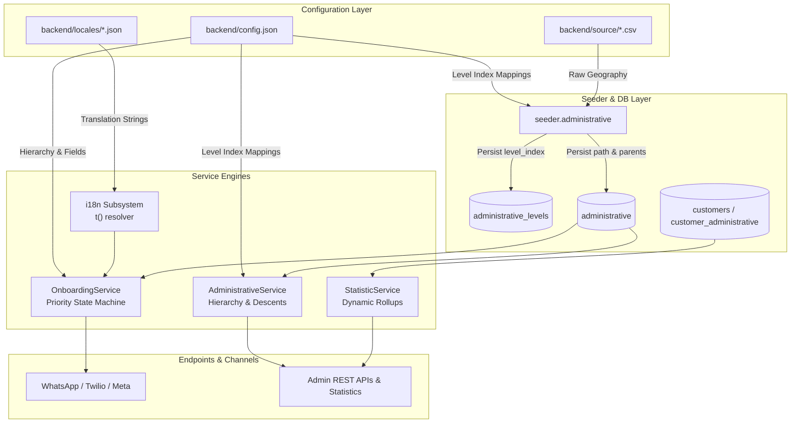

# Dynamic Systems Configuration & Deployment Guide

**Target Audience:** DevOps Engineers, System Administrators, Technical Implementers, and Partner Organizations
**Scope:** Dynamic Administrative Hierarchy, Configurable Onboarding Questionnaire, and Dynamic File-Based i18n System
**Status:** Authoritative Reference

---

## 📑 Table of Contents

- [Dynamic Systems Configuration \& Deployment Guide](#dynamic-systems-configuration--deployment-guide)
  - [📑 Table of Contents](#-table-of-contents)
  - [1. System Architecture \& Overview](#1-system-architecture--overview)
    - [The Three Interconnected Pillars](#the-three-interconnected-pillars)
  - [2. Pillar 1: Dynamic File-Based i18n Locales](#2-pillar-1-dynamic-file-based-i18n-locales)
    - [2.1 Directory Structure \& File Setup](#21-directory-structure--file-setup)
    - [2.2 Translation Keys Reference](#22-translation-keys-reference)
    - [2.3 Dynamic Format Variables](#23-dynamic-format-variables)
    - [2.4 Adding a New Language (Step-by-Step)](#24-adding-a-new-language-step-by-step)
  - [3. Pillar 2: Dynamic Administrative Hierarchy System](#3-pillar-2-dynamic-administrative-hierarchy-system)
    - [3.1 Hierarchy Data Model (`level_index`)](#31-hierarchy-data-model-level_index)
    - [3.2 Preparing the Administrative CSV Dataset](#32-preparing-the-administrative-csv-dataset)
      - [CSV Column Specification:](#csv-column-specification)
      - [Example: 5-Tier Hierarchy CSV (`source/indonesia_sample.csv`)](#example-5-tier-hierarchy-csv-sourceindonesia_samplecsv)
    - [3.3 Configuring `administrative_hierarchy` in `config.json`](#33-configuring-administrative_hierarchy-in-configjson)
      - [Field Properties:](#field-properties)
    - [3.4 Seeding the Database](#34-seeding-the-database)
      - [Mode 1: Standard Upsert / Enrichment](#mode-1-standard-upsert--enrichment)
    - [3.5 Clean Country Swap (`--replace-country`) \& Safety Guard](#35-clean-country-swap---replace-country--safety-guard)
    - [3.6 Edge Cases Handled Automatically](#36-edge-cases-handled-automatically)
  - [4. Pillar 3: Configurable Onboarding Questionnaire](#4-pillar-3-configurable-onboarding-questionnaire)
    - [4.1 Field Definition Schema](#41-field-definition-schema)
      - [Field Schema Properties:](#field-schema-properties)
    - [4.2 Integrating the Location Step](#42-integrating-the-location-step)
    - [4.3 Adding Custom Partner Fields (No DB Migrations)](#43-adding-custom-partner-fields-no-db-migrations)
      - [Example: Custom Farm Size Enum and Water Source Question](#example-custom-farm-size-enum-and-water-source-question)
    - [4.4 Re-ordering Questions (Priority Sequence)](#44-re-ordering-questions-priority-sequence)
    - [4.5 Optional \& Mandatory Skip Mechanics](#45-optional--mandatory-skip-mechanics)
  - [5. Verification, Diagnostics \& Troubleshooting](#5-verification-diagnostics--troubleshooting)
    - [5.1 Database Verification Scripts](#51-database-verification-scripts)
    - [5.2 Inspecting Farmer Profiles \& Custom Fields](#52-inspecting-farmer-profiles--custom-fields)
    - [5.3 Common Operational Troubleshooting](#53-common-operational-troubleshooting)

---

## 1. System Architecture & Overview

AgriConnect is designed for **zero-code international deployment**. All national geography, onboarding questionnaires, and system dialogues are decoupled from Python code and driven entirely by configuration files and localization catalogs.



### The Three Interconnected Pillars

| Pillar | Location | Primary Responsibility |
|---|---|---|
| **1. Dynamic i18n Locales** | `backend/locales/*.json` | Decouples system dialogs, fallback prompts, error messages, and crop names into language-specific JSON catalogs. |
| **2. Dynamic Administrative Hierarchy** | `backend/config.json`<br>`backend/source/*.csv` | Configures $N$-depth country geographical hierarchies (`0..N`), automated traversal, and database seeding. |
| **3. Configurable Onboarding Questionnaire** | `backend/config.json` | Controls question sequence, field types, custom partner fields, validation rules, and mandatory/optional enforcement. |

---

## 2. Pillar 1: Dynamic File-Based i18n Locales

All system messages, selection instructions, consent prompts, and validation warnings are stored in language-specific JSON files under `backend/locales/`.

### 2.1 Directory Structure & File Setup

```
backend/
├── locales/
│   ├── en.json      # English base system strings
│   ├── sw.json      # Swahili translated system strings
│   └── ...          # Additional partner languages (e.g., id.json, fr.json)
└── utils/
    └── i18n.py      # Runtime translation loader and resolver
```

### 2.2 Translation Keys Reference

Key namespaces used by the onboarding and location engines:

```json
{
  "onboarding": {
    "administration": {
      "select_region": "Let's find your location step by step.\n\nWhich county/region are you from?\n\n{options}",
      "select_district": "Great! You selected {parent}.\n\nWhich sub-county/district are you in?\n\n{options}",
      "select_ward": "You're in {parent}.\n\nWhich ward are you in?\n\n{options}",
      "select_level": "Let's find your location step by step.\n\nWhich {level} are you from?\n\n{options}",
      "select_next": "Great! You selected {parent}.\n\nWhich {level} are you in?\n\n{options}",
      "selection_instruction": "\nReply with the number (e.g., '1', '2', etc.)",
      "location_saved": "Thank you! I've recorded your location as: {value}."
    },
    "common": {
      "selection_prompt": "Reply with the number (e.g., '1', '2', etc.)",
      "invalid_selection": "Please reply with a number (e.g., '1', '2') corresponding to your choice.",
      "selection_out_of_range": "Please select a number between 1 and {max}"
    }
  }
}
```

### 2.3 Dynamic Format Variables

The `t(path, lang, **kwargs)` resolver safely replaces format placeholders:
* `{options}`: The dynamically generated numbered list of candidate areas.
* `{parent}`: The name of the parent area selected in the preceding step (e.g. `Jawa Barat` or `Murang'a`).
* `{level}`: The localized display name of the administrative level (e.g. `Provinsi`, `Kabupaten`, `Region`).
* `{value}`: The recorded answer or formatted location path.
* `{max}`: The maximum allowed numerical choice for out-of-range warnings.

### 2.4 Adding a New Language (Step-by-Step)

1. Create `backend/locales/<lang_code>.json` by copying `backend/locales/en.json`.
2. Translate all strings into the target language.
3. In `backend/config.json`, add the language code to `"languages"` and update question dictionaries:
   ```json
   {
     "languages": ["en", "sw", "id"],
     "default_language": "en"
   }
   ```
4. Restart the backend container:
   ```bash
   ./dc.sh restart backend
   ```

### 2.5 Single-Language Deployments & Automatic Bypass

For deployments operating in a single language (e.g., English-only in Micronesia or Swahili-only programs):
1. Specify only one language entry in `backend/config.json`:
   ```json
   {
     "languages": [
       { "code": "en", "name": "English", "active": true }
     ]
   }
   ```
2. **Automatic Language Assignment**: When a new farmer arrives via WhatsApp, `CustomerService.create_customer()` immediately assigns `customer.language = settings.default_language` (e.g. `"en"`).
3. **Seamless Onboarding Bypass**: `OnboardingService` detects `settings.is_single_language == True` and automatically marks the `language` question as satisfied without asking the farmer to choose a language, immediately presenting the first actionable question (e.g. `full_name`).

---

## 3. Pillar 2: Dynamic Administrative Hierarchy System

### 3.1 Hierarchy Data Model (`level_index`)

Administrative levels are ordered by an explicit zero-based integer index (`level_index`):
* `level_index = 0`: Root / National level (`country`).
* `level_index = 1`: First administrative division (e.g. `region` / `provinsi` / `state`).
* `level_index = 2..N-1`: Intermediate divisions (e.g. `district` / `kabupaten` / `kecamatan`).
* `level_index = N`: Leaf level where farmers are bound (e.g. `ward` / `desa` / `parish`).

```sql
-- administrative_levels table structure
CREATE TABLE administrative_levels (
    id SERIAL PRIMARY KEY,
    name VARCHAR(50) NOT NULL,
    level_index INTEGER NOT NULL UNIQUE,  -- Enforces strict 0..N ordering
    created_at TIMESTAMP WITH TIME ZONE DEFAULT NOW(),
    updated_at TIMESTAMP WITH TIME ZONE DEFAULT NOW()
);

-- administrative table structure
CREATE TABLE administrative (
    id SERIAL PRIMARY KEY,
    code VARCHAR(50) NOT NULL UNIQUE,
    name VARCHAR(255) NOT NULL,
    level_id INTEGER NOT NULL REFERENCES administrative_levels(id),
    parent_id INTEGER REFERENCES administrative(id),
    path VARCHAR(500) NOT NULL,           -- e.g. "Indonesia > Jawa Barat > Kabupaten Bandung > Kecamatan Cileunyi > Desa Cibiruhilir"
    created_at TIMESTAMP WITH TIME ZONE DEFAULT NOW(),
    updated_at TIMESTAMP WITH TIME ZONE DEFAULT NOW()
);
```

---

### 3.2 Preparing the Administrative CSV Dataset

The CSV file provides the raw geographic taxonomy. It MUST be placed under `backend/source/` and follow this exact 4-column format:

```csv
code,name,level,parent_code
```

#### CSV Column Specification:
1. **`code`** *(Required, String)*: Unique identifier for the area (e.g. `IDN-JB-BDG`).
2. **`name`** *(Required, String)*: Human-readable name of the area (e.g. `Kabupaten Bandung`).
3. **`level`** *(Required, String)*: Administrative level name matching `config.json` (e.g. `country`, `provinsi`, `kabupaten`, `kecamatan`, `desa`).
4. **`parent_code`** *(Optional for country root, Required for all sub-levels)*: The `code` of the immediate parent area.

#### Example: 5-Tier Hierarchy CSV (`source/indonesia_sample.csv`)
```csv
code,name,level,parent_code
IDN,Indonesia,country,
IDN-JB,Jawa Barat,provinsi,IDN
IDN-JB-BDG,Kabupaten Bandung,kabupaten,IDN-JB
IDN-JB-BDG-CLY,Kecamatan Cileunyi,kecamatan,IDN-JB-BDG
IDN-JB-BDG-CLY-CBR,Desa Cibiruhilir,desa,IDN-JB-BDG-CLY
IDN-JB-BDG-CLY-CNN,Desa Cinunuk,desa,IDN-JB-BDG-CLY
IDN-JT,Jawa Tengah,provinsi,IDN
IDN-JT-SMG,Kota Semarang,kabupaten,IDN-JT
IDN-JT-SMG-SMT,Kecamatan Semarang Timur,kecamatan,IDN-JT-SMG
IDN-JT-SMG-SMT-KRT,Kelurahan Karangturi,desa,IDN-JT-SMG-SMT
```

> [!IMPORTANT]
> **Parent-Child Ordering Rule:** The root country entry (`parent_code` empty) MUST be listed before its child records. Parent entries must always precede their descendants in the CSV file.

---

### 3.3 Configuring `administrative_hierarchy` in `config.json`

Open `backend/config.json` and declare the `administrative_hierarchy` block matching your target country:

```json
{
  "administrative_hierarchy": {
    "country_code": "IDN",
    "delimiter": " > ",
    "levels": [
      {
        "level_index": 0,
        "name": "country",
        "display": { "en": "Country", "sw": "Nchi" }
      },
      {
        "level_index": 1,
        "name": "provinsi",
        "display": { "en": "Provinsi", "sw": "Mkoa" }
      },
      {
        "level_index": 2,
        "name": "kabupaten",
        "display": { "en": "Kabupaten", "sw": "Wilaya" }
      },
      {
        "level_index": 3,
        "name": "kecamatan",
        "display": { "en": "Kecamatan", "sw": "Tarafa" }
      },
      {
        "level_index": 4,
        "name": "desa",
        "display": { "en": "Desa", "sw": "Kata" }
      }
    ]
  }
}
```

#### Field Properties:
* **`country_code`**: ISO 3-letter country code (`KEN`, `IDN`, `RWA`, `SGP`, etc.).
* **`delimiter`**: Path separator used for full location breadcrumbs (default `" > "`).
* **`levels`**: Ordered array defining:
  * `level_index`: Integer from `0` (country root) to `N` (leaf).
  * `name`: Internal technical identifier (lowercase, matching CSV `level` column).
  * `display`: Dictionary of localized display labels used when prompting farmers.

---

### 3.4 Seeding the Database

Run the administrative seeder from the terminal using `./dc.sh`:

#### Mode 1: Standard Upsert / Enrichment
Use this mode to seed a fresh deployment or update existing country boundaries with new sub-areas:

```bash
./dc.sh exec backend python -m seeder.administrative --source source/administrative.csv
```

---

### 3.5 Clean Country Swap (`--replace-country`) & Safety Guard

Use this mode when replacing an existing country dataset with a new country hierarchy:

```bash
./dc.sh exec backend python -m seeder.administrative --replace-country --source source/indonesia_sample.csv
```

> [!CAUTION]
> **Live Customer Safety Guard:**
> The `--replace-country` flag performs a foreign-key-safe purge of existing administrative boundaries. To prevent accidental data corruption in production, the seeder checks `SELECT count(*) FROM customers`. If any live customer records exist, **execution aborts immediately** with exit code `1`. Country replacement is restricted to fresh deployments or staging environments where customer data has been cleaned first (`DELETE FROM customer_administrative; DELETE FROM customers;`).

---

### 3.6 Edge Cases Handled Automatically

1. **Minimal 2-Tier Hierarchy (Country $\rightarrow$ District)**:
   If `config.json` defines only 2 levels (`0: country`, `1: district`), onboarding prompts once for the district, recognizes `level_index = 1` as the leaf level, saves the location, and advances to the next profile question without prompting for non-existent child levels.
2. **Intermediate Node with 0 Children (Isolated Area)**:
   If an intermediate area (e.g. an isolated province) has 0 child sub-districts registered in the database, selecting that area automatically treats it as the final location, logs `No children found for <Area>, saving as final location`, and completes the location step gracefully without error or empty selection menus.

---

## 4. Pillar 3: Configurable Onboarding Questionnaire

The onboarding questionnaire is configured in `backend/config.json` under `"onboarding"`.

### 4.1 Field Definition Schema

```json
{
  "onboarding": {
    "enabled": true,
    "fields": [
      {
        "field_name": "full_name",
        "db_field": "full_name",
        "enabled": true,
        "required": true,
        "priority": 1,
        "field_type": "string",
        "max_attempts": 1,
        "labels": {
          "en": "Name",
          "sw": "Jina"
        },
        "questions": {
          "en": "To get started, I need to know your full name.\n\nPlease tell me: What is your full name?",
          "sw": "Kuanza, nahitaji majina yako kamili.\n\nTafadhali niambie: Jina lako kamili ni nani?"
        },
        "success_messages": {
          "en": "Thank you, {value}!",
          "sw": "Asante, {value}!"
        }
      }
    ]
  }
}
```

#### Field Schema Properties:

| Property | Type | Description |
|---|---|---|
| `field_name` | String | Unique field key (e.g. `language`, `full_name`, `administration`, `crop_type`, `farm_size`). |
| `db_field` | String / Null | Target column on `Customer` model (or `null` to store in `customer.profile_data` JSONB). |
| `enabled` | Boolean | Whether this field is active in the questionnaire. |
| `required` | Boolean | If `true`, the farmer must answer. If `false`, farmer can reply `skip` / `ruka`. |
| `priority` | Integer | Determines question execution order (lower numbers asked first: `0`, `1`, `2`...). |
| `field_type` | String | Data type: `"string"`, `"integer"`, `"enum"`, `"location"`, `"boolean"`. |
| `extraction_method` | String / Null | Custom Python extraction method in `OnboardingService` or `null` for raw text capture. |
| `questions` | String / Dict | Localized question text displayed to the farmer (`{"en": "...", "sw": "..."}`). |
| `success_messages` | Dict | Localized acknowledgment message upon successful capture (`{value}` placeholder supported). |
| `labels` | Dict | Localized field labels displayed in the final profile completion summary. |

---

### 4.2 Integrating the Location Step

To connect the dynamic administrative hierarchy to onboarding, declare a field with `"field_type": "location"`:

```json
{
  "field_name": "administration",
  "db_field": "customer_administrative",
  "enabled": true,
  "required": true,
  "priority": 2,
  "field_type": "location",
  "extraction_method": "extract_location",
  "matching_method": "resolve_administration_ambiguity",
  "max_attempts": 3,
  "labels": {
    "en": "Location",
    "sw": "Eneo"
  },
  "questions": {
    "en": "Where is your farm located?\n\nPlease tell me your area (e.g. district, ward, or village):",
    "sw": "Shamba lako liko wapi?\n\nTafadhali niambie eneo lako (mfano wilaya, wadi, au kijiji):"
  },
  "success_messages": {
    "en": "Location saved as {value}.",
    "sw": "Eneo limehifadhiwa kama {value}."
  }
}
```

* When the state machine reaches `administration`, it asks the configured location question.
* If the farmer replies with their location name, smart fuzzy matching detects the candidate matches directly.
* If multiple areas match, it presents candidate options + an `"Other (select step by step)"` option.
* If no match is found or the farmer selects `"Other"`, it automatically guides the farmer through step-by-step hierarchical selection.

---

### 4.3 Adding Custom Partner Fields (No DB Migrations)

You can add arbitrary custom questions without database migrations. Any field with `db_field: null` is automatically persisted in the `customers.profile_data` JSONB dictionary.

#### Example: Custom Farm Size Enum and Water Source Question
```json
{
  "field_name": "farm_size",
  "db_field": null,
  "enabled": true,
  "required": true,
  "priority": 4,
  "field_type": "enum",
  "labels": { "en": "Farm Size", "sw": "Ukubwa wa Shamba" },
  "questions": {
    "en": "What is the size of your farm?\n1. < 1 Hectare\n2. 1 - 5 Hectares\n3. > 5 Hectares",
    "sw": "Ukubwa wa shamba lako ni upi?\n1. Chini ya Ekari 1\n2. Ekari 1 - 5\n3. Zaidi ya Ekari 5"
  },
  "success_messages": {
    "en": "Farm size recorded.",
    "sw": "Ukubwa wa shamba umehifadhiwa."
  }
},
{
  "field_name": "water_source",
  "db_field": null,
  "enabled": true,
  "required": false,
  "priority": 5,
  "field_type": "string",
  "labels": { "en": "Water Source", "sw": "Chanzo cha Maji" },
  "questions": {
    "en": "What is your main water source? (e.g. Well, River, Rainfed)",
    "sw": "Chanzo chako kikuu cha maji ni kipi? (mfano Kisima, Mto, Mvua)"
  },
  "success_messages": {
    "en": "Water source recorded.",
    "sw": "Chanzo cha maji kimehifadhiwa."
  }
}
```

---

### 4.4 Re-ordering Questions (Priority Sequence)

Question sequence is determined strictly by the `priority` integer (lower values executed first).

To ask **Location before Full Name**:
```json
[
  { "field_name": "language", "priority": 0 },
  { "field_name": "administration", "priority": 1 },
  { "field_name": "full_name", "priority": 2 },
  { "field_name": "crop_type", "priority": 3 }
]
```

The state machine will ask language preference $\rightarrow$ traverse location hierarchy down to leaf $\rightarrow$ ask for full name $\rightarrow$ ask for crops.

---

### 4.5 Optional & Mandatory Skip Mechanics

* **For Optional Fields (`required: false`)**:
  AgriConnect automatically appends the localized skip prompt: `"(Reply 'skip' if you prefer not to answer)"` (or `"(Jibu 'skip' kama hupendi kujibu)"`). Replying `"skip"`, `"lewati"`, or `"ruka"` records `null` and advances to the next question.
* **For Mandatory Fields (`required: true`)**:
  Sending text like `"skip"` or `"pass"` during hierarchical selection is strictly rejected with a friendly numeric prompt (`"Please reply with a number (e.g., '1', '2') corresponding to your choice."`), preserving data completeness.

---

## 5. Verification, Diagnostics & Troubleshooting

### 5.1 Database Verification Scripts

To inspect the seeded hierarchy and level indices directly from the database:

```bash
./dc.sh exec backend python -c "
from database import get_db
from models import Administrative, AdministrativeLevel
db = next(get_db())

print('--- ADMINISTRATIVE LEVELS ---')
for lvl in db.query(AdministrativeLevel).order_by(AdministrativeLevel.level_index).all():
    print(f'Level {lvl.level_index}: {lvl.name}')

print('\n--- SAMPLE ADMINISTRATIVE AREAS ---')
for a in db.query(Administrative).limit(10).all():
    print(f'ID: {a.id} | Code: {a.code} | Level: {a.level.name} | Path: {a.path}')
"
```

---

### 5.2 Inspecting Farmer Profiles & Custom Fields

To query registered customers and extracted custom fields stored in `profile_data`:

```sql
SELECT
    id,
    phone_number,
    full_name,
    language,
    onboarding_status,
    profile_data->>'farm_size' AS farm_size,
    profile_data->>'water_source' AS water_source
FROM customers
ORDER BY id DESC
LIMIT 10;
```

---

### 5.3 Common Operational Troubleshooting

| Issue / Symptom | Likely Root Cause | Solution |
|---|---|---|
| `Cannot run --replace-country! Found X live customer records` | Safety Guard prevented purging live farmer records. | In production, do not swap countries on active databases. On staging/fresh deploys, clean test records first (`DELETE FROM customer_administrative; DELETE FROM customers;`). |
| Location options show empty list during onboarding | CSV `level` names do not match `config.json` `levels.name`. | Check spelling and casing of level names in `config.json` and CSV (e.g. `provinsi` vs `province`). |
| Prompt displays `{parent}` unformatted | Legacy translation key invoked on custom level names. | Ensure `_get_level_display_name` is active and using `onboarding.administration.select_level` or `select_next`. |
| Flake8 or JSON syntax error after edits | Missing commas or formatting violation in `config.json`. | Run `./dc.sh exec backend python -m json.tool backend/config.json > /dev/null` to validate JSON syntax. |
| Test suite reports failures on specific country settings | Tests ran with custom country configuration in `config.json`. | Tests in `test_generic_onboarding.py` expect `KEN` 4-tier hierarchy. Restore `administrative_hierarchy` to `KEN` when running standard CI test suites. |
