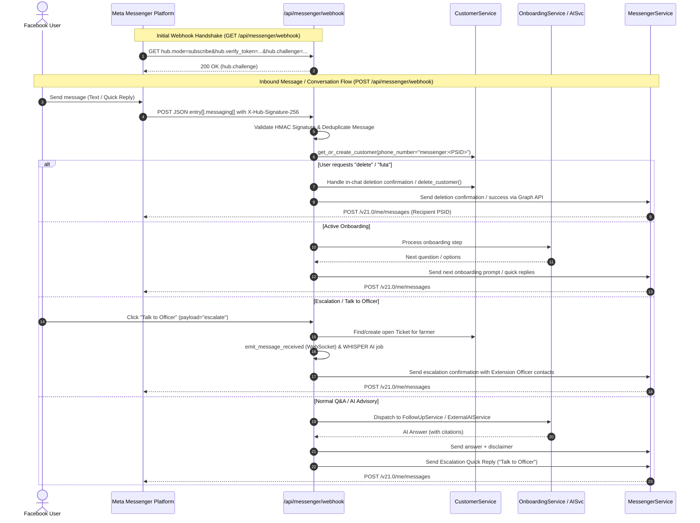

# Facebook Messenger Integration (PoC)

## Overview

This specification details the Proof of Concept (PoC) for integrating **Facebook Messenger** into AgriConnect as an additional messaging channel alongside WhatsApp. It enables farmers/users to interact with AgriConnect via Facebook Messenger (for automated onboarding, AI knowledge base Q&A, follow-up clarification, and self-service account deletion) without impacting or regressing any existing WhatsApp, Twilio, Mobile App, or Admin Web workflows.

Furthermore, it provides both:
1. **Self-Service Customer Deletion Flow**: User sends "delete" / "futa" over Messenger with confirmation handling.
2. **Meta Platform Data Deletion Callback Endpoint**: Mandatory Meta compliance endpoint (`POST /api/messenger/data-deletion`) satisfying Facebook Platform Data Deletion Request requirements.

---

## Architecture & Data Model Analysis: Why Migration is Optional for PoC vs Future Multi-Channel

### 1. The Core Question: Do We Need a Database Migration?
There are two architectural paths for handling Facebook Messenger user identifiers:

#### **Option A: Non-Breaking PoC Approach (Zero Migration)**
* **How it works**:
  - Facebook Messenger identifies users by Page-Scoped User IDs (`PSID`, e.g., `837192847291029`).
  - In the current schema, `Customer.phone_number` is `String(unique=True, nullable=False)` and `Message.message_sid` is `String(unique=True, nullable=False)`.
  - Storing the PSID in `Customer.phone_number` as `messenger:<PSID>` (or directly `<PSID>`) requires **zero database migrations** and **zero schema modifications**.
  - **Why prefix `messenger:`?** It guarantees that a numerical PSID will never clash with an E.164 phone number (e.g. Tanzanian phone `+255...` or Kenyan phone `+254...`), making channel routing deterministic for services that look up customers.

#### **Option B: Long-Term Multi-Channel Schema (Requires Migration)**
* **How it works**:
  - Add `channel` column to `customers` (e.g. `Enum('WHATSAPP', 'MESSENGER', 'TELEGRAM')`, default `'WHATSAPP'`).
  - Make `phone_number` nullable in `customers`.
  - Add `channel_user_id` (String) with a unique composite index `(channel, channel_user_id)`.
  - Create an Alembic migration script.
* **Trade-off**:
  - **Pros**: Clean, normalized relational design; explicit channel field.
  - **Cons**: Requires migration across all deployed tenant instances; touches queries in `CustomerService`, statistics, and admin listings.

> [!NOTE]
> **Recommended Strategy**: For this **PoC**, we use **Option A** (`messenger:<PSID>` in `Customer.phone_number`) so we can deploy and validate the Facebook Messenger bot immediately with **zero risk to existing database instances**. The spec is designed so transitioning to Option B later is an additive schema migration.

---

## 5W1H Requirements Analysis

- **Who**: Farmers and community users engaging with AgriConnect via Facebook Messenger; System Administrators; Meta Compliance Auditors.
- **What**:
  - Webhook verification & incoming message ingestion (`GET` / `POST /api/messenger/webhook`).
  - Outbound messaging via Meta Graph Send API (`MessengerService`).
  - In-chat self-service account deletion trigger.
  - Meta platform GDPR/Data Deletion callback (`POST /api/messenger/data-deletion`).
- **Where**:
  - Backend router: `/backend/routers/messenger.py`
  - Backend service: `/backend/services/messenger_service.py`
  - Configuration: `/backend/config.py`, `.env.example`
- **When**: Triggered upon Facebook Messenger message events from Meta webhooks or platform deletion requests.
- **Why**: Broaden reach beyond WhatsApp to Facebook Messenger while maintaining strict data privacy compliance and zero regression for existing channels.
- **How**: Channel isolation using `messenger:<PSID>` identifier mapped cleanly into existing `Customer` and `Message` models, reusing `OnboardingService`, `FollowUpService`, `CustomerService`, and `ExternalAIService`.

---

## Architecture Overview



---

## Zero-Regression Architecture Guardrails

1. **Identifier Isolation**:
   - WhatsApp uses E.164 phone numbers (e.g., `+254712345678`).
   - Facebook Messenger uses Page-Scoped IDs (PSIDs).
   - In `Customer.phone_number`, Messenger users are stored as `messenger:<PSID>`. This prevents accidental collisions and keeps `routers/whatsapp.py` completely safe.
2. **Dedicated Router & Services**:
   - `routers/whatsapp.py` remains 100% untouched.
   - All Messenger logic lives in `routers/messenger.py` and `services/messenger_service.py`.
3. **Shared Core Engine**:
   - `OnboardingService`, `CustomerService.delete_customer()`, `ExternalAIService`, and `t()` i18n are called modularly without channel coupling.

---

## 1. Backend Implementation

### 1.1 Configuration & Environment Variables

**File**: `/backend/config.py` & `.env.example`

```python
# Facebook Messenger Configuration
MESSENGER_PAGE_ID: str = os.getenv("MESSENGER_PAGE_ID", "")
MESSENGER_VERIFY_TOKEN: str = os.getenv("MESSENGER_VERIFY_TOKEN", "agriconnect_messenger_verify_token")
MESSENGER_PAGE_ACCESS_TOKEN: str = os.getenv("MESSENGER_PAGE_ACCESS_TOKEN", "")
MESSENGER_APP_SECRET: str = os.getenv("MESSENGER_APP_SECRET", "")
MESSENGER_GRAPH_API_VERSION: str = os.getenv("MESSENGER_GRAPH_API_VERSION", "v21.0")
```

### 1.2 Outbound Messenger Service

**File**: `/backend/services/messenger_service.py`

Responsible for communicating with Meta Graph API:
- `send_message(recipient_psid: str, text: str) -> Dict`
- `send_quick_replies(recipient_psid: str, text: str, options: List[Dict[str, str]]) -> Dict`
- `send_typing_indicator(recipient_psid: str, is_typing: bool = True) -> Dict`
- `verify_signature(payload_bytes: bytes, signature_header: str) -> bool`

### 1.3 Messenger Webhook & Deletion Endpoints

**File**: `/backend/routers/messenger.py`

#### 1. Webhook Handshake
- **`GET /api/messenger/webhook`**
  - Query Params: `hub.mode`, `hub.verify_token`, `hub.challenge`
  - Validates `hub.mode == "subscribe"` and `hub.verify_token == settings.MESSENGER_VERIFY_TOKEN`.
  - Returns `PlainTextResponse(content=str(hub_challenge))` with HTTP 200 OK on success (Meta requires raw plain text/integer string, not JSON) or 403 Forbidden on mismatch.

#### 2. Inbound Message Processing
- **`POST /api/messenger/webhook`**
  - Headers: `X-Hub-Signature-256` (HMAC-SHA256 signature prefixed with `sha256=`).
  - Request Payload: Consumes raw bytes via `request.body()` first for HMAC validation using `hmac.compare_digest()`, then parses Meta Messenger JSON.
  - Logic:
    1. Validate `X-Hub-Signature-256` HMAC signature against `settings.MESSENGER_APP_SECRET`.
    2. Check `object == "page"`.
    3. Loop through `entry[].messaging[]`.
    4. Ignore echo messages (`message.is_echo == True`) and read/delivery receipts (`delivery`, `read`).
    5. Extract `sender.id` (PSID) and `message.text` / `message.quick_reply.payload` / `postback.payload`.
    6. Identify/create customer via `phone_number = f"messenger:{psid}"`.
    7. Supports in-chat customer deletion trigger ("delete" / "futa" + confirmation).
    8. Handles onboarding flow (`OnboardingService`) or delegates to AI response pipeline (`ExternalAIService` / `FollowUpService`).
    9. Return immediate HTTP 200 OK to acknowledge Meta within the < 5s SLA.

#### 3. Meta Platform User Data Deletion Callback
- **`POST /api/messenger/data-deletion`**
  - Required by Meta Platform Policies for apps handling Messenger.
  - Request Payload: Form-encoded (`signed_request: str`) or JSON (`{"signed_request": "..."}`).
  - Parsing Algorithm:
    1. Split `signed_request` into `encoded_sig` and `payload`.
    2. Fix base64url padding (`payload += '=' * (-len(payload) % 4)`).
    3. Verify signature: `expected_sig = hmac.new(app_secret.encode(), payload.encode(), hashlib.sha256).digest()`.
    4. Compare decoded signature using `hmac.compare_digest(sig, expected_sig)`.
    5. Decode JSON payload to extract `user_id` (PSID).
    6. Call `customer_service.delete_customer(customer.id)` for `phone_number = f"messenger:{user_id}"`.
    7. Generate a unique confirmation code and status check URL.
    8. Return Meta JSON response:
       ```json
       {
         "url": "https://agriconnect.org/api/messenger/data-deletion/status?code=<CONFIRMATION_CODE>",
         "confirmation_code": "<CONFIRMATION_CODE>"
       }
       ```
- **`GET /api/messenger/data-deletion/status`**
  - Query Param: `code`
  - Renders deletion confirmation status for user/compliance lookup.

---

### 1.4 Multi-Channel Outbound Message Dispatching

To prevent regression and eliminate Twilio errors when communicating with Messenger users across asynchronous callbacks, EO direct replies, and weather services:

**Files**: `/backend/routers/callbacks.py`, `/backend/routers/messages.py`, `/backend/services/follow_up_service.py`, & `/backend/services/weather_intent_service.py`

* **Channel-Aware Routing Strategy**:
  When dispatching an AI response, EO manual reply, follow-up question, or weather alert/prompt to `customer.phone_number`:
  ```python
  if customer.phone_number.startswith("messenger:"):
      psid = customer.phone_number.replace("messenger:", "")
      messenger_service = MessengerService()
      messenger_service.send_message(recipient_psid=psid, text=ai_response_text)
  else:
      # Default WhatsApp flow (E.164 phone numbers)
      whatsapp_service = WhatsAppService()
      whatsapp_service.send_message_with_tracking(
          to_number=customer.phone_number,
          message_body=WhatsAppService.sanitize_whatsapp_content(ai_response_text),
          message_id=ai_message.id,
          db=db,
      )
  ```

---

## 2. Verification & Testing Strategy

### 2.1 Automated Unit & Integration Tests

**Files**: `/backend/tests/test_messenger_router.py` & `/backend/tests/test_messenger_service.py`

Test Cases:
1. `test_webhook_verification_success()`: Validate `GET /api/messenger/webhook` with `hub.mode=subscribe` and valid token returns plain-text challenge.
2. `test_webhook_verification_forbidden()`: Validate invalid token returns HTTP 403.
3. `test_webhook_signature_verification()`: Verify valid HMAC-SHA256 vs invalid/missing `X-Hub-Signature-256`.
4. `test_inbound_message_ignores_echoes_and_receipts()`: Ensure `is_echo: true` and delivery receipts do not trigger message processing.
5. `test_onboarding_and_ai_message_flow()`: Ensure incoming text from new PSID triggers customer creation (`messenger:<PSID>`) and onboarding response.
6. `test_in_chat_account_deletion()`: Verify sending "delete" and "yes" deletes the `messenger:<PSID>` customer without leaving orphaned records.
7. `test_meta_signed_request_data_deletion()`: Verify `POST /api/messenger/data-deletion` parses signed request, purges customer, and returns status URL.
8. `test_meta_signed_request_invalid_signature()`: Verify tampered or invalid signature returns HTTP 400/403.
9. `test_channel_routing_in_callbacks()`: Verify asynchronous AI callback delivers via `MessengerService` for `messenger:<PSID>` and `WhatsAppService` for standard phone numbers.
10. `test_regression_whatsapp_isolation()`: Verify WhatsApp webhook endpoints and services operate without side effects.

### 2.2 Test Execution Commands

```bash
# Run backend tests inside Docker
./dc.sh exec backend python -m pytest tests/test_messenger_router.py tests/test_messenger_service.py -v

# Run full test suite with linting
./dc.sh exec backend flake8 --exclude=alembic,patches
./dc.sh exec backend tests
```

---

## 3. Epic & Ballpark Estimation

> Ballpark estimates in developer hours. Break down complex tasks so no single task exceeds 16h.
- Confidence Level: **High**
- Dependencies: Meta Developer Account & Facebook Page Access Token for manual end-to-end verification.

| Task ID | Component & Description | Est. Hours (Min - Max) | Priority |
|---------|-------------------------|------------------------|----------|
| T-001   | **Config & Settings**: Add Messenger environment variables and settings to `config.py` and `.env.example` | 1h - 2h | Must Have |
| T-002   | **Messenger Service**: Implement `MessengerService` with Meta Graph API client, HMAC signature verification, and typing/quick-reply helpers | 4h - 6h | Must Have |
| T-003   | **Messenger Router**: Implement `GET` & `POST /api/messenger/webhook` handling handshake, raw-body HMAC check, message ingestion, and routing to `OnboardingService` & `ExternalAIService` | 6h - 10h | Must Have |
| T-004   | **Deletion Endpoints**: Implement in-chat deletion handling and Meta compliance callback `POST /api/messenger/data-deletion` with base64url signed request parser | 3h - 5h | Must Have |
| T-005   | **Multi-Channel Dispatching**: Add channel-aware message routing to `callbacks.py` and `follow_up_service.py` | 2h - 3h | Must Have |
| T-006   | **Unit & Integration Tests**: Complete test suite for signature verification, echo filtering, webhook routing, callback dispatching, and deletion flows | 4h - 6h | Must Have |
| **Total** | | **20h - 32h** | |
