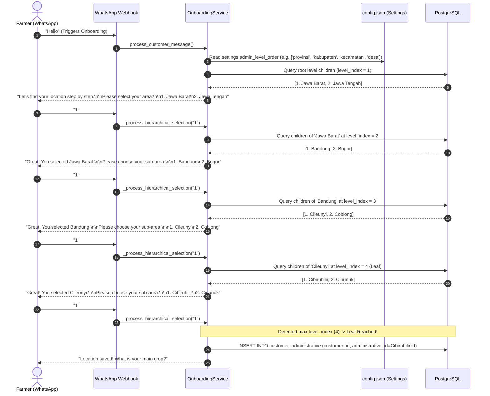

# Manual QA Test Plan: Dynamic Administrative Hierarchy & Multi-Tier Onboarding

**Document Version:** 1.0
**Date:** 2026-08-17
**Author:** Galih Pratama
**Specification:** [`docs/DYNAMIC_ADMIN_LEVELS.md`](/docs/DYNAMIC_ADMIN_LEVELS.md)
**Parent Specification:** [`docs/CONFIGURABLE_ONBOARDING_QUESTIONS.md`](/docs/CONFIGURABLE_ONBOARDING_QUESTIONS.md)
**Target:** Dynamic Administrative Hierarchy Engine, Country-Swap Seeder, and WhatsApp Onboarding State Machine

---

## 1. Objective & Scope

This manual test plan provides step-by-step verification procedures for the **Dynamic Administrative Hierarchy Engine** in AgriConnect. It validates that the platform can adapt to any national administrative structure (from 2-tier up to $N$-tier depths) and cleanly swap country data purely through configuration (`config.json`) and seeder parameters, without requiring code rewrites.

### What is Tested:
1. **Default 4-Tier Kenya Deployment** (`Country > Region > District > Ward`).
2. **International Country-Swap to 5-Tier Indonesia Deployment** (`Country > Provinsi > Kabupaten > Kecamatan > Desa`).
3. **Fresh Deployment Safety Guard** (preventing accidental purge of live customer data).
4. **Minimal 2-Tier Hierarchy** (`Country > Region`).
5. **Intermediate Nodes Without Children** (isolated areas gracefully saving at current depth).
6. **WhatsApp Conversational Onboarding Traversal** across all depths with input validation and i18n fallback prompts.
7. **Downstream Statistics & Extension Officer (EO) Escalation** resolving dynamically against configured leaf levels.

---

## 2. Test Environments & Prerequisites

### 2.1 Prerequisites
- Docker containers running via `./dc.sh up -d`
- Backend service operational at `http://localhost:8000` (or active ngrok tunnel)
- PostgreSQL database accessible via `./dc.sh exec db psql -U postgres -d agriconnect_dev`
- API documentation available at `http://localhost:8000/docs`

### 2.2 Test Message Injection Methods
Incoming WhatsApp messages during onboarding can be injected via:
1. **Direct Webhook POST (cURL)**:
   ```bash
   curl -X POST http://localhost:8000/api/whatsapp/webhook \
     -H "Content-Type: application/x-www-form-urlencoded" \
     -d "From=whatsapp%3A%2B254700111222&Body=Hello&ProfileName=FarmerTest"
   ```
2. **Interactive Swagger UI**: `POST /api/whatsapp/webhook`
3. **Database Inspection**:
   ```sql
   -- Check administrative levels
   SELECT id, name, level_index FROM administrative_levels ORDER BY level_index ASC;

   -- Check customer location links
   SELECT c.phone_number, c.onboarding_status, a.name AS location_name, al.name AS level_name, a.path
   FROM customers c
   LEFT JOIN customer_administrative ca ON c.id = ca.customer_id
   LEFT JOIN administrative a ON ca.administrative_id = a.id
   LEFT JOIN administrative_levels al ON a.level_id = al.id
   WHERE c.phone_number = '+254700111222';
   ```

---

## 3. Conversational Onboarding Flow



---

## 4. Test Scenarios

---

### 🧪 Scenario 1: Standard 4-Tier Kenya Hierarchy (Default Deployment)

#### Goal:
Verify that the default Kenya administrative hierarchy (`country` $\rightarrow$ `region` $\rightarrow$ `district` $\rightarrow$ `ward`) seeds correctly, assigns numeric `level_index` values (`0, 1, 2, 3`), and successfully navigates a 3-step WhatsApp onboarding location questionnaire to save the final ward.

#### Setup:
1. Ensure `backend/config.json` has standard Kenya hierarchy:
   ```json
   "administrative_hierarchy": {
     "country_code": "KEN",
     "delimiter": " > ",
     "levels": [
       { "level_index": 0, "name": "country", "display": { "en": "Country" } },
       { "level_index": 1, "name": "region", "display": { "en": "Region", "sw": "Mkoa" } },
       { "level_index": 2, "name": "district", "display": { "en": "District", "sw": "Wilaya" } },
       { "level_index": 3, "name": "ward", "display": { "en": "Ward", "sw": "Kata" } }
     ]
   }
   ```
2. Run seeder:
   ```bash
   ./dc.sh exec backend python -m seeder.administrative
   ```

#### Execution Steps:
| Step | Action / Payload | Expected Response | DB Verification |
|---|---|---|---|
| **1.1** | Verify seeded levels | Seeder logs: `Seeded 4 administrative levels, 1 countries, ...` | `SELECT name, level_index FROM administrative_levels ORDER BY level_index;`<br>$\rightarrow$ `country: 0`, `region: 1`, `district: 2`, `ward: 3` |
| **1.2** | Send WhatsApp message:<br>`From=+254700000101`<br>`Body=Hello` | Welcome greeting + Language selection (or direct name prompt). | Customer row created with `onboarding_status='in_progress'`. |
| **1.3** | Send Name:<br>`Body=John Doe` | Asks for Region:<br>`"Where is your farm located?\n\nPlease select your region:\n\n1. Central\n2. Coast\n..."` | Customer `full_name` updated. Onboarding field advances to `administration`. |
| **1.4** | Send Region selection:<br>`Body=1` (Central) | Asks for District under Central:<br>`"Great! You selected Central.\n\nPlease choose your district:\n\n1. Murang'a\n2. Kiambu\n..."` | Temporary hierarchy state stored in `customer.profile_data["_admin_hierarchy"]`. |
| **1.5** | Send District selection:<br>`Body=1` (Murang'a) | Asks for Ward under Murang'a:<br>`"Great! You selected Murang'a.\n\nPlease choose your ward:\n\n1. Kiharu\n2. Kangema\n..."` | Hierarchy state advances to level index 2. |
| **1.6** | Send Ward selection:<br>`Body=1` (Kiharu) | Location saved confirmation and advances to next question (e.g. crop type):<br>`"What crops do you grow?"` | `SELECT * FROM customer_administrative WHERE customer_id = <cust_id>;`<br>Points to `Kiharu` ward ID. `_admin_hierarchy` cleaned up. |

---

### 🧪 Scenario 2: Country Swap to Indonesia 5-Tier Hierarchy (International Deployment)

#### Goal:
Verify that on a fresh deployment, AgriConnect can replace the entire national administrative hierarchy with Indonesia's 5-tier system (`Country` $\rightarrow$ `Provinsi` $\rightarrow$ `Kabupaten` $\rightarrow$ `Kecamatan` $\rightarrow$ `Desa`) and seamlessly guide farmers through a 4-step location onboarding flow to save the leaf `desa`.

#### Setup:
1. Update `backend/config.json`:
   ```json
   "administrative_hierarchy": {
     "country_code": "IDN",
     "delimiter": " > ",
     "levels": [
       { "level_index": 0, "name": "country", "display": { "en": "Country" } },
       { "level_index": 1, "name": "provinsi", "display": { "en": "Provinsi" } },
       { "level_index": 2, "name": "kabupaten", "display": { "en": "Kabupaten" } },
       { "level_index": 3, "name": "kecamatan", "display": { "en": "Kecamatan" } },
       { "level_index": 4, "name": "desa", "display": { "en": "Desa" } }
     ]
   }
   ```
2. Create sample source CSV at `backend/source/indonesia_sample.csv`:
   ```csv
   code,name,level,parent_code
   IDN,Indonesia,country,
   IDN-JB,Jawa Barat,provinsi,IDN
   IDN-JB-BDG,Kabupaten Bandung,kabupaten,IDN-JB
   IDN-JB-BDG-CLY,Kecamatan Cileunyi,kecamatan,IDN-JB-BDG
   IDN-JB-BDG-CLY-CBR,Desa Cibiruhilir,desa,IDN-JB-BDG-CLY
   IDN-JB-BDG-CLY-CNN,Desa Cinunuk,desa,IDN-JB-BDG-CLY
   ```
3. Run Country Swap Seeder:
   ```bash
   ./dc.sh exec backend python -m seeder.administrative --replace-country --source source/indonesia_sample.csv
   ```

#### Execution Steps:
| Step | Action / Payload | Expected Response | DB Verification |
|---|---|---|---|
| **2.1** | Verify Country Swap Execution | CLI Output:<br>`REPLACE-COUNTRY mode active: Purging all existing administrative entities...`<br>`Purged records: {...}`<br>`Successfully seeded administrative data for Indonesia` | `SELECT count(*) FROM administrative WHERE path LIKE 'Indonesia%';`<br>Returns 6 rows. Kenya rows are completely purged. |
| **2.2** | Send WhatsApp message:<br>`From=+628123456789`<br>`Body=Halo` | Greeting prompt + Name inquiry. | New customer created with phone `+628123456789`. |
| **2.3** | Send Name:<br>`Body=Budi Santoso` | Asks for Level 1 (Provinsi):<br>`"Let's find your location step by step.\n\nPlease select your area:\n\n1. Jawa Barat"` | Hierarchy starts dynamically at `settings.admin_level_order[0]` (`provinsi`). |
| **2.4** | Select Provinsi:<br>`Body=1` (Jawa Barat) | Asks for Level 2 (Kabupaten):<br>`"Great! You selected Jawa Barat.\n\nPlease choose your sub-area:\n\n1. Kabupaten Bandung"` | Candidate IDs stored for level 2. |
| **2.5** | Select Kabupaten:<br>`Body=1` (Kabupaten Bandung) | Asks for Level 3 (Kecamatan):<br>`"Great! You selected Kabupaten Bandung.\n\nPlease choose your sub-area:\n\n1. Kecamatan Cileunyi"` | Candidate IDs stored for level 3. |
| **2.6** | Select Kecamatan:<br>`Body=1` (Kecamatan Cileunyi) | Asks for Level 4 (Desa):<br>`"Great! You selected Kecamatan Cileunyi.\n\nPlease choose your sub-area:\n\n1. Desa Cibiruhilir\n2. Desa Cinunuk"` | Candidate IDs stored for leaf level 4. |
| **2.7** | Select Desa:<br>`Body=1` (Desa Cibiruhilir) | Leaf reached! Saves location and advances to crop question:<br>`"Location saved! What crops do you grow?"` | `SELECT a.name, a.path, al.level_index FROM customer_administrative ca JOIN administrative a ON ca.administrative_id = a.id JOIN administrative_levels al ON a.level_id = al.id WHERE ca.customer_id = <cust_id>;`<br>Returns `Desa Cibiruhilir`, `level_index: 4`. |

---

### 🧪 Scenario 3: Country-Swap Safety Guard Live Protection

#### Goal:
Verify that the `--replace-country` flag is strictly forbidden on non-fresh deployments where customer records exist in the database, preventing accidental destruction of live customer data.

#### Setup:
1. Ensure at least 1 customer exists:
   ```sql
   INSERT INTO customers (phone_number, language, onboarding_status)
   VALUES ('+254711999888', 'en', 'completed')
   ON CONFLICT (phone_number) DO NOTHING;
   ```

#### Execution Steps:
| Step | Action / Command | Expected Result |
|---|---|---|
| **3.1** | Run Country-Swap Seeder:<br>`./dc.sh exec backend python -m seeder.administrative --replace-country --source source/indonesia_sample.csv` | **Execution ABORTS immediately** with error output:<br>`❌ ERROR: Cannot run --replace-country! Found 1 live customer records in database.`<br>`Country replacement is restricted to fresh deployments to prevent data corruption.`<br>Exit code: `1`. |
| **3.2** | Check DB integrity:<br>`SELECT count(*) FROM customers;`<br>`SELECT count(*) FROM administrative;` | All existing customers and administrative areas remain completely intact and untouched. |

---

### 🧪 Scenario 4: Minimal 2-Tier Hierarchy (Single-Step Onboarding)

#### Goal:
Verify that if a deployment configures a minimal 2-tier system (`Country` $\rightarrow$ `Region`), onboarding only prompts once for the region, recognizes it as the leaf level (`level_index = 1`), saves it immediately to `customer_administrative`, and advances to the next profile question without asking for nonexistent child levels.

#### Setup:
1. Update `backend/config.json`:
   ```json
   "administrative_hierarchy": {
     "country_code": "SGP",
     "delimiter": " > ",
     "levels": [
       { "level_index": 0, "name": "country" },
       { "level_index": 1, "name": "district" }
     ]
   }
   ```

#### Execution Steps:
| Step | Action / Payload | Expected Response | DB Verification |
|---|---|---|---|
| **4.1** | Restart backend & trigger location onboarding:<br>`From=+6591234567`<br>`Body=John` | Prompts for District:<br>`"Let's find your location step by step.\n\nPlease select your area:\n\n1. North District\n2. South District"` | Level 1 loaded. |
| **4.2** | Select District:<br>`Body=1` (North District) | System recognizes level 1 is max `level_index` (`settings.admin_leaf_level_index == 1`). Location saved immediately:<br>`"What crops do you grow?"` | `customer_administrative` points to `North District` ID. No sub-area prompted. |

---

### 🧪 Scenario 5: Intermediate Node Without Children (Isolated Area Handling)

#### Goal:
Verify that if an administrative area at an intermediate level has 0 children registered in the database (e.g. an isolated region without sub-districts yet mapped), selecting that area during onboarding gracefully treats it as the final location, saves it, and advances rather than erroring or showing an empty menu.

#### Setup:
1. In database, create an isolated Region under Kenya that has no child Districts:
   ```sql
   INSERT INTO administrative (code, name, level_id, parent_id, path)
   VALUES ('KEN-ISL', 'Isolated Region', (SELECT id FROM administrative_levels WHERE name='region'), (SELECT id FROM administrative WHERE name='Kenya'), 'Kenya > Isolated Region');
   ```

#### Execution Steps:
| Step | Action / Payload | Expected Response | DB Verification |
|---|---|---|---|
| **5.1** | Trigger onboarding & view Region options | List includes `"Isolated Region"`. | State awaiting region selection. |
| **5.2** | Select `"Isolated Region"` | System queries child districts of `Isolated Region`, finds 0 rows, logs: `No districts found for Isolated Region, saving as final location`, and proceeds:<br>`"Location saved! What crops do you grow?"` | `customer_administrative` links customer directly to `Isolated Region` ID. |

---

### 🧪 Scenario 6: User Input Resilience, Validation & i18n Fallbacks

#### Goal:
Verify that user errors (out-of-range numbers, text inputs) are handled gracefully with localized error prompts, and that non-English languages (e.g. Swahili) dynamically format fallback selection prompts.

#### Execution Steps:
| Scenario | Input / Action | Expected System Response | Status |
|---|---|---|---|
| **6A: Out of Range** | When 3 regions are shown (`1..3`), user sends `Body=9` | `"Please select a number between 1 and 3"`<br>(Status remains `awaiting_selection`, attempts incremented). | [ ] Pending |
| **6B: Non-Numeric Text** | When numbered list is shown, user sends `Body=Central` | `"Please reply with a number (e.g., '1', '2') corresponding to your choice."` | [ ] Pending |
| **6C: Swahili Fallback** | Customer with `language='sw'` enters location step on custom unlocalized level (e.g. `Provinsi`) | `"Hebu tupate eneo lako hatua kwa hatua.\n\nUnatoka Provinsi gani?\n\n1. Jawa Barat\n..."` | [ ] Pending |
| **6D: Skip Input** | User sends `Body=skip` or `Body=lewati` | Skips location selection without saving `customer_administrative` and moves to next profile question. | [ ] Pending |

---

### 🧪 Scenario 7: Extension Officer (EO) Routing & Statistics Matrix Drilldown

#### Goal:
Verify that `AdministrativeService` and `StatisticService` correctly resolve leaf areas and hierarchical rollups under dynamic configurations.

#### Execution Steps:
| Step | API Endpoint / Action | Expected Result |
|---|---|---|
| **7.1** | Query descendant leaf IDs for an area:<br>`AdministrativeService.get_descendant_ward_ids(db, prov_id)` | Returns all leaf `desa` or `ward` IDs that start with `prov_id.path`. |
| **7.2** | Call Crop Distribution Matrix API:<br>`GET /api/statistic/crops/distribution` | Returns matrix where `level_name` matches first child level (`Region` or `Provinsi`), and crops are aggregated across all descendant farmers. |
| **7.3** | Call Ward Farmer Stats API:<br>`GET /api/statistic/farmers/wards?administrative_id=<kab_id>` | Returns farmer counts grouped by each leaf area under the specified parent area. |

---

## 5. QA Verification & Sign-Off Matrix

| Scenario ID | Test Scenario Description | Pass Criteria | Tester | Status |
|---|---|---|---|---|
| **TC-01** | Kenya 4-Tier Seeder & `level_index` Assignment | Levels 0, 1, 2, 3 persisted with unique constraint | | [ ] Pending |
| **TC-02** | Kenya 4-Tier WhatsApp Onboarding | 3-step prompt completes and saves ward in DB | | [ ] Pending |
| **TC-03** | Country Swap Seeder (`--replace-country`) | Clean purge and re-seed of 5-tier Indonesia structure | | [ ] Pending |
| **TC-04** | Indonesia 5-Tier WhatsApp Onboarding | 4-step prompt completes and saves desa in DB | | [ ] Pending |
| **TC-05** | Country-Swap Safety Guard Block | Aborts with code 1 if `customers.count() > 0` | | [ ] Pending |
| **TC-06** | Minimal 2-Tier Hierarchy Onboarding | Single-step selection saves leaf region immediately | | [ ] Pending |
| **TC-07** | Isolated Area (0 Children) Handling | Saves intermediate area without crash or empty menu | | [ ] Pending |
| **TC-08** | Input Validation (Out of Range & Non-Numeric) | Localized error message re-prompts choice | | [ ] Pending |
| **TC-09** | Swahili Locale Dynamic Prompts | Correct Swahili phrasing for custom level names | | [ ] Pending |
| **TC-10** | Statistics API Leaf & Drilldown Resolution | Dynamic level naming and accurate descendant rollups | | [ ] Pending |
