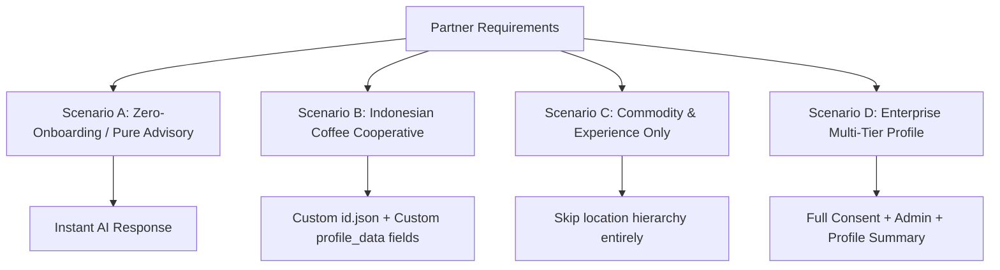

# Manual QA Test Plan: Multi-Partner Dynamic Onboarding System

**Version:** 1.0
**Date:** 2026-08-14
**Author:** AI Pair Programmer / Antigravity IDE
**Target:** AgriConnect Multi-Partner Onboarding & i18n Engine

---

## 1. Objective & Scope

This manual test plan verifies that AgriConnect can adapt to **very different onboarding systems and partner requirements** purely via JSON configuration and locale files (`backend/locales/`), without modifying Python backend code.

### What is Tested:
1. **Zero-Onboarding Mode** (empty `onboarding_fields = []` — instant AI advisory with no profile collection).
2. **New Partner & Language Deployment** (e.g., Indonesian Coffee Cooperative with custom fields like `farm_size`, `certification_status`).
3. **Location-Less Onboarding** (profile collection without administrative/ward hierarchy).
4. **Dynamic Profile Summary Generation** across arbitrary custom fields.
5. **Multi-attempt error handling & fallback resolution**.

---

## 2. Test Environments & Prerequisites

### 2.1 Prerequisites
- Docker containers running via `./dc.sh up -d`
- Backend API running on `http://localhost:8000` (or ngrok public tunnel)
- Access to Postgres database (`./dc.sh exec db psql -U postgres -d agriconnect_dev`) or API endpoints

### 2.2 Test Message Injection Methods
You can inject incoming WhatsApp messages via:
1. **Direct Webhook POST (cURL / Postman)**:
   ```bash
   curl -X POST http://localhost:8000/api/whatsapp/webhook \
     -H "Content-Type: application/x-www-form-urlencoded" \
     -d "From=whatsapp%3A%2B6281234567890&Body=Hello&ProfileName=Budi"
   ```
2. **Interactive Swagger UI**: `http://localhost:8000/docs#/WhatsApp/webhook_api_whatsapp_webhook_post`
3. **Real WhatsApp Twilio Sandbox / Meta Cloud API** connected to your local ngrok URL.

---

## 3. Test Scenarios



---

### Scenario A: Zero-Onboarding System (Instant AI Chat Mode)

#### Goal:
Verify that if a partner disables onboarding or specifies an empty list `[]`, AgriConnect immediately responds to farming questions without asking for any profile data.

#### Setup:
1. In `backend/config.json`:
   ```json
   {
     "onboarding_enabled": true,
     "onboarding_fields": []
   }
   ```
2. Restart backend: `./dc.sh restart backend`

#### Execution Steps:
| Step | Action / Payload | Expected Result | Status |
|---|---|---|---|
| A.1 | Send: `From=+254700000001`, `Body=How do I control fall armyworm in maize?` | System **does not** prompt for name, language, or location. Immediately routes query to Knowledge Base / AI and returns advisory. | [ ] |
| A.2 | Verify DB: `SELECT onboarding_status, language FROM customers WHERE phone_number = '+254700000001';` | `onboarding_status` is `COMPLETED` or bypassed; customer can chat freely. | [ ] |

---

### Scenario B: Indonesian Coffee Cooperative (New Language & Custom Fields)

#### Goal:
Verify that a partner in Indonesia can configure custom onboarding fields (`full_name`, `farm_size_ha`, `certification`) and dynamic Indonesian (`id`) translations with zero Python code changes.

#### Setup:
1. Add `backend/locales/id.json`:
   ```json
   {
     "onboarding": {
       "common": {
         "extraction_failed": "Maaf, kami tidak dapat memahami informasi tersebut. {question}",
         "selection_prompt": "Balas dengan nomor pilihan Anda (contoh: '1', '2')",
         "invalid_selection": "Pilihan tidak valid. Silakan balas dengan nomor angka.",
         "selection_out_of_range": "Silakan pilih nomor antara 1 dan {max}",
         "skip_instruction": "\n\n(Balas 'lewati' jika tidak ingin menjawab)",
         "completion": "Selesai! Profil petani Anda telah terdaftar:\n\n{profile_summary}",
         "database_error": "Terjadi kesalahan pada sistem. Silakan coba lagi."
       },
       "ask_edit_profile": "Untuk mengubah profil, hubungi petugas penyuluh kami:",
       "ask_delete_data": "Untuk menghapus akun, ketik *HAPUS*."
     },
     "crops": {
       "Coffee": { "name": "Kopi Arabika" },
       "Cacao": { "name": "Kakao" }
     },
     "gender": {
       "male": "Laki-laki",
       "female": "Perempuan",
       "other": "Lainnya"
     }
   }
   ```

2. Configure `backend/config.json`:
   ```json
   {
     "default_language": "id",
     "languages": [
       { "code": "id", "name": "Bahasa Indonesia", "active": true },
       { "code": "en", "name": "English", "active": true }
     ],
     "crop_types": ["Coffee", "Cacao"],
     "onboarding_fields": [
       {
         "field_name": "language",
         "field_type": "string",
         "required": true,
         "db_field": "language",
         "enabled": true,
         "questions": {
           "id": "Pilih bahasa Anda:\n1. Bahasa Indonesia\n2. English",
           "en": "Select your language:\n1. Bahasa Indonesia\n2. English"
         },
         "labels": {
           "id": "Bahasa",
           "en": "Language"
         }
       },
       {
         "field_name": "full_name",
         "field_type": "string",
         "required": true,
         "db_field": "full_name",
         "extraction_method": "extract_name",
         "enabled": true,
         "questions": {
           "id": "Siapa nama lengkap Anda?",
           "en": "What is your full name?"
         },
         "labels": {
           "id": "Nama Lengkap",
           "en": "Full Name"
         }
       },
       {
         "field_name": "farm_size_ha",
         "field_type": "string",
         "required": true,
         "db_field": "farm_size_ha",
         "extraction_method": null,
         "enabled": true,
         "questions": {
           "id": "Berapa luas lahan kopi Anda dalam hektar? (contoh: 1.5 ha)",
           "en": "What is your coffee farm size in hectares? (e.g. 1.5 ha)"
         },
         "labels": {
           "id": "Luas Lahan",
           "en": "Farm Size"
         }
       },
       {
         "field_name": "certification",
         "field_type": "string",
         "required": false,
         "db_field": "certification",
         "extraction_method": null,
         "enabled": true,
         "questions": {
           "id": "Apakah kebun Anda memiliki sertifikasi? (contoh: Rainforest Alliance, Fairtrade, atau Tidak Ada)",
           "en": "Does your farm have certifications? (e.g. Rainforest Alliance, Fairtrade, or None)"
         },
         "labels": {
           "id": "Sertifikasi",
           "en": "Certification"
         }
       }
     ]
   }
   ```

#### Execution Steps:
| Step | Phone & Payload | Expected Bot Response | Verification Point |
|---|---|---|---|
| B.1 | `+628121111111` $\rightarrow$ `Halo` | Language selection prompt: `Pilih bahasa Anda:\n1. Bahasa Indonesia\n2. English` | Correct language question from JSON config |
| B.2 | `+628121111111` $\rightarrow$ `1` | Saves language `id` $\rightarrow$ prompts for consent (if consent enabled) or next field: `Siapa nama lengkap Anda?` | Customer `language` is set to `id` |
| B.3 | `+628121111111` $\rightarrow$ `Budi Santoso` | Saves name `Budi Santoso` $\rightarrow$ asks: `Berapa luas lahan kopi Anda dalam hektar? (contoh: 1.5 ha)` | Direct column `full_name` populated |
| B.4 | `+628121111111` $\rightarrow$ `2.5 ha` | Saves `farm_size_ha: 2.5 ha` into `profile_data` $\rightarrow$ asks optional field: `Apakah kebun Anda memiliki sertifikasi?... (Balas 'lewati' jika tidak ingin menjawab)` | `profile_data["farm_size_ha"] == "2.5 ha"` |
| B.5 | `+628121111111` $\rightarrow$ `Rainforest Alliance` | Saves certification $\rightarrow$ Completes onboarding with localized summary: <br>`Selesai! Profil petani Anda telah terdaftar:`<br>`Bahasa: Bahasa Indonesia`<br>`Nama Lengkap: Budi Santoso`<br>`Luas Lahan: 2.5 ha`<br>`Sertifikasi: Rainforest Alliance` | Summary contains labels and values dynamically |

---

### Scenario C: Lightweight Profile (No Location, No Administrative Hierarchy)

#### Goal:
Verify onboarding functions seamlessly when `administration` location step is **completely omitted** from `onboarding_fields`.

#### Setup:
1. In `backend/config.json`:
   ```json
   {
     "onboarding_fields": [
       {
         "field_name": "full_name",
         "field_type": "string",
         "required": true,
         "db_field": "full_name",
         "extraction_method": "extract_name",
         "enabled": true,
         "questions": { "en": "What is your full name?" },
         "labels": { "en": "Full Name" }
       },
       {
         "field_name": "experience_years",
         "field_type": "string",
         "required": false,
         "db_field": "experience_years",
         "extraction_method": null,
         "enabled": true,
         "questions": { "en": "How many years have you been farming?" },
         "labels": { "en": "Farming Experience" }
       }
     ]
   }
   ```

#### Execution Steps:
| Step | Phone & Payload | Expected Bot Response | Verification Point |
|---|---|---|---|
| C.1 | `+254700000002` $\rightarrow$ `Hi` | `What is your full name?` | Bypasses location entirely |
| C.2 | `+254700000002` $\rightarrow$ `John Doe` | `How many years have you been farming?\n\n(Reply 'skip' if you prefer not to answer)` | Asks experience question |
| C.3 | `+254700000002` $\rightarrow$ `skip` | Completes onboarding with summary: <br>`Perfect! Your profile is all set up. Here's a summary:`<br>`Full Name: John Doe`<br>`Farming Experience: N/A` | Graceful skip handling with `N/A` in profile summary |

---

### Scenario D: Skip Behavior & Retry Bounds on Custom Fields

#### Goal:
Verify that farmers can skip optional custom fields, and that required custom fields enforce `max_attempts` cleanly.

#### Execution Steps:
| Step | Action | Expected Result |
|---|---|---|
| D.1 | Send invalid input to a custom field with `max_attempts: 2` | Bot reprompts with `onboarding.common.extraction_failed` for attempt 1, then triggers max attempts handler on attempt 2 without crashing. |
| D.2 | Send `skip` / `ruka` / `lewati` to an optional custom field | Bot immediately stores `null` in `profile_data` and advances to the next incomplete field. |

---

## 4. Post-Execution Database Verification

Run the following SQL queries to ensure data integrity in PostgreSQL:

```sql
-- 1. Check customer profile data storage
SELECT id, phone_number, full_name, language, onboarding_status, profile_data
FROM customers
ORDER BY id DESC LIMIT 5;

-- 2. Verify custom JSON fields are stored as key-value pairs in profile_data
SELECT id, profile_data->>'farm_size_ha' AS farm_size, profile_data->>'certification' AS cert
FROM customers
WHERE profile_data IS NOT NULL;
```

---

## 5. Pass / Fail Criteria

- [ ] **Pass**: Bot responds in the configured language, asks only the fields defined in `config.json`, stores custom fields in `customer.profile_data`, and generates an accurate localized profile summary.
- [ ] **Fail**: Bot crashes on unknown field names, fails to load custom locale JSON, falls back to hardcoded Kenyan region questions when location is disabled, or produces empty profile summaries.
