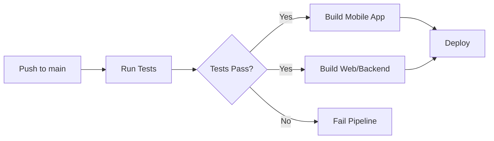

# Mobile App Deployment - Phase Documentation

**Issue:** #32 - APK Deployment
**Branch:** `feature/32-apk-deployment`
**Date:** 2025-10-14
**Status:** Initial Setup Complete

---

## Overview

This document outlines the implementation of automated mobile app builds for the AgriConnect React Native/Expo application using GitHub Actions and Expo Application Services (EAS).

## What Was Implemented

### 1. EAS Build Configuration (`app/eas.json`)

Created EAS configuration with three build profiles:

- **Development**: For development builds with development client
- **Preview**: For internal testing and distribution
- **Production**: For release builds (currently configured for Android APK)

**File Location:** `/app/eas.json`

```json
{
  "cli": {
    "version": ">= 14.0.0"
  },
  "build": {
    "development": {
      "developmentClient": true,
      "distribution": "internal",
      "android": {
        "buildType": "apk"
      }
    },
    "preview": {
      "distribution": "internal",
      "android": {
        "buildType": "apk"
      }
    },
    "production": {
      "android": {
        "buildType": "apk"
      }
    }
  }
}
```

### 2. GitHub Actions Workflow Extension

**File Modified:** `.github/workflows/deploy.yml`

Added new job `build-mobile` that:

1. **Runs after tests pass** - Ensures code quality before building
2. **Sets up environment**:
   - Checks out code
   - Sets up Node.js 18 with Yarn cache
   - Configures Expo/EAS CLI with authentication token
3. **Installs dependencies** - Uses `yarn install --frozen-lockfile`
4. **Triggers EAS Build** - Builds Android APK using production profile

**Key Features:**
- Runs in parallel with web/backend builds (after tests)
- Uses `EXPO_TOKEN` from GitHub Secrets
- Non-interactive build mode with `--no-wait` flag

### 3. CI Build Script Enhancement

**File Modified:** `ci/build.sh`

Added `mobileapp_build()` function that:

1. Installs dependencies via Docker Compose
2. Runs ESLint to validate code quality
3. Ensures mobile app is build-ready

This ensures the mobile app passes quality checks during CI/CD.

---

## Configuration Requirements

### GitHub Secrets

The following secret must be configured in GitHub repository settings:

| Secret Name | Description | How to Obtain |
|-------------|-------------|---------------|
| `EXPO_TOKEN` | Expo authentication token | 1. Login to expo.dev<br>2. Go to Access Tokens<br>3. Create new token<br>4. Copy and add to GitHub Secrets |

**Adding Secret to GitHub:**
1. Go to Repository → Settings → Secrets and variables → Actions
2. Click "New repository secret"
3. Name: `EXPO_TOKEN`
4. Value: Your Expo token
5. Click "Add secret"

### Expo Project Setup

Ensure the Expo project is properly configured:

1. **Expo Account**: Project must be linked to an Expo account
2. **EAS CLI**: EAS Build must be enabled for the project
3. **Project Slug**: Matches `app.json` configuration (`agriconnect`)

---

## How It Works

### Build Workflow



### Step-by-Step Process

1. **Trigger**: Push to `main` branch triggers the workflow
2. **Test Phase**: Runs backend and frontend tests
3. **Mobile Build** (parallel with web/backend builds):
   - GitHub Actions runner sets up environment
   - EAS CLI authenticates using `EXPO_TOKEN`
   - Build request submitted to EAS Build servers
   - EAS builds APK in the cloud
4. **Deployment**: Continues with web/backend deployment

### Current Build Configuration

- **Platform**: Android only
- **Build Type**: APK (not AAB/App Bundle)
- **Profile**: Production
- **Wait Mode**: `--no-wait` (pipeline continues without waiting for build completion)

---

## Usage

### Triggering a Build

**Automatic Build:**
```bash
git push origin main
```

**Manual Build via EAS CLI:**
```bash
cd app
eas build --platform android --profile production
```

**Building Other Profiles:**
```bash
# Preview build
eas build --platform android --profile preview

# Development build
eas build --platform android --profile development
```

### Monitoring Builds

1. **Via Expo Dashboard:**
   - Visit https://expo.dev
   - Navigate to your project
   - Click "Builds" tab
   - View build status, logs, and download APK

2. **Via GitHub Actions:**
   - Go to repository → Actions tab
   - Click on the workflow run
   - View "Build Mobile App (APK)" job logs

3. **Via EAS CLI:**
   ```bash
   eas build:list
   ```

### Downloading APK

Once build completes on Expo:

1. Go to https://expo.dev → Your Project → Builds
2. Find the completed build
3. Click "Download" to get the APK
4. Install on Android device via ADB or direct transfer

**Install via ADB:**
```bash
adb install path/to/agriconnect.apk
```

---

## Testing Locally

### Test Build Configuration

```bash
cd app
eas build:configure
```

### Local Build (requires EAS CLI login)

```bash
# Login to Expo
eas login

# Run local build
eas build --platform android --profile preview --local
```

---

## Current Limitations

1. **No Artifact Download**: Pipeline uses `--no-wait`, so APK is not automatically downloaded
2. **Manual Distribution**: APK must be manually downloaded from Expo dashboard
3. **No Version Bumping**: Version must be manually updated in `app.json`

---

## Future Improvements

### Phase 2: Artifact Management
- [ ] Remove `--no-wait` flag to wait for build completion
- [ ] Download APK artifact in GitHub Actions
- [ ] Upload APK to GitHub Releases
- [ ] Add workflow to attach APK to release tags

### Phase 3: Automated Distribution
- [ ] Integrate with Google Play Console for AAB uploads
- [ ] Configure internal testing track
- [ ] Automate version bumping
- [ ] Add changelog generation from commits

### Phase 4: Multi-Environment Builds
- [ ] Configure staging environment builds
- [ ] Add environment-specific configurations
- [ ] Set up different API endpoints per environment
- [ ] Create separate build profiles for each environment

### Phase 5: Advanced Features
- [ ] Add OTA (Over-The-Air) updates configuration
- [ ] Implement code signing automation
- [ ] Add build notifications (Slack/Email)
- [ ] Configure automatic screenshot testing
- [ ] Add app size monitoring and optimization

---

## Troubleshooting

### Build Fails with Authentication Error

**Problem:** EAS CLI cannot authenticate

**Solution:**
1. Verify `EXPO_TOKEN` is correctly set in GitHub Secrets
2. Check token is not expired at https://expo.dev
3. Ensure token has proper permissions

### Build Fails with "Project not found"

**Problem:** EAS cannot find the Expo project

**Solution:**
1. Ensure `app.json` has correct `slug` field
2. Run `eas build:configure` locally first
3. Push `eas.json` to repository

### Dependencies Installation Fails

**Problem:** Yarn install fails during build

**Solution:**
1. Check `yarn.lock` is committed to repository
2. Verify all dependencies are compatible with Expo SDK 54
3. Test locally: `cd app && yarn install --frozen-lockfile`

### Build Stuck in Queue

**Problem:** Build never starts on EAS

**Solution:**
1. Check Expo plan limits (free tier has limited builds)
2. Cancel queued builds from Expo dashboard
3. Wait for current builds to complete

### Pipeline Times Out

**Problem:** GitHub Actions job times out

**Solution:**
1. The `--no-wait` flag should prevent this
2. If removed, increase timeout in workflow:
   ```yaml
   timeout-minutes: 60
   ```

---

## Related Files

### Configuration Files
- `/app/eas.json` - EAS Build configuration
- `/app/app.json` - Expo app configuration
- `/app/package.json` - Dependencies and scripts

### CI/CD Files
- `/.github/workflows/deploy.yml` - Deployment workflow
- `/.github/workflows/test.yml` - Test workflow
- `/.github/workflows/test-reusable.yml` - Reusable test workflow
- `/ci/build.sh` - Build script for CI

### Documentation
- `/CLAUDE.md` - Project architecture and development guide
- `/docs/MOBILE_APP_DEPLOYMENT.md` - This file

---

## References

### Expo Documentation
- [EAS Build Overview](https://docs.expo.dev/build/introduction/)
- [EAS Build Configuration](https://docs.expo.dev/build-reference/eas-json/)
- [Android Builds](https://docs.expo.dev/build-reference/android-builds/)
- [GitHub Actions Integration](https://docs.expo.dev/build-reference/github-actions/)

### GitHub Actions
- [GitHub Actions Documentation](https://docs.github.com/en/actions)
- [expo/expo-github-action](https://github.com/expo/expo-github-action)

### Mobile App Development
- [React Native Documentation](https://reactnative.dev/)
- [Expo Router](https://docs.expo.dev/router/introduction/)
- [Expo SDK 54](https://docs.expo.dev/versions/latest/)

---

## Contacts & Support

- **Expo Support**: https://expo.dev/support
- **GitHub Issues**: Repository issues tab
- **Expo Community**: https://forums.expo.dev/

---

## Changelog

### 2025-10-14 - Initial Setup
- Created `eas.json` with three build profiles
- Added `build-mobile` job to deploy workflow
- Extended `ci/build.sh` with mobile app build function
- Configured GitHub Actions to use `EXPO_TOKEN`
- Documentation created

---

## Next Steps

1. **Test the Pipeline**: Push to main and verify build triggers
2. **Monitor First Build**: Check Expo dashboard for build status
3. **Download and Test APK**: Install on test device
4. **Plan Phase 2**: Implement artifact download and GitHub Releases integration
5. **Plan Phase 3**: Configure Google Play Console for automated distribution

---

**Note:** This is a living document. Update as the deployment process evolves.
