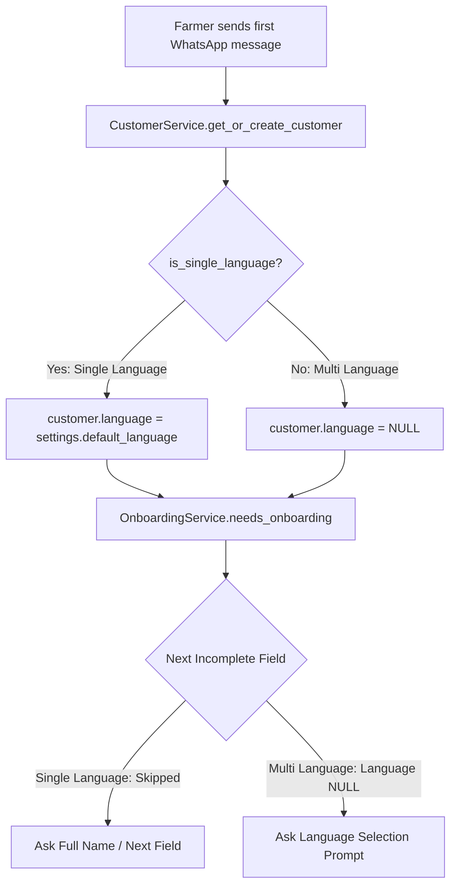

# [MT-003] Single-Language Auto-Configuration & Dynamic Language Bypass

**Date:** 2026-08-19
**Author:** Galih Pratama
**Status:** Implemented
**Parent Specification:** [`docs/CONFIGURABLE_ONBOARDING_QUESTIONS.md`](/docs/CONFIGURABLE_ONBOARDING_QUESTIONS.md)
**Objective:** Automatically assign the default language to customer profiles and seamlessly bypass the language selection step during onboarding when only a single language is configured in `config.json`.

---

## 📊 Overview

### Problem Statement

Currently, AgriConnect's onboarding system was designed assuming multiple languages (e.g., English and Swahili in Kenya). When a partner configures a single language in `config.json` (e.g. Micronesia/Pohnpeian, or English-only deployments), farmers are still prompted to choose a language, or `needs_onboarding()` repeatedly triggers language selection because `customer.language` defaults to `NULL` in the database and `onboarding_service.py` has a hardcoded gate:

```python
# TAC-7: If language is NULL, always trigger language selection
if customer.language is None:
    return True
```

### Solution

1. **Dynamic Language Mode Detection**: Expose `settings.is_single_language` in `config.py` based on `len(settings.supported_language_codes) <= 1`.
2. **Auto-Assignment on Creation**: When new customers are created (via WhatsApp or API without explicit language), automatically set `customer.language = settings.default_language` when running in single-language mode.
3. **Seamless Onboarding Bypass**: In `OnboardingService`, if only a single language is configured or if the `language` field is omitted/disabled in `onboarding.fields`, treat language as immediately satisfied and advance directly to the first actionable field (e.g. `full_name`).

---

## 🔄 User Journey / Workflow Comparison



---

## 📐 Architecture & Detailed Design

### 1. Configuration Layer (`backend/config.py`)

Add helper property to `Settings`:

```python
@property
def is_single_language(self) -> bool:
    """Return True if 1 or 0 supported languages are configured."""
    return len(self.supported_language_codes) <= 1
```

### 2. Customer Service (`backend/services/customer_service.py`)

In `create_customer()`:

```python
def create_customer(
    self,
    phone_number: str,
    language: Optional[str] = None,
) -> Customer:
    """Create a new customer with minimal fields."""
    if language is None and settings.is_single_language:
        language = settings.default_language

    customer = Customer(phone_number=phone_number, language=language)
    ...
```

### 3. Onboarding Service (`backend/services/onboarding_service.py`)

1. **`needs_onboarding(self, customer: Customer) -> bool`**:
   Update the language NULL check:

   ```python
   # In single-language mode, auto-backfill customer.language if missing
   if settings.is_single_language and customer.language is None:
       customer.language = settings.default_language
       self.db.commit()

   # In multi-language mode, if language is NULL and language field is enabled
   if not settings.is_single_language and customer.language is None:
       language_field = next(
           (f for f in enabled_fields if f.field_name == "language"),
           None,
       )
       if language_field is not None:
           return True
   ```

2. **`_is_field_complete(self, customer: Customer, field_config: OnboardingFieldConfig) -> bool`**:
   For `field_name == "language"`:

   ```python
   if field_name == "language":
       if settings.is_single_language:
           if customer.language is None:
               customer.language = settings.default_language
               self.db.commit()
           return True
       return customer.language is not None
   ```

3. **`_get_next_incomplete_field(self, customer: Customer)`**:
   If `settings.is_single_language` and candidate is `"language"`, `_is_field_complete()` returns `True`, advancing directly to the next incomplete field.

---

## 🧪 Verification & Test Strategy

### Automated Tests (`backend/tests/test_single_language_onboarding.py`)

1. **Customer Creation**: Verify `customer.language` is `"en"` (or configured default) when created in single-language config.
2. **Onboarding Message Flow**:
   - In single-language config: farmer's first message receives the `full_name` prompt (or next field), NOT language selection prompt.
   - In multi-language config (`["en", "sw"]`): farmer's first message receives language selection prompt.
3. **`needs_onboarding` Evaluation**:
   - Returns `True` if `full_name` or `administration` are pending even if `customer.language` is set.
   - Returns `False` when all required non-language fields are complete in single-language mode.
4. **Regression**: Run entire test suite (`./dc.sh exec backend pytest`) ensuring 1,099 tests pass.

---

## 📋 Task Breakdown & Ballpark Estimates

- **Standard Developer Estimate**: **4.5h – 7.5h**
- **Pair Programming with Vibe Coding (Accelerated)**: **50m – 75m**
- **Confidence Level**: High

| Task ID | Description | Target Files | Status | Standard Est. | Pair Programming (Vibe Coding) | Priority |
| --- | --- | --- | --- | --- | --- | --- |
| **T-001** | Add `is_single_language` property to `Settings` | `backend/config.py` | `DONE` | 0.5h | 5m – 10m | Must Have |
| **T-002** | Update `CustomerService` to auto-assign default language for single-language deployments | `backend/services/customer_service.py` | `DONE` | 0.5h – 1.0h | 10m – 15m | Must Have |
| **T-003** | Update `OnboardingService` (`needs_onboarding`, `_is_field_complete`, `_get_next_incomplete_field`) | `backend/services/onboarding_service.py` | `DONE` | 1.5h – 2.0h | 15m – 20m | Must Have |
| **T-004** | Comprehensive Unit & Integration Test Suite for Single-Language mode | `backend/tests/test_single_language_onboarding.py` | `DONE` | 1.5h – 2.5h | 15m – 20m | Must Have |
| **T-005** | Full Backend Test Suite & Lint Verification | `./dc.sh exec backend tests`, flake8 | `DONE` | 0.5h – 1.0h | 5m – 10m | Must Have |
| **Total** | | | | **4.5h – 7.5h** | **50m – 75m** | |
