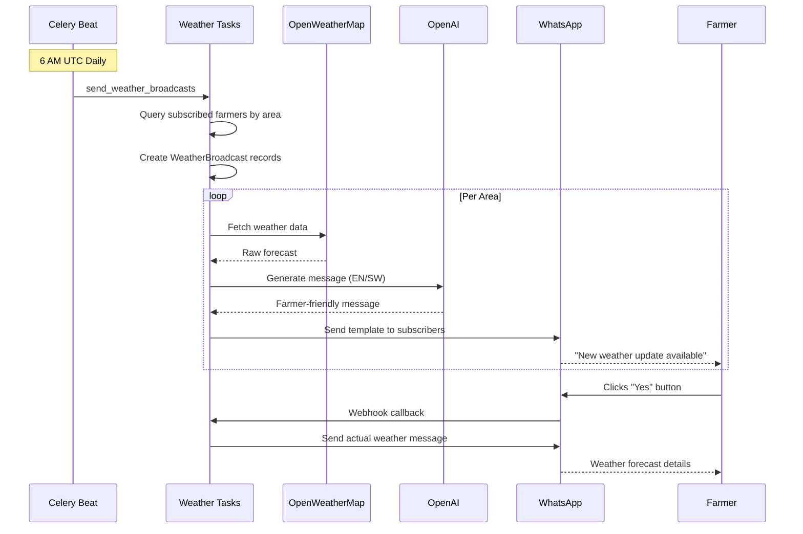
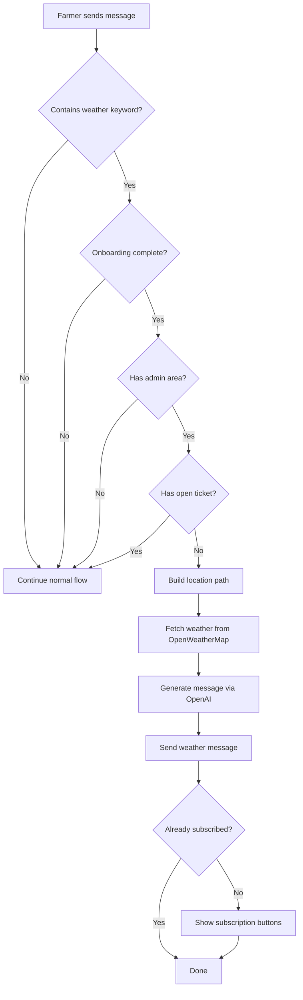
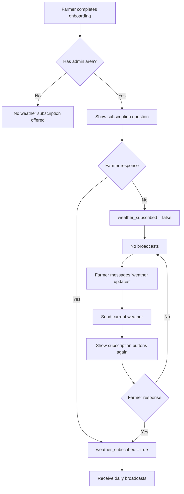

# Weather Subscription Feature Progress

## Overview

Weather subscription allows farmers to opt-in to receive daily weather forecast messages for their administrative area via WhatsApp.

## Current Status: Phase 3 In Progress

### Phase 1: Message Generation (DONE)

Implemented the ability to fetch weather data and generate farmer-friendly broadcast messages.

#### Key Files

| File | Purpose |
|------|---------|
| `services/weather_broadcast_service.py` | Core service for weather data retrieval and message generation |
| `services/weather_subscription_service.py` | Manages subscription preferences (subscribe/decline) |
| `routers/weather.py` | Admin test endpoint for message generation |
| `schemas/weather.py` | Request schema with location and language enum |
| `templates/weather_broadcast.txt` | Prompt template for OpenAI message generation |
| `tests/test_weather_broadcast_service.py` | Service tests (20 tests) |
| `tests/test_weather_router.py` | Router tests (9 tests) |

#### Configuration

Environment variables (in `.env`):
```
OPENWEATHER=your_openweather_api_key
```

Config.json:
```json
{
  "weather": {
    "broadcast_enabled": true,
    "intent_keywords": [
      "weather",
      "forecast",
      "weather updates",
      "hali ya hewa",
      "hali ya anga"
    ]
  }
}
```

#### How It Works

1. `WeatherBroadcastService.get_forecast_raw(location)` - Fetches raw weather data from OpenWeatherMap using `akvo-weather-info` library
2. `WeatherBroadcastService.generate_message(location, language, weather_data)` - Uses OpenAI to generate a farmer-friendly message based on the prompt template

#### Test Endpoint

```
POST /api/admin/weather/test-message
Authorization: Bearer <admin_token>
Content-Type: application/json

{
  "location": "Nairobi",
  "language": "en"  // or "sw" for Swahili
}
```

Returns plain text message.

#### Message Format

The generated message follows this structure:
1. Short title
2. Simple weather summary (2-3 lines) with temperature range and rainfall
3. "What to do today" section with bullet points (spraying, field work, watering)
4. One short reminder sentence

Max 1000 characters, WhatsApp-friendly formatting, no technical terms.

---

### Phase 2: Broadcast to Subscribers (DONE)

Implemented daily weather broadcasts to subscribed farmers with template confirmation workflow.

#### Key Files

| File | Purpose |
|------|---------|
| `models/weather_broadcast.py` | WeatherBroadcast and WeatherBroadcastRecipient models |
| `tasks/weather_tasks.py` | Celery tasks for broadcasting |
| `alembic/versions/..._create_weather_broadcast_tables.py` | Database migration |
| `tests/test_weather_tasks.py` | Task tests (16 tests) |

#### Database Schema

```
WeatherBroadcast (daily weather broadcast per area)
├── administrative_id (FK)
├── location_name
├── weather_data (JSON)
├── generated_message_en
├── generated_message_sw
├── status (pending, processing, completed, failed)
├── scheduled_at, started_at, completed_at

WeatherBroadcastRecipient (delivery tracking)
├── weather_broadcast_id (FK)
├── customer_id (FK)
├── status (DeliveryStatus enum)
├── confirm_message_sid (for webhook callback)
├── actual_message_sid
├── retry_count, error_message
├── sent_at, confirmed_at
```

#### Workflow



1. **Daily Task** (`send_weather_broadcasts`) runs at 6 AM UTC via Celery Beat
2. Queries customers with `weather_subscribed = True` grouped by administrative area
3. Creates `WeatherBroadcast` record per area
4. Queues `send_weather_templates` task per area

5. **Template Sending** (`send_weather_templates`):
   - Fetches weather data via OpenWeatherMap
   - Generates messages in EN and SW via OpenAI
   - Sends WhatsApp template (reuses `broadcast` template SID)
   - Creates `WeatherBroadcastRecipient` with `confirm_message_sid`

6. **User Confirmation**:
   - User clicks "Yes" button (`read_broadcast` payload)
   - Webhook checks `WeatherBroadcastRecipient` first (priority over regular broadcasts)
   - Queues `send_weather_message` task

7. **Actual Message** (`send_weather_message`):
   - Sends language-specific weather message
   - Creates `Message` record
   - Updates recipient with `actual_message_sid`

8. **Retry Mechanism** (`retry_failed_weather_broadcasts`):
   - Runs every 5 minutes via Celery Beat
   - Retries failed recipients at intervals [5, 15, 60] minutes
   - Marks as UNDELIVERED after max retries

#### Celery Beat Schedule

```python
# celery_app.py
"send-weather-broadcasts": {
    "task": "tasks.weather_tasks.send_weather_broadcasts",
    "schedule": crontab(hour=6, minute=0),  # 6 AM UTC daily
},
"retry-failed-weather-broadcasts": {
    "task": "tasks.weather_tasks.retry_failed_weather_broadcasts",
    "schedule": crontab(minute="*/5"),  # Every 5 minutes
},
```

#### Integration Points

- **Webhook** (`routers/whatsapp.py`): Weather recipients checked before regular broadcasts
- **Template**: Reuses existing `broadcast` template SID (language-aware)
- **Button Payload**: Reuses `read_broadcast` payload

---

### Phase 2.5: Weather Intent Detection (DONE)

Implemented on-demand weather message generation when farmers ask about weather.

#### Key Files

| File | Purpose |
|------|---------|
| `services/weather_intent_service.py` | Detects weather keywords and generates weather messages |
| `tests/test_weather_intent.py` | Weather intent tests |

#### How It Works



1. Farmer sends message containing weather keywords (e.g., "weather updates", "hali ya hewa")
2. `WeatherIntentService.has_weather_intent()` detects keywords from `config.json`
3. `WeatherIntentService.can_handle()` checks conditions:
   - Customer has completed onboarding
   - Customer has an administrative area assigned
   - No existing escalated ticket
4. `WeatherIntentService.handle_weather_intent()`:
   - Builds full location path from administrative hierarchy (Region, District, Ward)
   - Generates weather message via `WeatherBroadcastService`
   - Sends weather message to farmer
   - Shows subscription buttons if farmer is not already subscribed

#### Re-subscription Flow

Farmers who previously declined weather subscription can re-subscribe:
1. Farmer messages "weather updates" (or any configured keyword)
2. System sends current weather for their area
3. System shows subscription buttons again
4. Farmer can now subscribe by clicking "Yes"

This allows farmers to change their mind without needing admin intervention.

---

### Phase 3: Admin Management (Partial)

Admin interface to manage weather broadcasts.

#### Implemented Features

1. **Manual Trigger Endpoint** - Trigger weather broadcasts on-demand

```
POST /api/admin/weather/trigger-broadcast
Authorization: Bearer <admin_token>

Response (202 Accepted):
{
  "status": "queued",
  "task_id": "abc123-def456",
  "message": "Weather broadcast task queued successfully"
}
```

#### Remaining Features (TODO)

1. View subscription statistics by area
2. Preview message before sending
3. View broadcast history/logs
4. Enable/disable broadcasts per area

---

## Subscription Flow

Implemented in `weather_subscription_service.py` and `weather_intent_service.py`:



### Initial Subscription (After Onboarding)

1. After onboarding completion + admin area assignment
2. System asks: "Would you like to receive daily weather updates for {area_name}?"
3. Customer responds Yes/No via WhatsApp buttons
4. Preference stored in `customer.profile_data`:
   - `weather_subscription_asked: bool`
   - `weather_subscribed: bool | null`

### Re-subscription (After Decline)

Farmers who declined can subscribe later:

1. Farmer sends message with weather keyword (e.g., "weather updates")
2. System generates and sends current weather for their area
3. System shows subscription buttons again
4. Farmer clicks "Yes" to subscribe

Button payloads configured in `config.py`:
- `weather_yes_payload`: "weather_yes"
- `weather_no_payload`: "weather_no"

---

## Dependencies

- `akvo-weather-info>=0.1.0` - OpenWeatherMap API wrapper
- OpenAI API - Message generation
- Existing services: `openai_service.py`, `whatsapp_service.py`, `broadcast_service.py`
